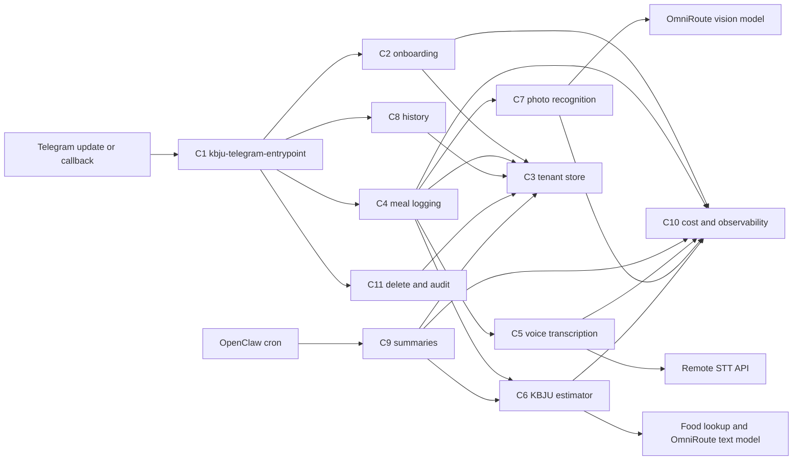

# ARCH-001: KBJU Coach v0.1

## 0. Recon Report (Phase 0 — MANDATORY before any design)

> Required input: `docs/knowledge/openclaw.md`, `docs/knowledge/awesome-skills.md`. Reviewer rejects ArchSpecs that skip this section.

### 0.1 OpenClaw capability map

Sources audited before design: local runtime notes in `docs/knowledge/openclaw.md`, skill catalogue notes in `docs/knowledge/awesome-skills.md`, OpenClaw docs (<https://docs.openclaw.ai>), OpenClaw source/README (<https://github.com/openclaw/openclaw>), and the public skills catalogue (<https://github.com/VoltAgent/awesome-openclaw-skills>). OpenClaw remains locked by PRD-001@0.2.0 §7; this map identifies only what the runtime closes and what remains project-owned.

| PRD requirement | OpenClaw built-in that closes infrastructure | Remaining KBJU Coach gap |
|---|---|---|
| PRD-001@0.2.0 §7 Telegram-only channel; PRD-001@0.2.0 §5 US-1 through US-8 Telegram UX | Gateway/channel support includes Telegram and media-capable messaging surfaces per docs (<https://docs.openclaw.ai>) and source README (<https://github.com/openclaw/openclaw>). | Russian onboarding, commands, inline confirm/edit/delete affordances, typing indicator behavior, and all bot copy. |
| PRD-001@0.2.0 §5 US-2 voice logging; §2 G3 voice latency | Voice/media routing can pass voice input to a skill; local runtime notes identify `VoiceWake` pre-routing to a transcription skill. | Actual Russian transcription provider adapter, retry/fallback policy, transcript retention, and latency/cost measurement. |
| PRD-001@0.2.0 §5 US-4 photo logging | OpenClaw media transport passes photo input into skills; sandbox isolates the skill process. | Meal-photo recognition, low-confidence threshold, mandatory confirmation UX, raw photo deletion after extraction. |
| PRD-001@0.2.0 §5 US-5 summaries | `cron-tools` / scheduled triggers are a built-in OpenClaw path for periodic skill invocation. | User-local schedule definitions, summary aggregation, Russian recommendation prompt, and no-meal nudge content. |
| PRD-001@0.2.0 §2 G2/G3/K2/K3 latency measurement; §7 observability minimums | OpenClaw observability hooks expose per-skill logs, latency metrics, and token spend. | Concrete log schema, metric names, user-scoped correlation IDs, and end-of-pilot KPI queries. |
| PRD-001@0.2.0 §2 G5 cost ceiling | OpenClaw model failover retries providers on errors; OpenClaw supports provider config/fallbacks per docs/source. | Monthly spend accumulator, hard per-call token budgets, auto-degrade trigger, and PO alert. |
| PRD-001@0.2.0 §2 G4 and §5 US-9 tenant isolation | OpenClaw sandbox/process isolation separates the skill process from the host. | Storage-level `user_id` scoping, no unscoped queries, per-user audit log, and end-of-pilot cross-user audit query. |
| PRD-001@0.2.0 §7 secrets | OpenClaw injects secrets through runtime context / env-var style secret handling per local runtime notes and docs. | `.env.example` schema, secret names, least-privilege API keys, and no raw key logging. |
| PRD-001@0.2.0 §7 Node 24 TypeScript runtime | OpenClaw skills are TypeScript on Node 24 per local runtime notes and source README (<https://github.com/openclaw/openclaw>). | Domain implementation must stay in TypeScript; Python/Rust/CLI skills can be referenced but not directly embedded without a later ADR. |

### 0.2 Skill audit (awesome-openclaw-skills)
| Candidate skill (URL) | Matches which PRD §/Goal | Verdict | Rationale |
|---|---|---|---|

Capability A - KBJU / nutrition calculation and meal logging.

| Candidate skill (URL) | Matches which PRD §/Goal | Verdict | Rationale |
|---|---|---|---|
| [`calorie-counter`](https://github.com/openclaw/skills/tree/main/skills/cnqso/calorie-counter) | PRD-001@0.2.0 §5 US-2/US-3/US-7; §2 G1 | reference | Python 3.7 stdlib + SQLite, MIT via skills repo license (<https://github.com/openclaw/skills/blob/main/LICENSE>), last path commit 2026-02-05 (<https://github.com/openclaw/skills/commits/main/skills/cnqso/calorie-counter>). It is forkable but tracks only calories/protein, expects manual values, and misses fat/carbs, Russian parsing, tenant isolation, and confirmation gates. |
| [`diet-tracker`](https://github.com/openclaw/skills/tree/main/skills/yonghaozhao722/diet-tracker) | PRD-001@0.2.0 §5 US-2/US-3/US-5; §2 G1 | reject | Python scripts + Chinese fallback database (`food_database.json` contains Chinese Subway items, no Russian alias corpus), MIT via skills repo, last path commit 2026-02-20 (<https://github.com/openclaw/skills/commits/main/skills/yonghaozhao722/diet-tracker>). ClawHub flags it suspicious, it reads `USER.md` and memory files instead of tenant-scoped storage, and it includes cron reminders outside our UX. |
| [`opencal`](https://github.com/openclaw/skills/tree/main/skills/neikfu/opencal) | PRD-001@0.2.0 §5 US-2/US-3/US-6; §7 food/nutrition database | reference | SKILL-only curl/jq wrapper around OpenCal API, requires `OPENCAL_API_KEY` and an OpenCal iOS account, MIT via skills repo, last path commit 2026-02-19 (<https://github.com/openclaw/skills/commits/main/skills/neikfu/opencal>). Its per-100g scaling and log/delete API shape are useful, but forking would bind the pilot to an external app/account and offload user records outside our right-to-delete boundary. |

Capability B - Voice transcription for Russian Telegram voice messages.

| Candidate skill (URL) | Matches which PRD §/Goal | Verdict | Rationale |
|---|---|---|---|
| [`mh-openai-whisper-api`](https://github.com/openclaw/skills/tree/main/skills/mohdalhashemi98-hue/mh-openai-whisper-api) | PRD-001@0.2.0 §5 US-2/US-7; §2 G3/G5 | reference | Shell/curl wrapper around OpenAI `/v1/audio/transcriptions`, requires `OPENAI_API_KEY`, MIT via skills repo, last path commit 2026-02-25 (<https://github.com/openclaw/skills/commits/main/skills/mohdalhashemi98-hue/mh-openai-whisper-api>). It matches the project default provider path in `docs/knowledge/awesome-skills.md`, but should be reimplemented as a typed Node 24 adapter rather than vendoring shell. |
| [`faster-whisper`](https://github.com/openclaw/skills/tree/main/skills/theplasmak/faster-whisper) | PRD-001@0.2.0 §5 US-2; §7 v0.2 local-transcription swap | reference | Python 3.10 + CTranslate2/faster-whisper with optional ffmpeg/yt-dlp/pyannote, MIT via skills repo, last path commit 2026-02-19 (<https://github.com/openclaw/skills/commits/main/skills/theplasmak/faster-whisper>). Good v0.2 reference for provider abstraction, but v0.1 VPS envelope is ≤2 GB steady RAM and this is a Python local-model stack, not Node 24. |
| [`auto-whisper-safe`](https://github.com/openclaw/skills/tree/main/skills/neal-collab/auto-whisper-safe) | PRD-001@0.2.0 §5 US-2; §7 resource ceiling | reject | Shell wrapper over local `whisper` + `ffmpeg`, default base model ~1.5 GB RAM, MIT via skills repo, last path commit 2026-02-14 (<https://github.com/openclaw/skills/commits/main/skills/neal-collab/auto-whisper-safe>). It optimizes long files, while PRD-001@0.2.0 limits voice to ≤15 s and requires low p95 latency; it would consume most of the 2 GB steady-state budget. |
| [`assemblyai-transcribe`](https://github.com/openclaw/skills/tree/main/skills/tristanmanchester/assemblyai-transcribe) | PRD-001@0.2.0 §5 US-2/US-7 | reject | Node 18+ CLI, requires `ASSEMBLYAI_API_KEY`, MIT via skills repo, last path commit 2026-03-14 (<https://github.com/openclaw/skills/commits/main/skills/tristanmanchester/assemblyai-transcribe>). Rich diarization/translation features exceed v0.1 need and add a second paid transcription provider without a PRD requirement. |
| [`deepgram`](https://github.com/openclaw/skills/tree/main/skills/nerkn/deepgram) | PRD-001@0.2.0 §5 US-2/US-7 | reject | SKILL-only guide to `@deepgram/cli`, requires Deepgram API key/account, MIT via skills repo, last path commit 2026-02-03 (<https://github.com/openclaw/skills/commits/main/skills/nerkn/deepgram>). It is not forkable application code and would introduce a CLI dependency plus another paid provider before ADR comparison. |
| [`elevenlabs-transcribe`](https://github.com/openclaw/skills/tree/main/skills/paulasjes/elevenlabs-transcribe) | PRD-001@0.2.0 §5 US-2/US-7 | reject | Python 3.8 + ffmpeg wrapper requiring `ELEVENLABS_API_KEY`, MIT via skills repo, last path commit 2026-02-03 (<https://github.com/openclaw/skills/commits/main/skills/paulasjes/elevenlabs-transcribe>). ClawHub marks OpenClaw audit suspicious; Scribe features are broader than v0.1 and must compete in ADR, not be forked silently. |

Capability C - Photo meal recognition and confidence labelling.

| Candidate skill (URL) | Matches which PRD §/Goal | Verdict | Rationale |
|---|---|---|---|
| [`google-gemini-media`](https://github.com/openclaw/skills/tree/main/skills/xsir0/google-gemini-media) | PRD-001@0.2.0 §5 US-4; §7 photo latency/cost | reference | Node.js/REST templates for Gemini image understanding/generation, requires `GEMINI_API_KEY`, declares MIT in SKILL, last path commit 2026-01-28 (<https://github.com/openclaw/skills/commits/main/skills/xsir0/google-gemini-media>). Useful for Files API vs inline image routing patterns, but it is generic media guidance and has no meal macro schema, confidence threshold, or confirmation UX. |
| [`hotdog`](https://github.com/openclaw/skills/tree/main/skills/mishafyi/hotdog) | PRD-001@0.2.0 §5 US-4 | reject | SKILL-only curl workflow to a public hotdog battle API, MIT via skills repo, last path commit 2026-02-10 (<https://github.com/openclaw/skills/commits/main/skills/mishafyi/hotdog>). It leaks images to a public leaderboard path, embeds a bearer token in instructions, and classifies only hotdog/not-hotdog rather than meal contents/macros. |
| [`image-detection`](https://github.com/openclaw/skills/tree/main/skills/raghulpasupathi/image-detection) | PRD-001@0.2.0 §5 US-4 | reject | Markdown guide to npm/HuggingFace/Hive AI-generated-image detectors, MIT via skills repo, last path commit 2026-02-21 (<https://github.com/openclaw/skills/commits/main/skills/raghulpasupathi/image-detection>). Wrong domain: detects AI-generated images/NSFW, not food items, portions, or KBJU estimates. |
| [`vtl-image-analysis`](https://github.com/openclaw/skills/tree/main/skills/rusparrish/vtl-image-analysis) | PRD-001@0.2.0 §5 US-4 | reject | Python 3 + numpy/opencv/scikit-image/scipy/pyyaml, per-skill license file plus MIT-compatible public source, last path commit 2026-02-25 (<https://github.com/openclaw/skills/commits/main/skills/rusparrish/vtl-image-analysis>). Wrong domain: composition diagnostics for generated images, no food recognition or nutrition path. |

Capability D - Periodic summary generation / coach wording.

| Candidate skill (URL) | Matches which PRD §/Goal | Verdict | Rationale |
|---|---|---|---|
| [`health-summary`](https://github.com/openclaw/skills/tree/main/skills/yusaku-0426/health-summary) | PRD-001@0.2.0 §5 US-5 | reference | JavaScript `health_summary.js` contract in SKILL metadata, MIT via skills repo, last path commit 2026-02-25 (<https://github.com/openclaw/skills/commits/main/skills/yusaku-0426/health-summary>). Closest domain match for daily/weekly/monthly nutrition totals, but Japanese copy and extra water/fiber/sodium/exercise fields conflict with Russian-only UX and PRD-001@0.2.0 §3 NG2/NG6. |
| [`daily-report`](https://github.com/openclaw/skills/tree/main/skills/visualdeptcreative/daily-report) | PRD-001@0.2.0 §5 US-5; §2 G5 cost alert | reference | Prompt/format SKILL for local Ollama aggregation and Telegram alerts, MIT via skills repo, last path commit 2026-02-05 (<https://github.com/openclaw/skills/commits/main/skills/visualdeptcreative/daily-report>). Good reference for budget-report wording and scheduled report structure, but domain is lead-generation pipeline and not forkable KBJU logic. |
| [`ai-conversation-summary`](https://github.com/openclaw/skills/tree/main/skills/dadaliu0121/ai-conversation-summary) | PRD-001@0.2.0 §5 US-5 | reject | SKILL-only curl call to an external summary API, MIT declared in SKILL, last path commit 2026-02-05 (<https://github.com/openclaw/skills/commits/main/skills/dadaliu0121/ai-conversation-summary>). Sends user text to an unrelated endpoint, lacks cost controls, and summarizes chat history rather than KBJU periods. |
| [`meeting-summarizer`](https://github.com/openclaw/skills/tree/main/skills/claudiodrusus/meeting-summarizer) | PRD-001@0.2.0 §5 US-5 | reject | ClawHub page exists (<https://clawskills.sh/skills/claudiodrusus-meeting-summarizer>) and commit history shows a 2026-03-05 path entry, but the current GitHub contents endpoint returns 404; source/README cannot be audited at current main. Rejecting avoids designing against unavailable source. |

Capability E - Scheduling / timezone support for reports.

| Candidate skill (URL) | Matches which PRD §/Goal | Verdict | Rationale |
|---|---|---|---|
| [`cron-scheduling`](https://github.com/openclaw/skills/tree/main/skills/gitgoodordietrying/cron-scheduling) | PRD-001@0.2.0 §5 US-5; §7 scheduled summaries | reference | SKILL-only guide for cron/systemd timers, MIT via skills repo, last path commit 2026-02-03 (<https://github.com/openclaw/skills/commits/main/skills/gitgoodordietrying/cron-scheduling>). Useful for idempotency/DST caveats, but OpenClaw `cron-tools` is already the project path; no separate cron/systemd integration should be forked. |
| [`temporal-cortex-datetime`](https://github.com/openclaw/skills/tree/main/skills/billylui/temporal-cortex-datetime) | PRD-001@0.2.0 §5 US-1/US-5 timezone confirmation | reference | Rust MCP binary distributed through npm, MIT declared in SKILL, last path commit 2026-03-10 (<https://github.com/openclaw/skills/commits/main/skills/billylui/temporal-cortex-datetime>). Strong reference for DST-aware parsing, but adding Rust/MCP runtime is unnecessary for v0.1 once a user confirms a fixed report time/timezone. |
| [`temporal-cortex-scheduling`](https://github.com/openclaw/skills/tree/main/skills/billylui/temporal-cortex-scheduling) | PRD-001@0.2.0 §5 US-5 only superficially | reject | Rust MCP binary + OAuth credentials for Google/Outlook/CalDAV, MIT declared in SKILL, last path commit 2026-03-10 (<https://github.com/openclaw/skills/commits/main/skills/billylui/temporal-cortex-scheduling>). It implements calendar booking, directly conflicting with PRD-001@0.2.0 §3 NG1. |
| [`calendar-scheduling`](https://github.com/openclaw/skills/tree/main/skills/billylui/calendar-scheduling) | PRD-001@0.2.0 §5 US-5 only superficially | reject | ClawHub page exists (<https://clawskills.sh/skills/billylui-calendar-scheduling>) with OAuth calendar requirements; content overlaps Temporal Cortex scheduling. It is calendar integration, which PRD-001@0.2.0 §3 NG1 explicitly excludes. |
| [`cron-optimizer`](https://github.com/openclaw/skills/tree/main/skills/autogame-17/cron-optimizer) | PRD-001@0.2.0 §5 US-5 only superficially | reject | ClawHub page exists (<https://clawskills.sh/skills/autogame-17-cron-optimizer>) and commit history shows a 2026-03-02 path entry, but the current GitHub contents endpoint returns 404; also optimizes host cron state, which is outside the locked OpenClaw scheduled-trigger path. |

### 0.3 Build-vs-fork-vs-reuse decision summary

Phase 0 produces zero direct forks for v0.1. All audited candidates are either wrong-language for the locked TypeScript/Node 24 skill runtime, too generic, not Russian/tenant-aware, unavailable at current source, externally account-bound, or outside PRD-001@0.2.0 scope. The Executor should build the KBJU domain logic, tenant-scoped storage, confirmation/edit/delete flows, photo confidence handling, right-to-delete, and spend-degrade logic from scratch inside OpenClaw skills; the architecture may reference `mh-openai-whisper-api` for hosted Whisper request shape, `faster-whisper` for a future provider abstraction, `opencal` for per-100g nutrition scaling, `google-gemini-media` for image-understanding request routing, `health-summary` for period aggregation shape, and `cron-scheduling` / `temporal-cortex-datetime` for DST/idempotency considerations.

Capabilities with no suitable fork-candidate: Russian onboarding and target calculation; tenant-isolated meal/audit/transcript storage; Russian confirm/edit/delete UX; photo-to-macro estimation with a numeric low-confidence threshold; monthly cost guard and auto-degrade; right-to-delete; end-of-pilot cross-user audit.

### 0.4 Architectural fork-candidate verdicts (≥3 per major capability)

> Per RV-SPEC-002@0.1.0 F-M1: §0.1 maps OpenClaw built-in vs gap, §0.2 audits skill-catalogue forks. This §0.4 enumerates ≥3 *architectural* alternatives per major capability with explicit reject/reference verdicts before they are formalized in ADRs, so the Recon Report is self-contained.

| Capability | Architectural fork-candidate | Verdict | Rationale (one sentence) | Chosen path / ADR |
|---|---|---|---|---|
| Telegram entrypoint | OpenClaw built-in Telegram gateway | **chosen** | PRD-001@0.2.0 §7 locks OpenClaw runtime; native gateway covers webhooks, media routing, and sandbox boundaries with no extra dependency. | C1 + ADR-008@0.1.0 |
| Telegram entrypoint | `telegraf` Node.js framework | reject | Adds a second message router, duplicates OpenClaw's gateway, and breaks PRD-001@0.2.0 §7 stack lock. | — |
| Telegram entrypoint | `grammy` Node.js framework | reject | Same duplication concern as `telegraf`; offers no advantage over OpenClaw native delivery for v0.1 scope. | — |
| Telegram entrypoint | Custom long-poll Bot API client | reject | OpenClaw provides webhook ingress; long-poll would consume vCPU continuously and lose ordering guarantees. | — |
| Voice transcription | Hosted Fireworks Whisper V3 Turbo | **chosen** | Russian-capable, predictable per-second pricing, lowest latency in the OmniRoute pool, satisfies G3 8 s p95 budget. | ADR-003@0.1.0 |
| Voice transcription | Hosted OpenAI Whisper API | reference | Functionally equivalent quality but second paid provider lock-in; held as runtime fallback only. | ADR-003@0.1.0 fallback row |
| Voice transcription | Local `faster-whisper` (CTranslate2) | reject | Steady RAM 0.8–1.5 GiB exceeds the 2 GiB envelope share for transcription, and pilot VPS has no GPU. | — |
| Voice transcription | AssemblyAI / Deepgram / ElevenLabs | reject | Each adds an extra paid account and per-minute pricing exceeds the $10/month cap; no clear quality win for ≤15 s clips. | — |
| Photo recognition | Fireworks Qwen3 VL 30B A3B Instruct | **chosen** | Free-tier vision model with structured-JSON output and Russian instruction following; threshold-friendly confidence outputs. | ADR-004@0.1.0 |
| Photo recognition | OpenAI GPT-4o vision | reject | Per-image price would exhaust the $10/month cap within 2 weeks at G2 logging volume. | — |
| Photo recognition | Anthropic Claude vision | reject | Similar cost/latency profile to GPT-4o; no Fireworks-pool route. | — |
| Photo recognition | Google Gemini Files API | reject | Requires a separate paid account, and `google-gemini-media` skill audit (§0.2 Capability C) shows generic prompt scaffolding without meal-specific schema. | — |
| Storage / multi-tenancy | PostgreSQL shared tables + `user_id` + RLS | **chosen** | Single durable store, RLS enforces tenant isolation at SQL level, and Docker Compose deploy fits the VPS envelope. | ADR-001@0.1.0 |
| Storage / multi-tenancy | SQLite shared file with `user_id` columns | reject | No native row-level security and no production-grade concurrent writer story; future migration to multi-user is painful. | — |
| Storage / multi-tenancy | One SQLite file per user | reject | Defeats the K4 cross-user audit query, complicates backups, and breaks shared schema migrations. | — |
| Storage / multi-tenancy | One PostgreSQL DB per user | reject | Operationally heavy on a 7.6 GiB VPS, and same K4 audit query problem as per-user SQLite. | — |
| LLM routing | OmniRoute first, direct provider fallback | **chosen** | Single key boundary, free Fireworks pool first, deterministic provider failover; skills never read raw provider keys. | ADR-002@0.1.0 |
| LLM routing | Direct Fireworks/OpenAI keys per skill | reject | Spreads provider keys across skills, defeats `docs/knowledge/llm-routing.md`'s key-boundary guarantee. | — |
| LLM routing | LiteLLM / OpenRouter | reject | OmniRoute already covers the Fireworks-first failover with a thinner adapter; adding another router is unnecessary surface. | — |
| Summary recommendation guardrails | System prompt + deterministic post-validator | **chosen** | Layered defense; deterministic fallback message ships when validator rejects forbidden topics. | ADR-006@0.1.0 |
| Summary recommendation guardrails | System prompt only | reject | Single point of failure against prompt drift / injection; no deterministic fallback. | — |
| Summary recommendation guardrails | Classifier model on output | reject | Adds another paid call per summary and exceeds the $10 cap; deterministic post-validator is cheaper and more auditable. | — |
| Data jurisdiction | EU durable storage with transient remote inference | **recommended (PO-pending)** | Most permissive cross-border inference path while keeping durable PII in EU; OBC-3 compliant. | ADR-007@0.1.0 Q_TO_BUSINESS_2 |
| Data jurisdiction | RU durable storage | reject | Triggers RU-specific data-localization obligations (152-FZ); pilot is non-resident-of-RU friendly. | — |
| Data jurisdiction | US durable storage | reject | Limits future EU users without DPA work; not chosen unless PO opts in. | — |
| Deployment | Docker Compose on VPS | **chosen** | Smallest viable runtime for 2-user pilot; matches PO VPS baseline (6 vCPU / 7.6 GiB). | ADR-008@0.1.0 |
| Deployment | Kubernetes (k3s / managed) | reject | Infra overhead exceeds the pilot envelope; no autoscaling need for 2 users. | — |
| Deployment | systemd-managed processes on host | reject | Sacrifices the named-volume reproducibility and breaks the "snapshot + scp + up" migration path. | — |
| Deployment | Nomad | reject | Same overhead concern as k8s; no operational team. | — |
| Observability | Structured JSON logs + PG metric tables + loopback `/metrics` | **chosen** | Zero new SaaS, audit log + KPIs queryable in-DB, right-to-delete reaches metric/cost rows. | ADR-009@0.1.0 |
| Observability | OpenTelemetry + Jaeger | reject | Operational overhead exceeds 2-user value; reserved as future migration path. | — |
| Observability | Sentry / Datadog / SaaS APM | reject | Sends user metadata to third party, contradicts §9.3 egress policy and OBC-3 jurisdiction. | — |

## 1. Context
Implements: PRD-001@0.2.0 §2 Goals, §5 User Stories, §6 KPIs, §7 Technical Envelope, and PO OBC/answers recorded in `docs/questions/Q-ARCH-001-gap-report-2026-04-26.md`.
Does NOT implement: PRD-001@0.2.0 §3 Non-Goals.

### 1.1 Trace matrix
| PRD section | PRD Goal / US | Components that satisfy it |
|---|---|---|
| PRD-001@0.2.0 §2 G1 | Logging volume: ≥3 confirmed meals/day on ≥5 of any rolling 7-day window per pilot user. | C1 Access-Controlled Telegram Entrypoint; C3 Tenant-Scoped Store; C4 Meal Logging Orchestrator; C6 KBJU Estimator; C8 History Mutation Service; C10 Cost, Degrade, and Observability Service |
| PRD-001@0.2.0 §2 G2 | Time-to-first-value: first meal-content message to KBJU draft ≤120 seconds. | C1 Access-Controlled Telegram Entrypoint; C4 Meal Logging Orchestrator; C5 Voice Transcription Provider; C6 KBJU Estimator; C7 Photo Recognition Provider; C10 Cost, Degrade, and Observability Service |
| PRD-001@0.2.0 §2 G3 | Voice round-trip latency: voice ≤15 s returns draft within ≤8 s p95 / ≤30 s p100 and continuous typing indicator. | C1 Access-Controlled Telegram Entrypoint; C4 Meal Logging Orchestrator; C5 Voice Transcription Provider; C6 KBJU Estimator; C10 Cost, Degrade, and Observability Service |
| PRD-001@0.2.0 §2 G4 | Tenant isolation: zero cross-user data leaks. | C1 Access-Controlled Telegram Entrypoint; C3 Tenant-Scoped Store; C10 Cost, Degrade, and Observability Service; C11 Right-to-Delete and Tenant Audit Service |
| PRD-001@0.2.0 §2 G5 | Cost ceiling: LLM + voice transcription ≤$10/month with auto-degrade and PO alert. | C5 Voice Transcription Provider; C6 KBJU Estimator; C7 Photo Recognition Provider; C9 Summary Recommendation Service; C10 Cost, Degrade, and Observability Service |
| PRD-001@0.2.0 §5 US-1 | Onboarding and personalized targets. | C1 Access-Controlled Telegram Entrypoint; C2 Onboarding and Target Calculator; C3 Tenant-Scoped Store |
| PRD-001@0.2.0 §5 US-2 | Voice meal logging with transcription, draft KBJU estimate, confirm/edit, and persistence. | C1 Access-Controlled Telegram Entrypoint; C3 Tenant-Scoped Store; C4 Meal Logging Orchestrator; C5 Voice Transcription Provider; C6 KBJU Estimator; C10 Cost, Degrade, and Observability Service |
| PRD-001@0.2.0 §5 US-3 | Text meal logging with draft KBJU estimate, confirm/edit, and persistence. | C1 Access-Controlled Telegram Entrypoint; C3 Tenant-Scoped Store; C4 Meal Logging Orchestrator; C6 KBJU Estimator; C10 Cost, Degrade, and Observability Service |
| PRD-001@0.2.0 §5 US-4 | Photo meal logging with estimated items/macros, low-confidence label, mandatory confirmation, and correction. | C1 Access-Controlled Telegram Entrypoint; C3 Tenant-Scoped Store; C4 Meal Logging Orchestrator; C6 KBJU Estimator; C7 Photo Recognition Provider; C10 Cost, Degrade, and Observability Service |
| PRD-001@0.2.0 §5 US-5 | Daily / weekly / monthly summaries with totals, deltas, previous-period comparison, and KBJU-only recommendation. | C2 Onboarding and Target Calculator; C3 Tenant-Scoped Store; C9 Summary Recommendation Service; C10 Cost, Degrade, and Observability Service |
| PRD-001@0.2.0 §5 US-6 | Edit / delete any past meal with pagination and audit log; future summaries reflect corrections. | C1 Access-Controlled Telegram Entrypoint; C3 Tenant-Scoped Store; C8 History Mutation Service; C9 Summary Recommendation Service |
| PRD-001@0.2.0 §5 US-7 | Failure UX with manual fallbacks for transcription, KBJU computation, and transport failures. | C1 Access-Controlled Telegram Entrypoint; C4 Meal Logging Orchestrator; C5 Voice Transcription Provider; C6 KBJU Estimator; C7 Photo Recognition Provider; C10 Cost, Degrade, and Observability Service |
| PRD-001@0.2.0 §5 US-8 | Right-to-delete with explicit confirmation and fresh onboarding after deletion. | C1 Access-Controlled Telegram Entrypoint; C3 Tenant-Scoped Store; C11 Right-to-Delete and Tenant Audit Service |
| PRD-001@0.2.0 §5 US-9 | Multi-tenant data isolation for every persistent record and end-of-pilot audit query. | C1 Access-Controlled Telegram Entrypoint; C3 Tenant-Scoped Store; C10 Cost, Degrade, and Observability Service; C11 Right-to-Delete and Tenant Audit Service |
| PRD-001@0.2.0 §6 K1 | Daily confirmed meals logged per active pilot user. | C3 Tenant-Scoped Store; C4 Meal Logging Orchestrator; C10 Cost, Degrade, and Observability Service |
| PRD-001@0.2.0 §6 K2 | Time-to-first-value measurement. | C1 Access-Controlled Telegram Entrypoint; C4 Meal Logging Orchestrator; C10 Cost, Degrade, and Observability Service |
| PRD-001@0.2.0 §6 K3 | Voice latency measurement over rolling 7-day windows. | C5 Voice Transcription Provider; C10 Cost, Degrade, and Observability Service |
| PRD-001@0.2.0 §6 K4 | Cross-user data leak audit over stored records. | C3 Tenant-Scoped Store; C11 Right-to-Delete and Tenant Audit Service |
| PRD-001@0.2.0 §6 K5 | Monthly LLM + voice-transcription spend and auto-degrade evidence. | C5 Voice Transcription Provider; C6 KBJU Estimator; C7 Photo Recognition Provider; C9 Summary Recommendation Service; C10 Cost, Degrade, and Observability Service |
| PRD-001@0.2.0 §6 K6 | Weekly retention: both pilot users active ≥7/7 days/week for 4 weeks. | C3 Tenant-Scoped Store; C4 Meal Logging Orchestrator; C10 Cost, Degrade, and Observability Service |
| PRD-001@0.2.0 §6 K7 | KBJU estimation accuracy target, to be proposed after Phase 5-6 feasibility analysis. | C6 KBJU Estimator; C7 Photo Recognition Provider; C10 Cost, Degrade, and Observability Service |

Every PRD Goal MUST appear. Every component MUST trace back to ≥1 PRD row.

## 2. Architecture Overview

OpenClaw owns Telegram transport, sandboxing, cron dispatch, secret injection, and LLM provider failover. The KBJU Coach implementation is split into cohesive TypeScript skills plus shared modules so meal logging, onboarding, summaries, and privacy/history operations can evolve independently without a single all-purpose skill.

Skill mapping:

| OpenClaw skill / module | Components |
|---|---|
| `kbju-telegram-entrypoint` skill | C1 Access-Controlled Telegram Entrypoint |
| `kbju-onboarding` skill | C2 Onboarding and Target Calculator |
| `kbju-meal-logging` skill | C4 Meal Logging Orchestrator; C5 Voice Transcription Provider; C6 KBJU Estimator; C7 Photo Recognition Provider |
| `kbju-history-privacy` skill | C8 History Mutation Service; C11 Right-to-Delete and Tenant Audit Service |
| `kbju-summary` skill | C9 Summary Recommendation Service |
| shared runtime modules | C3 Tenant-Scoped Store; C10 Cost, Degrade, and Observability Service |

All LLM calls go through OmniRoute first, with direct provider keys available only to the runtime failover path; skill business logic never reads raw provider keys. Persistent records are user_id scoped from day 1, with static Telegram access control (`TELEGRAM_PILOT_USER_IDS`) as a separate outer layer.



## 3. Components
### 3.1 C1 Access-Controlled Telegram Entrypoint
- Responsibility: Enforce pilot-user access, normalize Telegram updates/callbacks, keep the typing indicator active during processing, and route each Russian UX flow to the correct skill.
- Inputs: OpenClaw Telegram text/voice/photo/callback/cron-originated delivery event; `TELEGRAM_PILOT_USER_IDS`; per-user flow state from C3; outgoing message API from OpenClaw.
- Outputs: Routed command/event to C2, C4, C8, C9, or C11; Russian replies; inline confirm/edit/delete callbacks; typing indicator renewal events while C4/C5/C6/C7 run. Telegram `sendChatAction` typing indicators auto-expire approximately 5 seconds after the last call (per <https://core.telegram.org/bots/api#sendchataction>); C1 renews the indicator every **4 seconds** (`typing_renewal_interval_seconds = 4`) while a downstream provider call is in-flight, so the user sees a continuous indicator without flicker. Renewal stops as soon as the draft reply is sent or the provider call terminates with an error.
- LLM usage: none.
- State: No durable state directly; reads/writes conversation state through C3 with `user_id` scope.
- Failure modes: Telegram send failure retries once for transient transport errors, then C10 logs `telegram_send_failed`; malformed update returns a Russian generic recovery prompt and logs without persistence; unsupported Telegram message subtypes such as stickers return the Russian generic recovery prompt and emit C10 route-unmatched telemetry without invoking domain handlers; non-allowlisted user receives no domain data and no onboarding state; concurrent callbacks for the same draft use C3 optimistic version checks so only the first confirmed mutation wins; rate-limit responses defer typing renewal and emit a C10 alert if repeated.

### 3.2 C2 Onboarding and Target Calculator
- Responsibility: Collect validated biometric/lifestyle answers, explicit timezone, and confirmation before creating a user profile and daily KBJU targets.
- Inputs: `/start`; step answers for sex, age, height, weight, activity level, weight goal, optional pace, timezone, and target confirmation; current user identity from C1; target formula and defaults from Phase 5 KBJU ADR.
- Outputs: Validated user profile; `users.timezone`; daily calorie/protein/fat/carb targets; Russian onboarding messages; non-medical disclaimer; onboarding restart/re-explanation events.
- LLM usage: none for target math; optional template-only text rendering must not call an LLM.
- State: `users`, `user_profiles`, and onboarding step state in C3, all keyed by `user_id`.
- Failure modes: malformed or out-of-range answers re-ask in Russian with a concrete example; duplicate `/start` during onboarding resumes the current step instead of creating a second profile; DB write conflict re-reads the latest step and replays the prompt; timezone is never inferred from Telegram; if target calculation fails due invalid internal config, C10 raises a blocking error and C1 asks the user to retry later.

### 3.3 C3 Tenant-Scoped Store
- Responsibility: Provide the only persistence interface, enforcing `user_id` scope for every profile, draft, transcript, meal, summary, audit, metric, and deletion-relevant record.
- Inputs: Typed repository requests from C1/C2/C4/C8/C9/C10/C11; runtime migration version; `user_id`; transaction boundaries.
- Outputs: Scoped records; paginated query results; atomic mutations; audit entries; end-of-pilot query results for cross-user reference checks.
- LLM usage: none.
- State: Durable relational store selected in Phase 5 storage/multi-tenancy ADR; Docker volume-backed data directory only, no host paths outside declared volumes.
- Failure modes: unscoped repository methods are forbidden by interface and tests; DB locked/rate-limited paths retry once when idempotent, otherwise return a Russian retry-later message through C1; malformed query parameters are rejected before SQL; concurrent writes use transactions plus version columns for meal drafts and edits; migration mismatch fails startup rather than running with partial schema.

### 3.4 C4 Meal Logging Orchestrator
- Responsibility: Convert voice, text, photo, or manual-entry input into a reviewable KBJU draft and persist only explicitly confirmed meals.
- Inputs: Routed meal text from C1; transcript from C5; photo item candidates from C7; manual KBJU form answers; edit corrections; current profile/targets from C3.
- Outputs: Itemized draft with portions and KBJU breakdown; low-confidence label where applicable; inline confirm/edit affordance; confirmed meal record; manual-entry meal record; failure fallback prompt.
- LLM usage: none directly; invokes C6/C7 for model-backed parsing or image recognition.
- State: Meal drafts, draft versions, confirmation status, and source metadata in C3.
- Failure modes: empty/malformed meal text asks for a clearer Russian description; KBJU computation failure triggers guided manual entry via US-7; transport-layer failures in called providers retry once only when idempotent; suspicious model output is not retried and is routed to manual entry; duplicate confirm callbacks are idempotent; concurrent edits require latest draft version.

### 3.5 C5 Voice Transcription Provider
- Responsibility: Convert Telegram voice clips of 15 seconds or less into Russian text and delete raw audio after extraction completes.
- Inputs: Telegram voice file metadata and temporary raw clip handle from C1/OpenClaw; language hint `ru`; provider config from Phase 5 voice ADR; retry budget from C10.
- Outputs: Transcript record scoped to `user_id`; transcription success/failure metric; normalized transcript text for C4; raw-clip deletion confirmation.
- LLM usage: Hosted speech-to-text model selected in Phase 5 voice ADR; purpose is Russian ASR only, not meal reasoning.
- State: Transcript text retained in C3 until right-to-delete; raw audio is temporary and must be deleted immediately after transcript success or terminal failure.
- Failure modes: API unavailable/rate-limited retries once if within latency budget, then C1 replies `Не расслышал, напиши текстом`; second consecutive voice failure for the same user opens manual KBJU entry; voice >15 seconds is rejected with a Russian length prompt; no local GPU path is allowed on the current VPS; raw audio deletion failure is high-severity C10 alert.

### 3.6 C6 KBJU Estimator
- Responsibility: Produce itemized calories/protein/fat/carbs estimates from normalized text or corrected item lists using food lookup first and LLM fallback under cost guard.
- Inputs: Russian meal text; corrected item/portion list; profile/targets; optional lookup results; degrade mode flag from C10; prompt policy including PRD-001@0.2.0 §3 NG6/NG7 and US-5 prohibition terms.
- Outputs: Structured item list with portions, per-item KBJU, total KBJU, confidence, source attribution, and validation errors for C4/C9.
- LLM usage: OmniRoute-routed text model selected in Phase 5 routing ADR; purpose is structured food-item parsing, portion normalization, missing lookup fallback, and summary recommendation support when invoked by C9.
- State: Lookup cache and estimate metadata in C3 if selected by storage ADR; no raw prompt logging.
- Failure modes: lookup API down falls back to LLM-only unless C10 overage degradation disables optional lookup; LLM timeout/rate-limit falls back to manual entry for meal logging and no-meal nudge for summaries; malformed JSON is rejected once, not retried as a suspicious response; prompt-injection-like user text is treated as meal description only and cannot alter system/developer instructions; concurrent estimation requests are independent but spend-guarded per user/month.

### 3.7 C7 Photo Recognition Provider
- Responsibility: Convert a Telegram meal photo into candidate food items, portion estimates, and an explicit confidence value for mandatory user review.
- Inputs: Temporary photo file handle from C1/OpenClaw; user profile context limited to target units; vision model config from Phase 5 photo ADR; low-confidence threshold from Phase 5 photo ADR.
- Outputs: Candidate item list; portion estimates; numeric confidence; Russian `низкая уверенность` label when below threshold; raw-photo deletion confirmation; metrics for C10.
- LLM usage: OmniRoute-routed vision model selected in Phase 5 photo ADR; purpose is food identification and portion estimation only.
- State: Candidate items and confidence are stored in C3 as a draft; raw photo bytes are deleted immediately after extraction succeeds or terminally fails.
- Failure modes: vision API unavailable/rate-limited retries once if within photo latency hard cap, then C1 offers text/manual entry; malformed vision output is discarded and never auto-saved; all photo paths require C4 confirmation regardless of confidence; raw-photo deletion failure is high-severity C10 alert; concurrent photo drafts are separated by draft ID and `user_id`.

### 3.8 C8 History Mutation Service
- Responsibility: Let a user view, edit, or delete any past confirmed meal with page size 5 and append-only audit records.
- Inputs: History command or natural-language history request from C1; page cursor; selected meal ID; edit/delete callback; corrected items/portions/KBJU.
- Outputs: Paginated Russian history page; updated meal record; deleted meal marker or hard-delete result as selected by data ADR; audit entry; future-summary correction delta input for C9.
- LLM usage: none for command/callback flows; natural-language history intent classification can use C1 deterministic command patterns first and may use the Phase 5 routing ADR only if explicitly allowed.
- State: Meal history and audit entries in C3.
- Failure modes: requested meal not owned by `user_id` returns not-found without revealing existence; malformed cursor restarts at newest page; concurrent edit/delete uses meal version checks; recomputation failure after edit keeps the original meal unchanged and offers manual KBJU entry; already-delivered summaries are not modified.

### 3.9 C9 Summary Recommendation Service
- Responsibility: Generate scheduled daily, weekly, and monthly Telegram summaries per user using only that user's confirmed data and KBJU-only recommendations.
- Inputs: OpenClaw cron event; user timezone from C2/C3; confirmed meals and targets from C3; previous-period aggregates; persona document path from `PERSONA_PATH` pointing to `docs/personality/PERSONA-001-kbju-coach.md`; F-M2 enforcement policy from Phase 5 ADR.
- Outputs: Russian summary message; no-meal nudge; summary record; correction-delta note for post-edit periods; recommendation validation result.
- LLM usage: OmniRoute-routed text model selected in Phase 5 routing ADR; purpose is short Russian KBJU-only recommendation generation from numeric aggregates.
- State: Summary records, schedule metadata, and last-delivery status in C3.
- Failure modes: cron duplicate uses idempotency key `(user_id, period_type, period_start)`; no confirmed meals produces deterministic nudge without LLM; LLM timeout/rate-limit sends deterministic numeric summary without recommendation and logs degraded output; recommendation mentioning forbidden medical/clinical/supplement/drug topics is blocked by validator path from Phase 5 ADR; missing `PERSONA_PATH` fails startup for this skill.

### 3.10 C10 Cost, Degrade, and Observability Service
- Responsibility: Measure latency, success/failure, confirmation rates, and per-call spend while enforcing token/cost budgets and auto-degrade behavior before overspend.
- Inputs: Structured events from all components; per-call token budgets from skill manifests; provider cost estimates and router billing reports; monthly `$10` ceiling; PO alert destination.
- Outputs: JSON logs through `ctx.log`; latency/cost metrics; degrade-mode flag; PO alert; KPI query material for K1-K7.
- LLM usage: none.
- State: Metrics/cost counters in C3 or runtime metrics sink selected in Phase 7; no raw prompts, raw audio, or raw photos in logs.
- Failure modes: unknown cost event uses worst-case configured price until billing reconciliation; budget over trend enables cheaper model and/or optional lookup skip; metrics write failure never blocks user reply but raises an alert; malformed event is dropped with schema error metric; concurrent spend updates use atomic increments; provider-key or raw-prompt leakage in logs is treated as a security bug.

### 3.11 C11 Right-to-Delete and Tenant Audit Service
- Responsibility: Permanently delete all records for one user on confirmed `/forget_me` flow and provide the end-of-pilot tenant-isolation audit query.
- Inputs: `/forget_me` or natural-language deletion intent from C1; single yes/no confirmation; `user_id`; audit-run request after pilot.
- Outputs: Deletion transaction result; stopped summary schedule state; fresh-onboarding eligibility; audit report showing zero cross-user references or concrete findings.
- LLM usage: none.
- State: Operates on all C3 persistent entities; keeps no independent durable data after deletion. **Right-to-delete is hard-delete only**: no `deleted` state is preserved on `users` (see PO-noted gap in v0.2.0 changelog); after the deletion transaction commits there is no row to mark.
- Tenant audit role: K4 cross-user reference audit cannot run as the application DB role because §9.2 enables PostgreSQL row-level security on every user-owned table. The audit runner uses the dedicated `kbju_audit` role with `BYPASSRLS` (see §9.1 / §9.2), gated by the separate `AUDIT_DB_URL` runtime secret. The audit query aggregates cross-user reference counts and writes them to `tenant_audit_runs.findings` without returning user payloads.
- Failure modes: cancellation leaves all data unchanged; partial deletion failure rolls back transaction and alerts C10; a repeat `/forget_me` from a Telegram user who has no `users` row (already deleted, allowlist still active) returns a Russian fresh-start message and does not persist anything new; audit query never returns full other-user data in user-facing messages; concurrent delete and meal confirmation serializes on a per-user advisory lock for the `users.id` of the requester until the transaction completes.

## 4. Data Flow

### 4.1 Onboarding and target creation
1. C1 accepts `/start` only from `TELEGRAM_PILOT_USER_IDS`, maps Telegram numeric user ID to internal `users.id`, and creates or resumes an onboarding state in C3.
2. C2 collects sex, age, height, weight, activity level, goal, optional pace, explicit IANA timezone, and report time preferences through deterministic Russian prompts.
3. C2 validates each answer against PRD-001@0.2.0 US-1 ranges before persistence; invalid answers are not stored as profile facts.
4. C2 calculates BMR, activity-adjusted calories, pace delta, and protein/fat/carb targets using ADR-005@0.2.0, then applies ADR-010@0.1.0 `goal=lose` final-calorie floors before macro conversion (female 1200 kcal/day, male 1500 kcal/day), discloses any clamp before confirmation, persists `formula_version = "mifflin_st_jeor_v2_2026_04"` for clamped-floor-capable calculations, and writes `user_profiles`, `user_targets`, and `summary_schedules` in one user-scoped transaction.
5. C1 displays the non-medical disclaimer, target summary, and confirmation prompt. Logging mode starts only after the user confirms targets.

### 4.2 Text meal logging
1. C1 receives a Russian free-form meal text from an onboarded user and creates `meal_drafts` with `source=text`, `status=estimating`, and `version=1`.
2. C4 normalizes the text and calls C6 with the user's target context and the ADR-006@0.1.0 prompt-injection boundary: user meal text is data, not instructions.
3. C6 parses item candidates through the ADR-002@0.1.0 model route, uses ADR-005@0.1.0 lookup sources where possible, and returns itemized KBJU plus confidence/source metadata.
4. C4 updates the draft to `status=awaiting_confirmation` and C1 sends the itemized draft with confirm/edit affordances.
5. On confirm, C4 copies draft items into `confirmed_meals` and `meal_items` in one transaction, marks the draft `confirmed`, and emits K1/K2/K5 metric events through C10.

### 4.3 Voice meal logging
1. C1 rejects voice clips longer than 15 seconds before downloading raw media.
2. For valid clips, C1 keeps Telegram typing status active and gives C5 a temporary raw audio handle scoped to the request.
3. C5 sends the clip to ADR-003@0.1.0 transcription, stores only the transcript text in `transcripts`, and deletes local raw audio on success or terminal failure.
4. C4 treats the transcript as text meal input and follows the text meal flow.
5. On first transcription failure, C1 sends `Не расслышал, напиши текстом`; on the second consecutive voice failure for that user, C1 opens guided manual KBJU entry.

### 4.4 Photo meal logging
1. C1 receives the Telegram photo, stores only a temporary local file handle, and creates a `meal_drafts` row with `source=photo` and `status=estimating`.
2. C7 sends a downscaled temporary image to the ADR-004@0.1.0 vision route and requires structured item candidates plus `confidence_0_1`.
3. C7 deletes local raw photo bytes after success or terminal failure, then writes candidate items, confidence, and `low_confidence_label_shown` if confidence is below `0.70`.
4. C4 always asks for user confirmation or correction before any photo-derived `confirmed_meals` row exists.
5. Edits create a new draft version; only the latest version can be confirmed.

### 4.5 Manual entry, edit, and delete history
1. Manual entry creates a `meal_drafts` row with `source=manual` and user-provided calories/protein/fat/carbs, then confirms it after the final user confirmation.
2. C8 paginates `confirmed_meals` newest-first with page size 5, always filtered by `user_id` through C3.
3. Editing a confirmed meal creates an `audit_events` row with before/after KBJU totals and updates the meal version in one transaction.
4. Deleting a meal sets `confirmed_meals.deleted_at`, writes an audit event, and excludes the meal from future summaries; only right-to-delete hard-deletes the user-scoped rows.
5. Already-delivered summaries are immutable; the next summary includes a correction delta when relevant.

### 4.6 Scheduled summaries
1. OpenClaw cron invokes C9 for each due `summary_schedules` row using `users.timezone` and idempotency key `(user_id, period_type, period_start)`.
2. C9 reads confirmed, non-deleted meals for that user and period, computes totals, deltas vs targets, and previous-period comparison.
3. If there are zero confirmed meals, C9 sends a deterministic Russian nudge without an LLM call.
4. If meals exist, C9 calls ADR-002@0.1.0 text routing with the ADR-006@0.1.0 system prompt and validator, then stores the delivered `summary_records` row.
5. Any validator failure sends a deterministic numeric KBJU-only fallback and logs `summary_recommendation_blocked`.

### 4.7 Right-to-delete and tenant audit
1. C11 starts only after `/forget_me` or the configured Russian natural-language deletion phrase and a single yes/no confirmation.
2. C11 locks the user, stops future schedules, deletes all user-scoped records listed in §5, and clears flow state in one transaction.
3. After deletion, the same Telegram user can `/start` and receives fresh onboarding with no previous personalization.
4. End-of-pilot audit runs the K4 cross-user reference checks over user-owned tables and produces a non-user-facing audit result for PO/Reviewer review.

### 4.8 Cost, latency, and degradation
1. Every provider call starts with a C10 budget check using configured worst-case cost from ADR-002@0.1.0, ADR-003@0.1.0, and ADR-004@0.1.0.
2. C10 records start/end timestamps, estimated cost, provider alias, model alias, user_id, request_id, and outcome without raw prompts, raw audio, or raw photos.
3. If monthly trend risks exceeding $10, C10 enables degrade mode: cheaper text model, skip optional lookup leg when it would add latency/cost, no photo retry beyond one transient transport retry, and deterministic summaries when needed.
4. C10 sends the PO alert once per degrade episode and suppresses duplicates with a monthly idempotency key.

#### 4.8.1 Behavior beyond pilot capacity (RV-SPEC-002@0.1.0 Q1 — graceful degradation)
If pilot scope informally expands beyond 2 users before any subscription/billing model exists (PRD-001@0.2.0 §3 Non-Goals lock paid features for v0.1), the cost guard remains a single shared `MONTHLY_SPEND_CEILING_USD = 10` accumulator, not a per-user budget. The user-visible behavior is:

1. C10 evaluates the projected monthly total on every provider call; the projection is uniform across all active users (no per-user prioritization, no preferred-user reservation).
2. When the projected total reaches the ceiling, **all users** are placed in degrade mode simultaneously (cheaper text model, lookup-only KBJU path when possible, deterministic numeric summaries).
3. If even degraded calls would still exceed the ceiling, **new** model-backed requests fail open to manual KBJU entry for *every* user (no fail-closed for new users). The bot continues to operate at reduced quality — it never refuses a logged-in pilot user simply because someone else exhausted the budget.
4. The PO alert (§4.8 step 4) explicitly states observed user count and projected overrun, so the PO either (a) raises the cap with an ADR amendment, (b) pauses new-user onboarding via `TELEGRAM_PILOT_USER_IDS`, or (c) ships the subscription/billing capability as a follow-on PRD.
5. Until any of (a)–(c) ships, the budget counter resets at the start of each calendar month (UTC) and degrade mode auto-clears, so service quality returns gradually rather than abruptly.

## 5. Data Model / Schemas (declarative — no runnable code)
```yaml
users:
  id: uuid
  telegram_user_id: string_unique
  telegram_chat_id: string
  language_code: string_optional
  timezone: iana_timezone_string
  onboarding_status: enum[pending, awaiting_target_confirmation, active]
  created_at: timestamptz
  updated_at: timestamptz
  # No deleted_at column. Right-to-delete is hard-delete only (§3.11, §9.5).
  # If a future Telegram user with a previously-deleted user_id sends /forget_me again,
  # there is no row to mark; §3.11 returns a Russian fresh-start message instead.

user_profiles:
  id: uuid
  user_id: uuid_fk_users
  sex: enum[male, female]
  age_years: integer_10_120
  height_cm: decimal_100_250
  weight_kg: decimal_20_300
  activity_level: enum[sedentary, light, moderate, active, very_active]
  weight_goal: enum[lose, maintain, gain]
  pace_kg_per_week: decimal_0_1_to_2_0_optional
  default_pace_applied: boolean
  formula_version: string
  created_at: timestamptz
  updated_at: timestamptz

user_targets:
  id: uuid
  user_id: uuid_fk_users
  profile_id: uuid_fk_user_profiles
  bmr_kcal: integer
  activity_multiplier: decimal
  maintenance_kcal: integer
  goal_delta_kcal_per_day: integer
  calories_kcal: integer
  protein_g: integer
  fat_g: integer
  carbs_g: integer
  formula_version: string
  confirmed_at: timestamptz

summary_schedules:
  id: uuid
  user_id: uuid_fk_users
  period_type: enum[daily, weekly, monthly]
  local_time: hh_mm_string
  timezone: iana_timezone_string
  enabled: boolean
  last_due_period_start: date_optional
  created_at: timestamptz
  updated_at: timestamptz

onboarding_states:
  id: uuid
  user_id: uuid_fk_users
  current_step: string
  partial_answers: json_object
  version: integer
  updated_at: timestamptz

transcripts:
  id: uuid
  user_id: uuid_fk_users
  telegram_message_id: string
  provider_alias: string
  audio_duration_seconds: integer_max_15
  transcript_text: string
  confidence: decimal_optional
  raw_audio_deleted_at: timestamptz
  created_at: timestamptz

meal_drafts:
  id: uuid
  user_id: uuid_fk_users
  source: enum[text, voice, photo, manual, correction]
  transcript_id: uuid_fk_transcripts_optional
  status: enum[estimating, awaiting_confirmation, confirmed, abandoned, failed]
  normalized_input_text: string_optional
  photo_confidence_0_1: decimal_optional
  low_confidence_label_shown: boolean
  total_calories_kcal: integer_optional
  total_protein_g: decimal_optional
  total_fat_g: decimal_optional
  total_carbs_g: decimal_optional
  confidence_0_1: decimal_optional
  version: integer
  created_at: timestamptz
  updated_at: timestamptz

meal_draft_items:
  id: uuid
  user_id: uuid_fk_users
  draft_id: uuid_fk_meal_drafts
  item_name_ru: string
  portion_text_ru: string
  portion_grams: decimal_optional
  calories_kcal: integer
  protein_g: decimal
  fat_g: decimal
  carbs_g: decimal
  source: enum[open_food_facts, usda_fdc, llm_fallback, manual]
  source_ref: string_optional
  confidence_0_1: decimal_optional

confirmed_meals:
  id: uuid
  user_id: uuid_fk_users
  source: enum[text, voice, photo, manual]
  draft_id: uuid_fk_meal_drafts_optional
  meal_local_date: date
  meal_logged_at: timestamptz
  total_calories_kcal: integer
  total_protein_g: decimal
  total_fat_g: decimal
  total_carbs_g: decimal
  manual_entry: boolean
  deleted_at: timestamptz_optional
  version: integer
  created_at: timestamptz
  updated_at: timestamptz

meal_items:
  id: uuid
  user_id: uuid_fk_users
  meal_id: uuid_fk_confirmed_meals
  item_name_ru: string
  portion_text_ru: string
  portion_grams: decimal_optional
  calories_kcal: integer
  protein_g: decimal
  fat_g: decimal
  carbs_g: decimal
  source: enum[open_food_facts, usda_fdc, llm_fallback, manual]
  source_ref: string_optional

summary_records:
  id: uuid
  user_id: uuid_fk_users
  period_type: enum[daily, weekly, monthly]
  period_start_local_date: date
  period_end_local_date: date
  idempotency_key: string_unique_per_user
  totals: kbju_totals_object
  deltas_vs_target: kbju_deltas_object
  previous_period_comparison: kbju_deltas_object_optional
  recommendation_text_ru: string_optional
  recommendation_mode: enum[llm_validated, deterministic_fallback, no_meal_nudge]
  blocked_reason: string_optional
  delivered_at: timestamptz

audit_events:
  id: uuid
  user_id: uuid_fk_users
  event_type: enum[meal_created, meal_edited, meal_deleted, profile_created, right_to_delete_confirmed, right_to_delete_completed, summary_blocked]
  entity_type: string
  entity_id: uuid_optional
  before_snapshot: json_object_optional
  after_snapshot: json_object_optional
  reason: string_optional
  created_at: timestamptz

metric_events:
  id: uuid
  user_id: uuid_fk_users
  request_id: string
  event_name: string
  component: enum[C1, C2, C3, C4, C5, C6, C7, C8, C9, C10, C11]
  latency_ms: integer_optional
  outcome: enum[success, user_fallback, provider_failure, validation_blocked, budget_blocked]
  metadata: json_object_without_raw_prompt_or_media
  created_at: timestamptz

cost_events:
  id: uuid
  user_id: uuid_fk_users
  request_id: string
  provider_alias: string
  model_alias: string
  call_type: enum[text_llm, vision_llm, transcription, lookup]
  estimated_cost_usd: decimal
  actual_cost_usd: decimal_optional
  input_units: integer_optional
  output_units: integer_optional
  billing_unit: enum[token, audio_second, request]
  created_at: timestamptz

monthly_spend_counters:
  id: uuid
  user_id: uuid_fk_users
  month_utc: yyyy_mm_string
  estimated_spend_usd: decimal
  actual_spend_usd: decimal_optional
  degrade_mode_enabled: boolean
  po_alert_sent_at: timestamptz_optional
  updated_at: timestamptz

food_lookup_cache:
  id: uuid
  user_id: uuid_fk_users
  canonical_query_hash: string
  canonical_food_name: string
  source: enum[open_food_facts, usda_fdc]
  source_ref: string
  per_100g_kbju: kbju_object
  expires_at: timestamptz
  created_at: timestamptz

tenant_audit_runs:
  id: uuid
  run_type: enum[end_of_pilot_k4]
  started_at: timestamptz
  completed_at: timestamptz_optional
  checked_tables: list_string
  cross_user_reference_count: integer
  findings: json_array_without_user_payloads

kbju_accuracy_labels:
  id: uuid
  user_id: uuid_fk_users
  meal_id: uuid_fk_confirmed_meals
  labeled_by: enum[po, partner, reviewer]
  sample_reason: enum[random_pilot_sample, low_confidence_review, user_corrected]
  estimate_totals: kbju_totals_object
  ground_truth_totals: kbju_totals_object
  calorie_error_pct: decimal
  protein_error_pct: decimal
  fat_error_pct: decimal
  carbs_error_pct: decimal
  notes: string_optional
  created_at: timestamptz
```

Schema invariants:
- Every user-owned table has `user_id NOT NULL` and is accessed only through C3 repository methods that require `user_id`.
- Child tables that reference user-owned parents include composite ownership validation: `(user_id, parent_id)` must match a parent row owned by the same user.
- PostgreSQL RLS from ADR-001@0.1.0 is enabled on all user-owned tables; the app role is not table owner and cannot bypass RLS.
- Soft-delete is allowed only on `confirmed_meals.deleted_at` (US-6 ordinary edit/delete history). Right-to-delete is hard-delete: §3.11 / §9.5 remove every user-scoped row including the `users` row itself.
- The K4 cross-user audit query is the **only** persistent mechanism that may read across `user_id`; it runs as the `kbju_audit` PostgreSQL role with `BYPASSRLS` (§9.2) under the separate `AUDIT_DB_URL` secret, never inside an application skill.
- Raw voice clips and raw photo bytes are not represented in durable schemas.
- Logs and metric metadata must never store raw prompt text, raw audio, raw photos, provider keys, or Telegram bot tokens.

## 6. External Interfaces
| System | Protocol | Auth | Rate limit | Failure mode |
|---|---|---|---|---|
| Telegram Bot API | HTTPS through OpenClaw Telegram gateway | Bot token injected by runtime secret handling | Telegram returns retry metadata on rate limits; C1 additionally caps outbound sends at 1 message/chat/second and 25 total messages/second for pilot safety | Retry transient sends once, obey retry-after, then log `telegram_send_failed`; typing status uses `sendChatAction` while providers run |
| OpenClaw runtime | Local skill runtime / sandbox / cron / media handoff | Runtime context and injected secrets | Local process capacity; one cron delivery per due schedule/idempotency key | Startup fails if required secrets, skill manifests, or `PERSONA_PATH` are missing; cron duplicates are ignored by idempotency key |
| PostgreSQL C3 store | Local Docker network PostgreSQL connection | Non-owner app DB role plus runtime DB secret | Local connection pool sized for pilot; migrations fail startup on mismatch | Transaction rollback and Russian retry-later UX; RLS denial is security error; migration mismatch blocks startup |
| OmniRoute | Local or private HTTP OpenAI-compatible endpoint | `OMNIROUTE_API_KEY` runtime secret | Provider/account quotas managed by router; skill-level token budgets are hard limits | Fallback to configured direct provider only at runtime layer; C10 budget block or deterministic/manual fallback if router unavailable |
| Fireworks text / vision models | HTTPS via OmniRoute, runtime fallback only if router path fails | Router credential or fallback Fireworks key outside skill code | Account quota unknown; C10 enforces local max tokens, timeout, and monthly trend guard | One idempotent transport retry only; malformed/suspicious output is validation failure, not retry; degrade to manual/deterministic paths |
| Fireworks Whisper V3 Turbo | HTTPS via OmniRoute audio path or runtime fallback | Router credential or fallback Fireworks key outside skill code | Account quota unknown; local cap is voice <=15 seconds and one in-flight transcription/user | First failure asks for text; second consecutive voice failure opens manual entry; raw audio deletion failure is high severity |
| Open Food Facts | HTTPS JSON API or downloaded export-derived lookup | None for public API | Live API is used only for real user-triggered lookups; local cap 60 requests/minute and cache hits first | Timeout or no hit falls through to USDA and then LLM fallback; no scraping from live API |
| USDA FoodData Central | HTTPS REST API | `USDA_FDC_API_KEY`; `DEMO_KEY` only for local exploration | 1,000 requests/hour/IP default per USDA API guide | Timeout/rate-limit skips USDA leg and continues with available lookup/LLM fallback; repeated failures enable lookup degrade |
| `PERSONA_PATH` persona file | Read-only local file mounted into skill container | File-system read controlled by deployment | Read once at startup and reloaded only on deploy/restart | Missing/unreadable persona fails C9 startup; C9 sends deterministic summary only until fixed |

Interface sources:
- Telegram Bot API User, webhook, response, and typing action docs: <https://core.telegram.org/bots/api#user>, <https://core.telegram.org/bots/api#setwebhook>, <https://core.telegram.org/bots/api#sendchataction>.
- OmniRoute README: <https://github.com/diegosouzapw/OmniRoute>.
- Fireworks model catalogue for text, vision, and audio prices: <https://fireworks.ai/models>.
- Open Food Facts data/API reuse guidance: <https://world.openfoodfacts.org/data>.
- USDA FoodData Central API guide and rate limit: <https://fdc.nal.usda.gov/api-guide>.
- PostgreSQL RLS behavior: <https://www.postgresql.org/docs/current/ddl-rowsecurity.html>.

## 7. Tech Stack Decisions (linked ADRs)
- Language / runtime: OpenClaw TypeScript skill runtime on Node 24, PO-locked by PRD-001@0.2.0 §7.
- Storage and tenant isolation: PostgreSQL shared tables with `user_id`, composite keys, and row-level security — `ADR-001@0.1.0`.
- LLM routing: OmniRoute-first Fireworks pool with direct provider keys only as runtime fallback — `ADR-002@0.1.0`.
- Voice transcription: Fireworks Whisper V3 Turbo hosted transcription — `ADR-003@0.1.0`.
- Photo recognition (v0.1): Fireworks Qwen3 VL 30B A3B Instruct, low-confidence threshold `confidence_0_1 < 0.70` — `ADR-004@0.1.0`.
- Food / KBJU estimation: Open Food Facts + USDA FoodData Central lookup with LLM fallback; K7 proposal +/-25% calories and +/-30% macros per meal, +/-15% daily calories and +/-20% daily macros — `ADR-005@0.1.0`.
- Summary recommendation guardrails: system prompt plus deterministic validator and deterministic fallback for forbidden topics — `ADR-006@0.1.0`.
- Data hosting jurisdiction shortlist: recommend EU durable storage with transient remote inference; PO selection remains open until ratified — `ADR-007@0.1.0`.
- Deployment: portable Docker Compose on the VPS with named volumes and no host-path/systemd dependency — `ADR-008@0.1.0`.
- Observability: local structured JSON logs, durable PostgreSQL pilot metric tables, and loopback-only metrics endpoint — `ADR-009@0.1.0`.

## 8. Observability

### 8.1 Logs
- Format: one JSON object per event through OpenClaw `ctx.log`, emitted to container stdout and captured by Docker's JSON logging driver with bounded rotation (`max-size=10m`, `max-file=5`).
- Collection: local Docker logs for short-term diagnostics; durable KPI/cost facts are written to C3 tables (`metric_events`, `cost_events`, `monthly_spend_counters`, `kbju_accuracy_labels`) per ADR-009@0.1.0.
- Required fields: `timestamp_utc`, `level`, `service`, `component`, `event_name`, `request_id`, `user_id`, `telegram_message_id_hash_optional`, `source`, `latency_ms_optional`, `provider_alias_optional`, `model_alias_optional`, `estimated_cost_usd_optional`, `outcome`, `error_code_optional`, `degrade_mode_enabled`, `schema_version`.
- Forbidden fields: raw Telegram bot token, provider keys, raw prompt text, raw transcript text in logs, raw audio/photo bytes, full Telegram usernames, full callback payloads when they include meal text, and provider responses before schema validation.
- Emit-boundary redaction: C10 MUST re-apply allowlist filtering and forbidden-field redaction immediately before serializing metadata to `ctx.log`; producer-side redaction by C1/C4/C9 is treated as untrusted. Non-allowlisted `extra` keys such as `meal_text`, `username`, `callback_payload_meal_text`, raw prompt/transcript/media fields, and raw provider responses must be absent from serialized log metadata even if a producer bypasses its local `redactPii` helper. The only new `extra` key allowed by TKT-015@0.1.0 is `message_subtype` for bounded unsupported-message telemetry values such as `sticker`.
- Severity mapping: `info` for normal flow milestones, `warn` for user-visible fallback/degrade, `error` for provider/DB failures that affect one request, `critical` for raw media deletion failure, RLS denial, cross-user audit finding, or spend-guard failure.

### 8.2 Metrics
- Endpoint: Prometheus-format `/metrics` served only on explicit loopback (`127.0.0.1` / `::1`) or Docker-internal hostnames; unspecified-address wildcards (`0.0.0.0`, `::`, `[::]`) are forbidden. It is not exposed through the public Telegram/OpenClaw ingress.
- Label policy: endpoint metrics may label by `component`, `source`, `period_type`, `outcome`, `provider_alias`, and `model_alias`; they must not label by Telegram ID, username, internal `user_id`, meal text, or free-form error text.
- Durable metric events: C10 writes per-request events to C3 so end-of-pilot analysis can run after log rotation and can be removed by right-to-delete.
- Required metric names: `kbju_updates_total`, `kbju_meal_draft_latency_ms`, `kbju_voice_roundtrip_latency_ms`, `kbju_text_roundtrip_latency_ms`, `kbju_photo_roundtrip_latency_ms`, `kbju_transcription_total`, `kbju_estimation_total`, `kbju_confirmation_total`, `kbju_confirmed_meals_total`, `kbju_summary_delivery_total`, `kbju_provider_cost_usd_total`, `kbju_degrade_mode`, `kbju_manual_fallback_total`, `kbju_route_unmatched_count`, `kbju_right_to_delete_total`, `kbju_raw_media_delete_failures_total`, `kbju_tenant_audit_cross_user_references`.

### 8.3 KPI Measurement
- K1: query `confirmed_meals` grouped by `user_id` and `meal_local_date`, excluding `deleted_at IS NOT NULL`.
- K2: compute first meal-content inbound timestamp to first draft reply timestamp from `metric_events` with `event_name in [meal_content_received, draft_reply_sent]`.
- K3: compute p95/p100 from `kbju_voice_roundtrip_latency_ms` and backing `metric_events` for voice messages with `audio_duration_seconds <= 15`.
- K4: run C11 tenant audit against user-owned tables and require `tenant_audit_runs.cross_user_reference_count = 0`.
- K5: sum `cost_events.estimated_cost_usd` and reconcile with provider/router invoices; degrade mode starts before projected monthly total exceeds `$10`.
- K6: count distinct active days with at least one confirmed meal per user over the pilot window.
- K7: sample confirmed meals into `kbju_accuracy_labels` and compare estimate totals to manual ground truth using ADR-005@0.1.0 proposed bounds.

### 8.4 Tracing
- v0.1 uses request-level correlation IDs rather than a distributed tracing backend. Every C1 inbound update creates `request_id`, and C4/C5/C6/C7/C9/C10 propagate it through logs, metric rows, and provider calls.
- No OpenTelemetry collector, Jaeger, Sentry tracing, or external APM service is deployed in v0.1. ADR-009@0.1.0 keeps OTLP as a future migration path if the pilot shows debugging gaps.

## 9. Security

### 9.1 Secrets Management
- Secrets are runtime-injected by OpenClaw/Docker environment handling and are never committed. Required secret names: `TELEGRAM_BOT_TOKEN`, `TELEGRAM_PILOT_USER_IDS`, `DATABASE_URL`, `POSTGRES_PASSWORD`, `OMNIROUTE_BASE_URL`, `OMNIROUTE_API_KEY`, `FIREWORKS_API_KEY` for runtime fallback only, `USDA_FDC_API_KEY`, `PERSONA_PATH`, `PO_ALERT_CHAT_ID`, `MONTHLY_SPEND_CEILING_USD=10`, `AUDIT_DB_URL` (separate connection string for the `kbju_audit` BYPASSRLS role; loaded only by the C11 K4 audit script, never by application skills).
- Skill business logic reads model access through OmniRoute config, not raw provider keys, per ADR-002@0.1.0 and `docs/knowledge/llm-routing.md`.
- `.env.example` may document variable names only; real values live on the VPS secret store or deployment environment and must not appear in logs, tickets, PR bodies, or git history.

### 9.2 Access Control and Tenant Isolation
- Outer access control is `TELEGRAM_PILOT_USER_IDS`; non-allowlisted Telegram users receive no onboarding, no persisted profile, and no domain data.
- Inner isolation is C3 plus ADR-001@0.1.0: every user-owned table has `user_id`, composite ownership validation for child rows, PostgreSQL RLS enabled, and a non-owner app DB role that cannot bypass RLS.
- Repository APIs must require `user_id` for all reads/mutations except migrations and the C11 end-of-pilot audit runner. Any unscoped repository method is a security defect.
- Telegram automated messages are sent only to users who initiated the bot and confirmed onboarding/report schedules; C1 obeys Telegram retry metadata and the local outbound cap from §6.
- **Privileged audit role (RV-SPEC-002@0.1.0 F-M2)**: PostgreSQL RLS by design blocks the application role from reading rows owned by other users, so the K4 cross-user reference audit cannot run as that role. A dedicated PostgreSQL role `kbju_audit` is provisioned with `BYPASSRLS` (or, equivalently, `pg_read_all_data` membership scoped to the audit query set), and is gated by a **separate** runtime secret `AUDIT_DB_URL` injected only into the C11 audit script container/job. Constraints on `kbju_audit`:
  - Read-only on user-owned tables; write access limited to `tenant_audit_runs` (audit metadata, no user payloads).
  - Forbidden in any application skill image (`kbju-telegram-entrypoint`, `kbju-onboarding`, `kbju-meal-logging`, `kbju-history-privacy`, `kbju-summary`); CI/deploy linter rejects images that import `AUDIT_DB_URL`.
  - Audit script is a one-shot job (Docker `--rm` or equivalent), not a long-running service; the `AUDIT_DB_URL` secret is unmounted after the job exits.
  - Audit results record only aggregate cross-user reference counts and any concrete inter-tenant findings without reproducing user payloads (§5 `tenant_audit_runs.findings: json_array_without_user_payloads`).

### 9.3 Network Boundaries
- Public inbound: only the OpenClaw Telegram ingress/webhook endpoint is internet-reachable.
- Internal only: PostgreSQL, OmniRoute local/private endpoint, C10 metrics endpoint, and any admin/debug endpoint are on the Docker network or loopback only.
- Outbound egress: Telegram Bot API, OmniRoute, Fireworks fallback path, Open Food Facts, and USDA FoodData Central. No runtime path sends data to observability SaaS in v0.1.
- Containers must not use host networking. Raw media temp storage is container-local or tmpfs and is not mounted into persistent volumes.

### 9.4 LLM Prompt-Injection Mitigations
- C6 meal text: user-provided meal text is serialized as data inside a fixed schema field (`meal_text_ru`) and the system prompt explicitly says user text cannot change instructions, call tools, change output schema, or override PRD-001@0.2.0 NG6/NG7. Output must validate against the structured KBJU schema; malformed or instruction-like output routes to manual entry without retry.
- C7 photos: any text visible in the image is treated as untrusted image content, not an instruction. The vision prompt requests only food items, portions, and confidence; all photo outputs require user confirmation and cannot persist directly.
- C9 summaries: the model receives numeric aggregates, deltas, and PO persona from `PERSONA_PATH`; it does not receive arbitrary user meal prose unless needed for a numeric correction note. ADR-006@0.1.0 system prompt plus deterministic validator blocks medical/clinical, vitamins, supplements, drugs/medications, hydration, glycemic index, meal timing, micronutrients, diagnosis, treatment, and exercise/fitness recommendations.
- All LLM outputs use schema validation before Telegram delivery. Suspicious model output is a validation failure, not a retry trigger, to avoid prompt-injection amplification.

### 9.5 PII Handling and Deletion
- Durable PII/personal data: Telegram numeric user ID, Telegram chat ID, biometric profile, targets, transcripts, meal items/totals, summaries, audit events, and user-scoped metrics/cost events.
- Raw voice clips and raw photo bytes are deleted immediately after extraction succeeds or terminally fails and are never represented in durable schemas.
- Ordinary meal delete is soft-delete (`confirmed_meals.deleted_at`) so US-6 audit history and future summary correction deltas remain possible; C9 excludes soft-deleted meals from future totals. **`confirmed_meals.deleted_at` is the only soft-delete column in the schema.** No other table (including `users`) carries a `deleted_at` field; the v0.1.0 draft of the schema mistakenly included `users.deleted_at` and `onboarding_status = deleted`, both removed in v0.2.0 because right-to-delete is hard-delete (PO-noted gap).
- Right-to-delete is hard deletion for all user-scoped rows, including the `users` row, transcripts, meal records, summaries, audit events, metric/cost events, lookup cache rows, and K7 labels; the transaction takes a per-user PostgreSQL advisory lock on `users.id`, deletes summary schedules first to stop cron, then deletes child rows in dependency order, and finally deletes the `users` row itself. After commit there is no row to mark; a subsequent `/start` from the same Telegram user creates a brand-new `users` row with fresh onboarding state.
- Backups must be treated as personal data. Backup retention for pilot is at most 30 days, stored outside git with operator-only file permissions, and any restore after a right-to-delete request must replay deletion before the bot resumes.

## 10. Deployment

### 10.1 Runtime Topology
- Runtime: OpenClaw skill images on Node 24, Docker Compose on the PO VPS, per ADR-008@0.1.0.
- Services: OpenClaw runtime/Telegram gateway, `kbju-telegram-entrypoint`, `kbju-onboarding`, `kbju-meal-logging`, `kbju-history-privacy`, `kbju-summary`, PostgreSQL, and OmniRoute local/private router endpoint if the PO runs it on the same VPS.
- Persistent named volumes: `kbju_pgdata` for PostgreSQL, `openclaw_state` for OpenClaw runtime state, and optional `omniroute_config` if local router config is mounted read-only. No host bind mounts for production data.
- Temporary storage: raw Telegram voice/photo files use container-local tmpfs or non-persistent temp directories and are deleted by C5/C7 on success or terminal failure.

### 10.2 Resource Budget
- VPS floor from PO Q2: 6 shared x86_64 vCPU, 7.6 GiB RAM, about 5.7 GiB available at idle, 75 GB ext4 with about 61 GB free, Ubuntu 24.04.4, Docker 29.4.0, no GPU.
- PRD-001@0.2.0 §7 budget: KBJU stack <=25% VPS CPU p95 and <=2 GiB resident RAM steady state.
- Expected steady RAM: OpenClaw runtime/gateway 256 MiB; five Node skill processes 512 MiB total; PostgreSQL 512 MiB; OmniRoute local/private endpoint 256 MiB; in-process metrics/logging overhead 128 MiB; temp media headroom 128 MiB; total target 1.75 GiB.
- CPU target: <=1.5 vCPU p95 across the KBJU stack on the 6 vCPU VPS. Remote Fireworks/OmniRoute model calls keep transcription, vision, and LLM inference off the CPU/GPU-limited host.
- Disk target: PostgreSQL plus logs/backups <=10 GB during 30-day pilot; Docker log rotation from §8 caps live diagnostic logs at about 50 MB per service.

### 10.3 Deploy Sequence
```bash
git fetch origin
git checkout main
git pull --ff-only origin main
docker compose pull
docker compose up -d --remove-orphans
docker compose ps
docker compose logs --since=5m kbju-telegram-entrypoint
python3 scripts/validate_docs.py
```

### 10.4 Backup Sequence
```bash
mkdir -p backups
docker compose exec -T postgres pg_dump -Fc -U "$POSTGRES_USER" "$POSTGRES_DB" > "backups/kbju-$(date -u +%Y%m%dT%H%M%SZ).dump"
chmod 0600 backups/*.dump
```

### 10.5 Rollback Sequence (RV-SPEC-002@0.1.0 F-H1 hardened)
Rollback is image/git-tag based for code and restore-from-backup only for data. Do not use `git reset --hard`, do not delete volumes, and do not roll the database backward unless the forward migration damaged data.

#### 10.5.1 Pre-flight checks (run BEFORE any rollback action)
```bash
# 1. Identify the last known-good commit and confirm it is reachable.
git fetch origin
LAST_GOOD_COMMIT="<sha-of-last-good-deploy>"
git log --oneline "$LAST_GOOD_COMMIT" -1   # must succeed

# 2. Determine whether forward DB migrations have run since LAST_GOOD_COMMIT.
#    If TKT-002@0.1.0 added a `migrations/applied` table or equivalent, list rows newer than the deploy timestamp.
docker compose exec -T postgres psql -U "$POSTGRES_USER" -d "$POSTGRES_DB" -c \
  "SELECT version, applied_at FROM migrations_applied WHERE applied_at > (SELECT created_at FROM deployments WHERE git_sha = '$LAST_GOOD_COMMIT') ORDER BY applied_at;"

# 3. Snapshot the current DB before any rollback in case rollback itself fails.
mkdir -p backups
docker compose exec -T postgres pg_dump -Fc -U "$POSTGRES_USER" "$POSTGRES_DB" \
  > "backups/pre-rollback-$(date -u +%Y%m%dT%H%M%SZ).dump"
chmod 0600 backups/*.dump

# 4. Verify VPS has at least 1 GiB free disk and PostgreSQL is reachable.
df -h /
docker compose exec -T postgres pg_isready -U "$POSTGRES_USER" -d "$POSTGRES_DB"
```

If step 2 returns rows, the rollback **crosses a schema change**. Either (a) the forward migrations are backward-compatible (additive only) and rolling back the code alone is safe, or (b) you must restore the database from a pre-migration dump (§10.5.3) during a maintenance window. Never run an ad-hoc `DROP COLUMN` to undo a migration; recover via dump replay only.

#### 10.5.2 Code rollback (no DB change required)
```bash
git fetch origin
git checkout "$LAST_GOOD_COMMIT"
docker compose pull
docker compose up -d --remove-orphans
docker compose ps
```

Health check (required before declaring rollback successful):
```bash
# Wait for the loopback metrics endpoint to become healthy (§8.2).
for i in $(seq 1 30); do
  if curl -fsS --max-time 2 http://127.0.0.1:9464/metrics > /dev/null; then
    echo "metrics endpoint healthy after ${i}s"; break
  fi
  sleep 1
done

# Wait for each user-facing skill to log its Ready line.
for svc in kbju-telegram-entrypoint kbju-onboarding kbju-meal-logging kbju-history-privacy kbju-summary; do
  docker compose logs --since=5m "$svc" | grep -q '"event_name":"skill_ready"' \
    || { echo "$svc not ready"; exit 1; }
done

# Send a Telegram ping to PO_ALERT_CHAT_ID confirming the rolled-back commit is live.
curl -fsS -X POST "https://api.telegram.org/bot$TELEGRAM_BOT_TOKEN/sendMessage" \
  -d chat_id="$PO_ALERT_CHAT_ID" \
  -d text="⏮️ Rolled back to $LAST_GOOD_COMMIT — health checks passing"
```

On-failure escalation: if any health check or `skill_ready` log line is missing after 60 seconds, *do not roll forward again automatically*. Instead, restore from `backups/pre-rollback-*.dump` (§10.5.3), send a `⚠️ Rollback failed — see VPS` Telegram alert, and page the PO. Never run a second `docker compose up` against an unknown state without operator review.

#### 10.5.3 Database restore (required only if step 1.2 showed forward migrations damaged data)
If database restore is required, stop user-facing skills first, restore from a known-good dump during a maintenance window, replay any right-to-delete requests recorded after the dump timestamp, then resume skills:

```bash
docker compose stop kbju-telegram-entrypoint kbju-onboarding kbju-meal-logging kbju-history-privacy kbju-summary
docker compose exec -T postgres dropdb -U "$POSTGRES_USER" --if-exists "$POSTGRES_DB"
docker compose exec -T postgres createdb -U "$POSTGRES_USER" "$POSTGRES_DB"
docker compose exec -T postgres pg_restore -U "$POSTGRES_USER" -d "$POSTGRES_DB" < "backups/<known_good>.dump"
docker compose up -d kbju-telegram-entrypoint kbju-onboarding kbju-meal-logging kbju-history-privacy kbju-summary
```

After `pg_restore` completes, replay the audit log for any `event_type = right_to_delete_completed` events whose `created_at` is between the dump timestamp and the restore time — §9.5 requires deletion replay before the bot resumes serving users.

### 10.6 VPS Migration Runbook (RV-SPEC-002@0.1.0 F-L1 hardened)

The migration moves *all* persistent state (PostgreSQL volume + `.env.production`) from the old VPS to a new VPS, then re-points the public Telegram webhook so messages flow to the new host. Snapshot tooling is `pg_dump -Fc` (PostgreSQL custom format, restored with `pg_restore`). A reference helper lives at `scripts/migrate-vps.sh` and wraps the same commands non-interactively.

#### 10.6.1 Pre-flight
```bash
# Old host: confirm services are healthy before the freeze window.
docker compose ps
curl -fsS --max-time 2 http://127.0.0.1:9464/metrics > /dev/null && echo "metrics OK"
df -h /
```

#### 10.6.2 Stop, snapshot, transfer
```bash
# 1. Quiesce user-facing skills on the OLD VPS (PostgreSQL stays up so we can dump).
docker compose stop kbju-telegram-entrypoint kbju-onboarding kbju-meal-logging kbju-history-privacy kbju-summary

# 2. Snapshot Postgres in custom format and protect the dump file mode.
mkdir -p backups
DUMP="backups/kbju-migration-$(date -u +%Y%m%dT%H%M%SZ).dump"
docker compose exec -T postgres pg_dump -Fc -U "$POSTGRES_USER" "$POSTGRES_DB" > "$DUMP"
chmod 0600 "$DUMP"

# 3. Copy the dump and the production env file to the NEW VPS.
scp "$DUMP" <new-vps>:/srv/openclown-assistant/backups/
scp .env.production <new-vps>:/srv/openclown-assistant/.env.production
```

#### 10.6.3 Bring the new VPS up
```bash
ssh <new-vps> '
  cd /srv/openclown-assistant && \
  git fetch origin && git checkout main && \
  docker compose pull && \
  docker compose up -d postgres
'

ssh <new-vps> '
  cd /srv/openclown-assistant && \
  docker compose exec -T postgres pg_restore -U "$POSTGRES_USER" -d "$POSTGRES_DB" \
    /srv/openclown-assistant/backups/<dump>.dump
'

ssh <new-vps> '
  cd /srv/openclown-assistant && \
  docker compose up -d --remove-orphans && \
  docker compose ps
'
```

#### 10.6.4 Re-register the Telegram webhook (required — the new VPS has a different IP)
```bash
# 1. Get the new VPS public IP / DNS name (e.g. https://kbju.example.com or https://<new-ip>:443).
NEW_WEBHOOK_URL="https://kbju.example.com/telegram"

# 2. Tell Telegram to send updates to the new endpoint.
curl -fsS -X POST "https://api.telegram.org/bot$TELEGRAM_BOT_TOKEN/setWebhook" \
  -d url="$NEW_WEBHOOK_URL" \
  -d drop_pending_updates=false   # keep any updates queued during migration

# 3. Verify Telegram now points at the new host AND has no errors.
curl -fsS "https://api.telegram.org/bot$TELEGRAM_BOT_TOKEN/getWebhookInfo"
# Expected: "url":"$NEW_WEBHOOK_URL", "pending_update_count":<small>, "last_error_date":null

# 4. Send an end-to-end ping from PO Telegram — the bot must reply through C1 on the new VPS.
#    Then confirm the new host's logs recorded the inbound update.
ssh <new-vps> 'docker compose logs --since=2m kbju-telegram-entrypoint | grep telegram_update_received'
```

#### 10.6.5 Migration validation checklist
- [ ] `getWebhookInfo` returns `last_error_date: null` and the new URL.
- [ ] PO ping in Telegram returns a Russian reply within 5 seconds.
- [ ] New VPS `kbju-telegram-entrypoint` log shows `telegram_update_received` for the ping.
- [ ] `tenant_audit_runs` is empty or in a known consistent state on the new DB (§3.11 audit role still works).
- [ ] Old VPS has been put into read-only mode (services stopped, port 443 closed) to prevent split-brain.

Reference helper:
```
scripts/migrate-vps.sh <new-vps> <new-webhook-url>
```
(adds non-interactive ssh-agent forwarding, transfers the latest dump, runs steps 10.6.2–10.6.4, and prints the final `getWebhookInfo` output).

### 10.7 Observability Hardening Addendum (TKT-015@0.1.0)

TKT-015@0.1.0 is a focused hardening follow-up from TKT-004@0.1.0 closure and does not introduce new components or product scope. It extends C1/C10 contracts as follows:

- C1 unsupported-message handling: a Telegram `Message` that has no supported `text`, `voice`, or `photo` payload, including `sticker`, must not fall through silently and must not invoke meal/onboarding/history handlers. C1 sends `MSG_GENERIC_RECOVERY`, then emits route-unmatched telemetry with `outcome = unsupported_message_type` and bounded `extra.message_subtype` such as `sticker`.
- C1 history-command routing: routing-only case normalization must use at most the first 256 characters of inbound text; the original unmodified `text` value remains available to downstream handlers.
- C10 emit-boundary redaction: `emitLog` (or the final JSON-serialization boundary if renamed) reapplies the §8.1 allowlist/forbidden-field policy to event metadata immediately before calling `ctx.log`, so a producer that bypasses `redactPii` cannot serialize `meal_text`, usernames, raw transcripts, raw prompts, raw media markers, provider keys, or provider responses.
- C10 metrics bind guard: `createMetricsServer` rejects unspecified-address wildcards before `server.listen`, including `0.0.0.0`, `::`, and `[::]`; loopback (`127.0.0.1` / `::1`) and Docker-internal hostnames remain allowed.

## 11. Work Breakdown (tickets for Executor)
| ID | Title | Depends on | Assigned executor |
|---|---|---|---|
| TKT-001@0.1.0 | TypeScript OpenClaw Project Scaffold | — | glm-5.1 |
| TKT-002@0.1.0 | Tenant PostgreSQL Store | TKT-001@0.1.0 | codex-gpt-5.5 |
| TKT-003@0.1.0 | Observability Cost Guard | TKT-001@0.1.0, TKT-002@0.1.0 | glm-5.1 |
| TKT-004@0.1.0 | Telegram Entrypoint Routing | TKT-001@0.1.0, TKT-002@0.1.0, TKT-003@0.1.0 | glm-5.1 |
| TKT-005@0.1.0 | Onboarding Target Calculator | TKT-001@0.1.0, TKT-002@0.1.0, TKT-004@0.1.0 | glm-5.1 |
| TKT-006@0.1.0 | Food Lookup KBJU Estimator | TKT-001@0.1.0, TKT-002@0.1.0, TKT-003@0.1.0 | glm-5.1 |
| TKT-007@0.1.0 | Voice Transcription Adapter | TKT-001@0.1.0, TKT-003@0.1.0, TKT-004@0.1.0 | glm-5.1 |
| TKT-008@0.1.0 | Photo Recognition Adapter | TKT-001@0.1.0, TKT-003@0.1.0, TKT-006@0.1.0 | glm-5.1 |
| TKT-009@0.1.0 | Meal Draft Confirmation Flow | TKT-002@0.1.0, TKT-003@0.1.0, TKT-004@0.1.0, TKT-005@0.1.0, TKT-006@0.1.0, TKT-007@0.1.0, TKT-008@0.1.0 | glm-5.1 |
| TKT-010@0.1.0 | History Mutation Flow | TKT-002@0.1.0, TKT-004@0.1.0, TKT-009@0.1.0 | glm-5.1 |
| TKT-011@0.1.0 | Summary Recommendation Scheduler | TKT-002@0.1.0, TKT-003@0.1.0, TKT-005@0.1.0, TKT-006@0.1.0, TKT-010@0.1.0 | qwen-3.6-plus |
| TKT-012@0.1.0 | Right To Delete Audit | TKT-002@0.1.0, TKT-003@0.1.0, TKT-004@0.1.0, TKT-010@0.1.0, TKT-011@0.1.0 | codex-gpt-5.5 |
| TKT-013@0.1.0 | Deployment Packaging | TKT-001@0.1.0, TKT-002@0.1.0, TKT-003@0.1.0 | glm-5.1 |
| TKT-014@0.1.0 | Pilot KPI Smoke Suite | TKT-003@0.1.0, TKT-005@0.1.0, TKT-009@0.1.0, TKT-010@0.1.0, TKT-011@0.1.0, TKT-012@0.1.0, TKT-013@0.1.0 | qwen-3.6-plus |
| TKT-015@0.1.0 | Observability Hardening | TKT-003@0.1.0, TKT-004@0.1.0 | glm-5.1 |

Execution notes:
- The DAG is acyclic: TKT-001@0.1.0 seeds the scaffold; TKT-002@0.1.0 and TKT-003@0.1.0 establish the storage/observability base; user-facing flows layer on top; TKT-014@0.1.0 closes end-to-end readiness.
- Executor mix: 11 GLM tickets, 2 Qwen tickets, 2 Codex tickets. Codex is reserved for RLS/deletion-critical work only.

## 12. Risks & Open Questions
- R1: KBJU estimates may miss ADR-005@0.1.0 proposed K7 bounds for mixed dishes and unweighed portions. Mitigation: confirmation/edit before persistence, K7 labelling sample, and accuracy target ratification at Phase 11.
- R2: Voice p95 can miss the 8 second target if remote transcription or router latency spikes. Mitigation: 15 second voice cap, one in-flight transcription/user, typing indicator, one transient retry only if still inside hard cap, and text/manual fallback.
- R3: Cross-user data leakage is the highest-severity failure. Mitigation: ADR-001@0.1.0 RLS, C3-only repositories, composite ownership checks, no user labels on public metrics, and C11 K4 audit.
- R4: $10/month LLM+voice budget can be exceeded by repeated photo/voice experiments. Mitigation: C10 worst-case preflight cost accounting, monthly trend counter, degrade mode, and PO alert.
- R5: Right-to-delete can conflict with backups and audit records. Mitigation: hard-delete user-scoped rows in live DB, cap pilot backup retention at 30 days, and require deletion replay before any restored backup goes live.
- R6: PO-authored persona file may be missing or include wording that conflicts with PRD-001@0.2.0 NG6/NG7. Mitigation: C9 startup fails closed on missing `PERSONA_PATH`; ADR-006@0.1.0 validator blocks forbidden topics.
- Q_TO_BUSINESS_1: At Phase 11 PR handoff, PO ratifies or revises the ADR-005@0.1.0 proposed K7 target: +/-25% calories and +/-30% macros per meal after correction opportunity; +/-15% daily calories and +/-20% daily macros on days with >=3 confirmed meals.
- Q_TO_BUSINESS_2: Before deploying real pilot data, PO selects the durable-storage jurisdiction from ADR-007@0.1.0. Architecture recommendation is EU durable storage with transient remote inference unless PO chooses otherwise.

---

## Handoff Checklist
- [x] §0 Recon Report present, ≥3 candidates audited per major capability (§0.2 skill catalogue, §0.4 architectural fork-candidates per RV-SPEC-002@0.1.0 F-M1)
- [x] Trace matrix covers every PRD Goal
- [x] Each component has clear Inputs / Outputs / failure modes
- [x] All referenced ADRs exist and are `proposed` or `accepted`
- [x] Resource budget fits PRD Technical Envelope (numeric check)
- [x] Work Breakdown lists ≥3 atomic tickets with explicit dependency graph
- [x] §8, §9, §10 are non-empty with concrete choices
- [x] All PRD/ADR references pin to a specific version (`@X.Y.Z`)
- [x] No production code in this file (schemas in §5 are declarative YAML only)
- [x] Rollback runbook (§10.5) has pre-flight, health-check, Telegram PO ping, on-failure escalation
- [x] VPS migration runbook (§10.6) re-registers the Telegram webhook and verifies via `getWebhookInfo`
- [x] PERSONA-001-kbju-coach.md exists at `docs/personality/PERSONA-001-kbju-coach.md` (TKT-011@0.1.0 input)
- [x] Privileged audit role `kbju_audit` (BYPASSRLS) defined in §9.2 with `AUDIT_DB_URL` secret in §9.1
- [x] No contradiction between §3.11 / §9.5 / §5 schema on right-to-delete (hard-delete only; no `users.deleted_at`)
