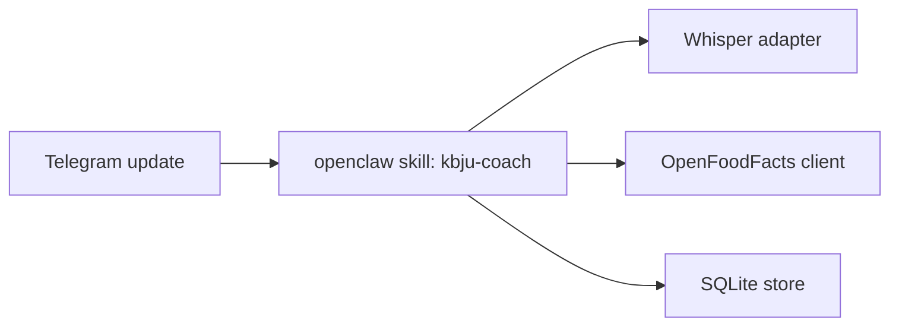

# ARCH-001: KBJU Coach v0.1

## 0. Recon Report (Phase 0 — MANDATORY before any design)

> Required input: `docs/knowledge/openclaw.md`, `docs/knowledge/awesome-skills.md`. Reviewer rejects ArchSpecs that skip this section.

### 0.1 OpenClaw capability map

Sources audited before design: local runtime notes in `docs/knowledge/openclaw.md`, skill catalogue notes in `docs/knowledge/awesome-skills.md`, OpenClaw docs (<https://docs.openclaw.ai>), OpenClaw source/README (<https://github.com/openclaw/openclaw>), and the public skills catalogue (<https://github.com/VoltAgent/awesome-openclaw-skills>). OpenClaw remains locked by PRD-001@0.2.0 §7; this map identifies only what the runtime closes and what remains project-owned.

| PRD requirement | OpenClaw built-in that closes infrastructure | Remaining KBJU Coach gap |
|---|---|---|
| PRD-001@0.2.0 §7 Telegram-only channel; PRD-001@0.2.0 §5 US-1 through US-8 Telegram UX | Gateway/channel support includes Telegram and media-capable messaging surfaces per docs (<https://docs.openclaw.ai>) and source README (<https://github.com/openclaw/openclaw>). | Russian onboarding, commands, inline confirm/edit/delete affordances, typing indicator behavior, and all bot copy. |
| PRD-001@0.2.0 §5 US-2 voice logging; §2 G3 voice latency | Voice/media routing can pass voice input to a skill; local runtime notes identify `VoiceWake` pre-routing to a transcription skill. | Actual Russian transcription provider adapter, retry/fallback policy, transcript retention, and latency/cost measurement. |
| PRD-001@0.2.0 §5 US-4 photo logging | OpenClaw media transport passes photo input into skills; sandbox isolates the skill process. | Meal-photo recognition, low-confidence threshold, mandatory confirmation UX, raw photo deletion after extraction. |
| PRD-001@0.2.0 §5 US-5 summaries | `cron-tools` / scheduled triggers are a built-in OpenClaw path for periodic skill invocation. | User-local schedule definitions, summary aggregation, Russian recommendation prompt, and no-meal nudge content. |
| PRD-001@0.2.0 §2 G2/G3/K2/K3 latency measurement; §7 observability minimums | OpenClaw observability hooks expose per-skill logs, latency metrics, and token spend. | Concrete log schema, metric names, user-scoped correlation IDs, and end-of-pilot KPI queries. |
| PRD-001@0.2.0 §2 G5 cost ceiling | OpenClaw model failover retries providers on errors; OpenClaw supports provider config/fallbacks per docs/source. | Monthly spend accumulator, hard per-call token budgets, auto-degrade trigger, and PO alert. |
| PRD-001@0.2.0 §2 G4 and §5 US-9 tenant isolation | OpenClaw sandbox/process isolation separates the skill process from the host. | Storage-level `user_id` scoping, no unscoped queries, per-user audit log, and end-of-pilot cross-user audit query. |
| PRD-001@0.2.0 §7 secrets | OpenClaw injects secrets through runtime context / env-var style secret handling per local runtime notes and docs. | `.env.example` schema, secret names, least-privilege API keys, and no raw key logging. |
| PRD-001@0.2.0 §7 Node 24 TypeScript runtime | OpenClaw skills are TypeScript on Node 24 per local runtime notes and source README (<https://github.com/openclaw/openclaw>). | Domain implementation must stay in TypeScript; Python/Rust/CLI skills can be referenced but not directly embedded without a later ADR. |

### 0.2 Skill audit (awesome-openclaw-skills)
| Candidate skill (URL) | Matches which PRD §/Goal | Verdict | Rationale |
|---|---|---|---|

Capability A - KBJU / nutrition calculation and meal logging.

| Candidate skill (URL) | Matches which PRD §/Goal | Verdict | Rationale |
|---|---|---|---|
| [`calorie-counter`](https://github.com/openclaw/skills/tree/main/skills/cnqso/calorie-counter) | PRD-001@0.2.0 §5 US-2/US-3/US-7; §2 G1 | reference | Python 3.7 stdlib + SQLite, MIT via skills repo license (<https://github.com/openclaw/skills/blob/main/LICENSE>), last path commit 2026-02-05 (<https://github.com/openclaw/skills/commits/main/skills/cnqso/calorie-counter>). It is forkable but tracks only calories/protein, expects manual values, and misses fat/carbs, Russian parsing, tenant isolation, and confirmation gates. |
| [`diet-tracker`](https://github.com/openclaw/skills/tree/main/skills/yonghaozhao722/diet-tracker) | PRD-001@0.2.0 §5 US-2/US-3/US-5; §2 G1 | reject | Python scripts + Chinese fallback database (`food_database.json` contains Chinese Subway items, no Russian alias corpus), MIT via skills repo, last path commit 2026-02-20 (<https://github.com/openclaw/skills/commits/main/skills/yonghaozhao722/diet-tracker>). ClawHub flags it suspicious, it reads `USER.md` and memory files instead of tenant-scoped storage, and it includes cron reminders outside our UX. |
| [`opencal`](https://github.com/openclaw/skills/tree/main/skills/neikfu/opencal) | PRD-001@0.2.0 §5 US-2/US-3/US-6; §7 food/nutrition database | reference | SKILL-only curl/jq wrapper around OpenCal API, requires `OPENCAL_API_KEY` and an OpenCal iOS account, MIT via skills repo, last path commit 2026-02-19 (<https://github.com/openclaw/skills/commits/main/skills/neikfu/opencal>). Its per-100g scaling and log/delete API shape are useful, but forking would bind the pilot to an external app/account and offload user records outside our right-to-delete boundary. |

Capability B - Voice transcription for Russian Telegram voice messages.

| Candidate skill (URL) | Matches which PRD §/Goal | Verdict | Rationale |
|---|---|---|---|
| [`mh-openai-whisper-api`](https://github.com/openclaw/skills/tree/main/skills/mohdalhashemi98-hue/mh-openai-whisper-api) | PRD-001@0.2.0 §5 US-2/US-7; §2 G3/G5 | reference | Shell/curl wrapper around OpenAI `/v1/audio/transcriptions`, requires `OPENAI_API_KEY`, MIT via skills repo, last path commit 2026-02-25 (<https://github.com/openclaw/skills/commits/main/skills/mohdalhashemi98-hue/mh-openai-whisper-api>). It matches the project default provider path in `docs/knowledge/awesome-skills.md`, but should be reimplemented as a typed Node 24 adapter rather than vendoring shell. |
| [`faster-whisper`](https://github.com/openclaw/skills/tree/main/skills/theplasmak/faster-whisper) | PRD-001@0.2.0 §5 US-2; §7 v0.2 local-transcription swap | reference | Python 3.10 + CTranslate2/faster-whisper with optional ffmpeg/yt-dlp/pyannote, MIT via skills repo, last path commit 2026-02-19 (<https://github.com/openclaw/skills/commits/main/skills/theplasmak/faster-whisper>). Good v0.2 reference for provider abstraction, but v0.1 VPS envelope is ≤2 GB steady RAM and this is a Python local-model stack, not Node 24. |
| [`auto-whisper-safe`](https://github.com/openclaw/skills/tree/main/skills/neal-collab/auto-whisper-safe) | PRD-001@0.2.0 §5 US-2; §7 resource ceiling | reject | Shell wrapper over local `whisper` + `ffmpeg`, default base model ~1.5 GB RAM, MIT via skills repo, last path commit 2026-02-14 (<https://github.com/openclaw/skills/commits/main/skills/neal-collab/auto-whisper-safe>). It optimizes long files, while PRD-001@0.2.0 limits voice to ≤15 s and requires low p95 latency; it would consume most of the 2 GB steady-state budget. |
| [`assemblyai-transcribe`](https://github.com/openclaw/skills/tree/main/skills/tristanmanchester/assemblyai-transcribe) | PRD-001@0.2.0 §5 US-2/US-7 | reject | Node 18+ CLI, requires `ASSEMBLYAI_API_KEY`, MIT via skills repo, last path commit 2026-03-14 (<https://github.com/openclaw/skills/commits/main/skills/tristanmanchester/assemblyai-transcribe>). Rich diarization/translation features exceed v0.1 need and add a second paid transcription provider without a PRD requirement. |
| [`deepgram`](https://github.com/openclaw/skills/tree/main/skills/nerkn/deepgram) | PRD-001@0.2.0 §5 US-2/US-7 | reject | SKILL-only guide to `@deepgram/cli`, requires Deepgram API key/account, MIT via skills repo, last path commit 2026-02-03 (<https://github.com/openclaw/skills/commits/main/skills/nerkn/deepgram>). It is not forkable application code and would introduce a CLI dependency plus another paid provider before ADR comparison. |
| [`elevenlabs-transcribe`](https://github.com/openclaw/skills/tree/main/skills/paulasjes/elevenlabs-transcribe) | PRD-001@0.2.0 §5 US-2/US-7 | reject | Python 3.8 + ffmpeg wrapper requiring `ELEVENLABS_API_KEY`, MIT via skills repo, last path commit 2026-02-03 (<https://github.com/openclaw/skills/commits/main/skills/paulasjes/elevenlabs-transcribe>). ClawHub marks OpenClaw audit suspicious; Scribe features are broader than v0.1 and must compete in ADR, not be forked silently. |

Capability C - Photo meal recognition and confidence labelling.

| Candidate skill (URL) | Matches which PRD §/Goal | Verdict | Rationale |
|---|---|---|---|
| [`google-gemini-media`](https://github.com/openclaw/skills/tree/main/skills/xsir0/google-gemini-media) | PRD-001@0.2.0 §5 US-4; §7 photo latency/cost | reference | Node.js/REST templates for Gemini image understanding/generation, requires `GEMINI_API_KEY`, declares MIT in SKILL, last path commit 2026-01-28 (<https://github.com/openclaw/skills/commits/main/skills/xsir0/google-gemini-media>). Useful for Files API vs inline image routing patterns, but it is generic media guidance and has no meal macro schema, confidence threshold, or confirmation UX. |
| [`hotdog`](https://github.com/openclaw/skills/tree/main/skills/mishafyi/hotdog) | PRD-001@0.2.0 §5 US-4 | reject | SKILL-only curl workflow to a public hotdog battle API, MIT via skills repo, last path commit 2026-02-10 (<https://github.com/openclaw/skills/commits/main/skills/mishafyi/hotdog>). It leaks images to a public leaderboard path, embeds a bearer token in instructions, and classifies only hotdog/not-hotdog rather than meal contents/macros. |
| [`image-detection`](https://github.com/openclaw/skills/tree/main/skills/raghulpasupathi/image-detection) | PRD-001@0.2.0 §5 US-4 | reject | Markdown guide to npm/HuggingFace/Hive AI-generated-image detectors, MIT via skills repo, last path commit 2026-02-21 (<https://github.com/openclaw/skills/commits/main/skills/raghulpasupathi/image-detection>). Wrong domain: detects AI-generated images/NSFW, not food items, portions, or KBJU estimates. |
| [`vtl-image-analysis`](https://github.com/openclaw/skills/tree/main/skills/rusparrish/vtl-image-analysis) | PRD-001@0.2.0 §5 US-4 | reject | Python 3 + numpy/opencv/scikit-image/scipy/pyyaml, per-skill license file plus MIT-compatible public source, last path commit 2026-02-25 (<https://github.com/openclaw/skills/commits/main/skills/rusparrish/vtl-image-analysis>). Wrong domain: composition diagnostics for generated images, no food recognition or nutrition path. |

Capability D - Periodic summary generation / coach wording.

| Candidate skill (URL) | Matches which PRD §/Goal | Verdict | Rationale |
|---|---|---|---|
| [`health-summary`](https://github.com/openclaw/skills/tree/main/skills/yusaku-0426/health-summary) | PRD-001@0.2.0 §5 US-5 | reference | JavaScript `health_summary.js` contract in SKILL metadata, MIT via skills repo, last path commit 2026-02-25 (<https://github.com/openclaw/skills/commits/main/skills/yusaku-0426/health-summary>). Closest domain match for daily/weekly/monthly nutrition totals, but Japanese copy and extra water/fiber/sodium/exercise fields conflict with Russian-only UX and PRD-001@0.2.0 §3 NG2/NG6. |
| [`daily-report`](https://github.com/openclaw/skills/tree/main/skills/visualdeptcreative/daily-report) | PRD-001@0.2.0 §5 US-5; §2 G5 cost alert | reference | Prompt/format SKILL for local Ollama aggregation and Telegram alerts, MIT via skills repo, last path commit 2026-02-05 (<https://github.com/openclaw/skills/commits/main/skills/visualdeptcreative/daily-report>). Good reference for budget-report wording and scheduled report structure, but domain is lead-generation pipeline and not forkable KBJU logic. |
| [`ai-conversation-summary`](https://github.com/openclaw/skills/tree/main/skills/dadaliu0121/ai-conversation-summary) | PRD-001@0.2.0 §5 US-5 | reject | SKILL-only curl call to an external summary API, MIT declared in SKILL, last path commit 2026-02-05 (<https://github.com/openclaw/skills/commits/main/skills/dadaliu0121/ai-conversation-summary>). Sends user text to an unrelated endpoint, lacks cost controls, and summarizes chat history rather than KBJU periods. |
| [`meeting-summarizer`](https://github.com/openclaw/skills/tree/main/skills/claudiodrusus/meeting-summarizer) | PRD-001@0.2.0 §5 US-5 | reject | ClawHub page exists (<https://clawskills.sh/skills/claudiodrusus-meeting-summarizer>) and commit history shows a 2026-03-05 path entry, but the current GitHub contents endpoint returns 404; source/README cannot be audited at current main. Rejecting avoids designing against unavailable source. |

Capability E - Scheduling / timezone support for reports.

| Candidate skill (URL) | Matches which PRD §/Goal | Verdict | Rationale |
|---|---|---|---|
| [`cron-scheduling`](https://github.com/openclaw/skills/tree/main/skills/gitgoodordietrying/cron-scheduling) | PRD-001@0.2.0 §5 US-5; §7 scheduled summaries | reference | SKILL-only guide for cron/systemd timers, MIT via skills repo, last path commit 2026-02-03 (<https://github.com/openclaw/skills/commits/main/skills/gitgoodordietrying/cron-scheduling>). Useful for idempotency/DST caveats, but OpenClaw `cron-tools` is already the project path; no separate cron/systemd integration should be forked. |
| [`temporal-cortex-datetime`](https://github.com/openclaw/skills/tree/main/skills/billylui/temporal-cortex-datetime) | PRD-001@0.2.0 §5 US-1/US-5 timezone confirmation | reference | Rust MCP binary distributed through npm, MIT declared in SKILL, last path commit 2026-03-10 (<https://github.com/openclaw/skills/commits/main/skills/billylui/temporal-cortex-datetime>). Strong reference for DST-aware parsing, but adding Rust/MCP runtime is unnecessary for v0.1 once a user confirms a fixed report time/timezone. |
| [`temporal-cortex-scheduling`](https://github.com/openclaw/skills/tree/main/skills/billylui/temporal-cortex-scheduling) | PRD-001@0.2.0 §5 US-5 only superficially | reject | Rust MCP binary + OAuth credentials for Google/Outlook/CalDAV, MIT declared in SKILL, last path commit 2026-03-10 (<https://github.com/openclaw/skills/commits/main/skills/billylui/temporal-cortex-scheduling>). It implements calendar booking, directly conflicting with PRD-001@0.2.0 §3 NG1. |
| [`calendar-scheduling`](https://github.com/openclaw/skills/tree/main/skills/billylui/calendar-scheduling) | PRD-001@0.2.0 §5 US-5 only superficially | reject | ClawHub page exists (<https://clawskills.sh/skills/billylui-calendar-scheduling>) with OAuth calendar requirements; content overlaps Temporal Cortex scheduling. It is calendar integration, which PRD-001@0.2.0 §3 NG1 explicitly excludes. |
| [`cron-optimizer`](https://github.com/openclaw/skills/tree/main/skills/autogame-17/cron-optimizer) | PRD-001@0.2.0 §5 US-5 only superficially | reject | ClawHub page exists (<https://clawskills.sh/skills/autogame-17-cron-optimizer>) and commit history shows a 2026-03-02 path entry, but the current GitHub contents endpoint returns 404; also optimizes host cron state, which is outside the locked OpenClaw scheduled-trigger path. |

### 0.3 Build-vs-fork-vs-reuse decision summary

Phase 0 produces zero direct forks for v0.1. All audited candidates are either wrong-language for the locked TypeScript/Node 24 skill runtime, too generic, not Russian/tenant-aware, unavailable at current source, externally account-bound, or outside PRD-001@0.2.0 scope. The Executor should build the KBJU domain logic, tenant-scoped storage, confirmation/edit/delete flows, photo confidence handling, right-to-delete, and spend-degrade logic from scratch inside OpenClaw skills; the architecture may reference `mh-openai-whisper-api` for hosted Whisper request shape, `faster-whisper` for a future provider abstraction, `opencal` for per-100g nutrition scaling, `google-gemini-media` for image-understanding request routing, `health-summary` for period aggregation shape, and `cron-scheduling` / `temporal-cortex-datetime` for DST/idempotency considerations.

Capabilities with no suitable fork-candidate: Russian onboarding and target calculation; tenant-isolated meal/audit/transcript storage; Russian confirm/edit/delete UX; photo-to-macro estimation with a numeric low-confidence threshold; monthly cost guard and auto-degrade; right-to-delete; end-of-pilot cross-user audit.

## 1. Context
Implements: PRD-001@0.2.0 §2 Goals, §5 User Stories, §6 KPIs, §7 Technical Envelope, and PO OBC/answers recorded in `docs/questions/Q-ARCH-001-gap-report-2026-04-26.md`.
Does NOT implement: PRD-001@0.2.0 §3 Non-Goals.

### 1.1 Trace matrix
| PRD section | PRD Goal / US | Components that satisfy it |
|---|---|---|
| PRD-001@0.2.0 §2 G1 | Logging volume: ≥3 confirmed meals/day on ≥5 of any rolling 7-day window per pilot user. | C1 Access-Controlled Telegram Entrypoint; C3 Tenant-Scoped Store; C4 Meal Logging Orchestrator; C6 KBJU Estimator; C8 History Mutation Service; C10 Cost, Degrade, and Observability Service |
| PRD-001@0.2.0 §2 G2 | Time-to-first-value: first meal-content message to KBJU draft ≤120 seconds. | C1 Access-Controlled Telegram Entrypoint; C4 Meal Logging Orchestrator; C5 Voice Transcription Provider; C6 KBJU Estimator; C7 Photo Recognition Provider; C10 Cost, Degrade, and Observability Service |
| PRD-001@0.2.0 §2 G3 | Voice round-trip latency: voice ≤15 s returns draft within ≤8 s p95 / ≤30 s p100 and continuous typing indicator. | C1 Access-Controlled Telegram Entrypoint; C4 Meal Logging Orchestrator; C5 Voice Transcription Provider; C6 KBJU Estimator; C10 Cost, Degrade, and Observability Service |
| PRD-001@0.2.0 §2 G4 | Tenant isolation: zero cross-user data leaks. | C1 Access-Controlled Telegram Entrypoint; C3 Tenant-Scoped Store; C10 Cost, Degrade, and Observability Service; C11 Right-to-Delete and Tenant Audit Service |
| PRD-001@0.2.0 §2 G5 | Cost ceiling: LLM + voice transcription ≤$10/month with auto-degrade and PO alert. | C5 Voice Transcription Provider; C6 KBJU Estimator; C7 Photo Recognition Provider; C9 Summary Recommendation Service; C10 Cost, Degrade, and Observability Service |
| PRD-001@0.2.0 §5 US-1 | Onboarding and personalized targets. | C1 Access-Controlled Telegram Entrypoint; C2 Onboarding and Target Calculator; C3 Tenant-Scoped Store |
| PRD-001@0.2.0 §5 US-2 | Voice meal logging with transcription, draft KBJU estimate, confirm/edit, and persistence. | C1 Access-Controlled Telegram Entrypoint; C3 Tenant-Scoped Store; C4 Meal Logging Orchestrator; C5 Voice Transcription Provider; C6 KBJU Estimator; C10 Cost, Degrade, and Observability Service |
| PRD-001@0.2.0 §5 US-3 | Text meal logging with draft KBJU estimate, confirm/edit, and persistence. | C1 Access-Controlled Telegram Entrypoint; C3 Tenant-Scoped Store; C4 Meal Logging Orchestrator; C6 KBJU Estimator; C10 Cost, Degrade, and Observability Service |
| PRD-001@0.2.0 §5 US-4 | Photo meal logging with estimated items/macros, low-confidence label, mandatory confirmation, and correction. | C1 Access-Controlled Telegram Entrypoint; C3 Tenant-Scoped Store; C4 Meal Logging Orchestrator; C6 KBJU Estimator; C7 Photo Recognition Provider; C10 Cost, Degrade, and Observability Service |
| PRD-001@0.2.0 §5 US-5 | Daily / weekly / monthly summaries with totals, deltas, previous-period comparison, and KBJU-only recommendation. | C2 Onboarding and Target Calculator; C3 Tenant-Scoped Store; C9 Summary Recommendation Service; C10 Cost, Degrade, and Observability Service |
| PRD-001@0.2.0 §5 US-6 | Edit / delete any past meal with pagination and audit log; future summaries reflect corrections. | C1 Access-Controlled Telegram Entrypoint; C3 Tenant-Scoped Store; C8 History Mutation Service; C9 Summary Recommendation Service |
| PRD-001@0.2.0 §5 US-7 | Failure UX with manual fallbacks for transcription, KBJU computation, and transport failures. | C1 Access-Controlled Telegram Entrypoint; C4 Meal Logging Orchestrator; C5 Voice Transcription Provider; C6 KBJU Estimator; C7 Photo Recognition Provider; C10 Cost, Degrade, and Observability Service |
| PRD-001@0.2.0 §5 US-8 | Right-to-delete with explicit confirmation and fresh onboarding after deletion. | C1 Access-Controlled Telegram Entrypoint; C3 Tenant-Scoped Store; C11 Right-to-Delete and Tenant Audit Service |
| PRD-001@0.2.0 §5 US-9 | Multi-tenant data isolation for every persistent record and end-of-pilot audit query. | C1 Access-Controlled Telegram Entrypoint; C3 Tenant-Scoped Store; C10 Cost, Degrade, and Observability Service; C11 Right-to-Delete and Tenant Audit Service |
| PRD-001@0.2.0 §6 K1 | Daily confirmed meals logged per active pilot user. | C3 Tenant-Scoped Store; C4 Meal Logging Orchestrator; C10 Cost, Degrade, and Observability Service |
| PRD-001@0.2.0 §6 K2 | Time-to-first-value measurement. | C1 Access-Controlled Telegram Entrypoint; C4 Meal Logging Orchestrator; C10 Cost, Degrade, and Observability Service |
| PRD-001@0.2.0 §6 K3 | Voice latency measurement over rolling 7-day windows. | C5 Voice Transcription Provider; C10 Cost, Degrade, and Observability Service |
| PRD-001@0.2.0 §6 K4 | Cross-user data leak audit over stored records. | C3 Tenant-Scoped Store; C11 Right-to-Delete and Tenant Audit Service |
| PRD-001@0.2.0 §6 K5 | Monthly LLM + voice-transcription spend and auto-degrade evidence. | C5 Voice Transcription Provider; C6 KBJU Estimator; C7 Photo Recognition Provider; C9 Summary Recommendation Service; C10 Cost, Degrade, and Observability Service |
| PRD-001@0.2.0 §6 K6 | Weekly retention: both pilot users active ≥7/7 days/week for 4 weeks. | C3 Tenant-Scoped Store; C4 Meal Logging Orchestrator; C10 Cost, Degrade, and Observability Service |
| PRD-001@0.2.0 §6 K7 | KBJU estimation accuracy target, to be proposed after Phase 5-6 feasibility analysis. | C6 KBJU Estimator; C7 Photo Recognition Provider; C10 Cost, Degrade, and Observability Service |

Every PRD Goal MUST appear. Every component MUST trace back to ≥1 PRD row.

## 2. Architecture Overview
<Prose + Mermaid diagram.>



## 3. Components
### 3.1 <Component name>
- Responsibility: <1 sentence>
- Inputs: ...
- Outputs: ...
- LLM usage: none | <model, purpose>
- State: stateless | <where stored>
- Failure modes: <external API down / LLM timeout / rate-limited / malformed input / concurrent invocation>

### 3.2 ...

## 4. Data Flow
<Step-by-step; what data is produced where.>

## 5. Data Model / Schemas (declarative — no runnable code)
```yaml
EntityName:
  id: uuid
  field: type
```

## 6. External Interfaces
| System | Protocol | Auth | Rate limit | Failure mode |
|---|---|---|---|---|
| Telegram Bot API | HTTPS | bot token | 30 msg/s/chat | retry w/ backoff |
| OpenFoodFacts | HTTPS | none | ≈100 req/min | cache + LLM fallback |
| Whisper | HTTPS | API key | 50 req/min (OpenAI) | local fallback in v0.2 |

## 7. Tech Stack Decisions (linked ADRs)
- Language / runtime: <choice> — `ADR-XXX@X.Y.Z`
- Storage: <choice> — `ADR-XXX@X.Y.Z`
- Voice transcription: <choice> — `ADR-XXX@X.Y.Z`
- Photo recognition (v0.1): <choice> — `ADR-XXX@X.Y.Z`
- LLM routing: OmniRoute → Fireworks pool — `ADR-XXX@X.Y.Z`
- Deployment: <choice> — `ADR-XXX@X.Y.Z`

## 8. Observability
- Logs: format, where collected
- Metrics: what + endpoint
- Tracing: yes/no + tool

## 9. Security
- Secrets management: <where>
- Network boundaries: <what's exposed>
- LLM prompt-injection mitigations: <concrete; "sanitise inputs" alone is rejected>
- PII handling: <retention, deletion path>

## 10. Deployment
- Runtime: openclaw skill image, Docker Compose on VPS
- Resource budget: <CPU/RAM — must fit PRD Technical Envelope>
- Rollback procedure: <actual command sequence, not "revert to previous version">

## 11. Work Breakdown (tickets for Executor)
| ID | Title | Depends on | Assigned executor |
|---|---|---|---|
| TKT-XXX | … | — | glm-5.1 |

## 12. Risks & Open Questions
- R1: ...
- Q_TO_BUSINESS_1: ... ← escalation upstream

---

## Handoff Checklist
- [ ] §0 Recon Report present, ≥3 candidates audited per major capability
- [ ] Trace matrix covers every PRD Goal
- [ ] Each component has clear Inputs / Outputs / failure modes
- [ ] All referenced ADRs exist and are `proposed` or `accepted`
- [ ] Resource budget fits PRD Technical Envelope (numeric check)
- [ ] Work Breakdown lists ≥3 atomic tickets with explicit dependency graph
- [ ] §8, §9, §10 are non-empty with concrete choices
- [ ] All PRD/ADR references pin to a specific version (`@X.Y.Z`)
- [ ] No production code in this file (schemas in §5 are declarative YAML only)
