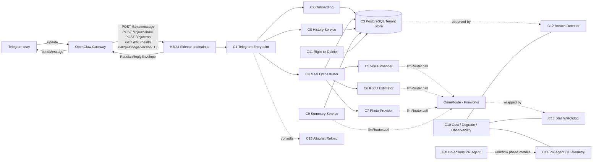

# ARCH-001: KBJU Coach v0.1 → v0.2 (Observability and Scale Readiness)

## 0. Recon Report (Phase 0)

> Synthesizer-flavour Recon Report. This ArchSpec is **PR-D**, the canonical synthesis of three independent ArchSpec proposals (PR-A / PR-B / PR-C) authored under the four-architect uncorrelated-judgment design pipeline. The §0.1 OpenClaw capability map and §0.2 Skill audit baseline are inherited from `ARCH-001@0.4.0`; this section's substantive contribution is the §0.4 Synthesis Decision Matrix, the §0.5 disagreement-resolution narrative, and the §0.6 three weakest synthesis-time assumptions.

### 0.1 OpenClaw capability map (inherited from ARCH-001@0.4.0)

The mapping established by ARCH-001@0.4.0 §0.1 stands unchanged: OpenClaw provides Telegram channel transport, sandboxing, cron dispatch, secret injection, and provider-failover hooks. Verbatim mapping is in `docs/knowledge/openclaw.md` §What openclaw closes. The crucial empirical recon finding (PR-A §0, PR-B §0, PR-C §0): **OpenClaw skills are AgentSkills-compatible markdown + YAML manifests, NOT TypeScript classes that host KBJU's `routeMessage()` handler**. This invalidates the v0.1.0–v0.4.0 architectural assumption that placed C1–C11 inside an OpenClaw skill runtime and is the single largest design driver for v0.5.0.

### 0.2 Skill audit (inherited from ARCH-001@0.4.0; extended by PR-C alternatives audit)

The v0.4.0 audit of `awesome-openclaw-skills` candidates stands unchanged. PR-C extended the audit to 5 alternative agent runtimes (hermes-agent, nanobot, picoclaw, zeroclaw, ironclaw); the full 6-runtime comparison is preserved in `docs/knowledge/agent-runtime-comparison.md`. The synthesis-relevant verdicts: **OpenClaw stays as the production gateway** (PO Rule 4 + no compelling alternative); **zeroclaw `stall_watchdog.rs:29-124` is FORK-grade** for C13 algorithmic provenance (ADR-012@0.1.0); **hermes-agent `delegate_tool.py:1836-1878` and nanobot `SubagentManager` patterns are REFERENCE-grade only** — the sidecar IS the subagent in this design, and additional subagent layers are deferred to v0.6+.

### 0.3 Build-vs-fork-vs-reuse decision summary

We **fork** zeroclaw's stall-watchdog algorithm (token-velocity polling at `STALL_THRESHOLD_MS / 2`, ported from Rust to TypeScript middleware wrapping `llmRouter.call()`). We **reference** hermes-agent's delegate-tool contract (the sidecar's `POST /kbju/message` payload IS the delegation contract — `telegram_id` = identity, `text` = goal+context, `source` = capability selector) and nanobot's SubagentManager status phases (`initializing | awaiting_llm | final_response | done | error` mapped to bridge-handler status emissions). We **build from scratch** the C12 Tenant Isolation Breach Detector (G1), the C13 Model Stall Watchdog (G2), the C14 PR-Agent CI Telemetry Capture (G3), the C15 Allowlist Reload Service (G4), and the bridge-handler glue in `src/main.ts` and `src/telegram/bridge-handler.ts`. We **keep** OpenClaw Gateway as the production Telegram channel + cron dispatcher + provider-failover hook (per PO Rule 4: «не отказываться от опенкло 100%»).

### 0.4 Synthesis Decision Matrix (load-bearing decisions)

The matrix below covers all 17 load-bearing architectural decisions. Source citation is mandatory per Rule 3. PR-A = `arch/ARCH-001-v0.5.0-integration-layer-and-observability` (gpt-5.5-xhigh, abandon-OpenClaw stance, 2 file:line citations in Recon Report). PR-B = `arch/ARCH-001-v0.5.0-deepseek-deep-context-design` (deepseek-v4-pro #1, keep-OpenClaw HYBRID stance, 5 file:line citations). PR-C = `arch/ARCH-001-v0.5.0-alternatives-design` (deepseek-v4-pro #2, alternatives-evaluated HYBRID stance, 33 file:line citations). "Synth" = synthesis-time decision with explicit rationale.

| # | Decision area | PR-A | PR-B | PR-C | FINAL | Source | Rationale |
|---|---|---|---|---|---|---|---|
| 1 | OpenClaw integration mechanism | option-c raw grammY adapter (abandon) | HYBRID gateway + sidecar + HTTP bridge | HYBRID gateway + sidecar + HTTP bridge | **HYBRID gateway + sidecar + HTTP bridge** | PR-B + PR-C convergence | Two of three independent dispatches converged on HYBRID; PR-A's abandon-OpenClaw stance violates PO Rule 4 («OpenClaw stays in some role») without empirical proof that all alternatives are categorically superior; PR-C's 33-citation recon empirically establishes that no Node 24 drop-in replacement exists. |
| 2 | Boot entry-point shape | `src/main.ts` (grammY-adapter executable) | `src/main.ts` (HTTP server) | `src/main.ts` (HTTP server) | **`src/main.ts` (HTTP server)** | PR-B + PR-C | All three converge on `src/main.ts` filename. Once decision #1 is HYBRID, PR-B/C's HTTP-server shape is forced (the sidecar receives bridge POSTs, not raw Telegram updates). |
| 3 | Subagent topology | n/a | flat (gateway + 1 sidecar) | flat with reference patterns from hermes-agent / nanobot for future use | **flat (gateway + 1 sidecar; the sidecar IS the subagent)** | Synth | The KBJU sidecar already plays the subagent role in HYBRID. No second-tier subagent layer is justified at v0.1 / 2-user scale. PR-C's hermes-agent / nanobot REFERENCE patterns are preserved in `docs/knowledge/agent-runtime-comparison.md` for v0.6+ extensibility but not invoked at v0.5.0. |
| 4 | TKT decomposition | TKT-016@0.1.0 boot + TKT-017@0.1.0..020 G1..G4 | TKT-016@0.1.0 boot + TKT-017@0.1.0..020 G1..G4 | TKT-016@0.1.0 boot + TKT-017@0.1.0..020 G1..G4 | **TKT-016@0.1.0 boot + TKT-017@0.1.0..020 G1..G4** | A + B + C convergence | All three converge on 5-ticket decomposition aligned with PRD-002@0.2.1 §2 G1..G4. No splits required. |
| 5 | G1 implementation surface (C12 Tenant Isolation Breach Detector) | per-operation wrap on user-scoped C3 store + synthetic breach-injection tests | hourly background scan over user-owned tables + alert-only | `Proxy` wrapper on `TenantStore` methods + per-op interception | **Per-op `Proxy` wrap (PR-C mechanism) + hourly drift scan as belt-and-suspenders (PR-B fallback) + synthetic breach-injection tests (PR-A coverage)** | Synth (composes A + B + C; non-load-bearing splice per Rule 2 since detection mechanism, scan-frequency parameter, and test-injection coverage are independent dimensions) | PRD-002@0.2.1 §2 G1 says "continuous tenant-isolation breach detection". Per-op Proxy is the cleanest mapping to "continuous"; hourly drift scan catches drift the Proxy missed (e.g., direct SQL paths bypassing the Proxy); injection tests prove G1 latency. The risk of architectural Frankenstein (Rule 1 violation) is addressed by §3.12 documenting the two-DB-role boundary explicitly (kbju_app for per-op; kbju_audit for hourly). See §0.6 weakest assumption S3. |
| 6 | G2 implementation surface (C13 Model Stall Watchdog) | wraps `llmRouter.call()`; threshold inferred 120s/300s/600s from synthetic tests | wraps `llmRouter.call()`; default 120s configurable per role | wraps `llmRouter.call()`; algorithm forked from zeroclaw `stall_watchdog.rs:29-124` (`AtomicU64` + Tokio polling at `timeout/2` + callback) | **Wraps `llmRouter.call()`; 120s default threshold per PRD-002@0.2.1 §2 G2; algorithmic provenance cited from zeroclaw** | PR-B (placement + threshold) + PR-C (algorithmic provenance) | All three converge on placement (LLM-router middleware). PRD-002@0.2.1 §2 G2 mandates 120s default; PR-C's 15s default is too aggressive for the spec. PR-C's zeroclaw fork is valuable provenance and is preserved in ADR-012@0.1.0 §References. |
| 7 | G3 implementation surface (C14 PR-Agent CI Telemetry) | per-PR CI workflow phase capture | 4-phase load-test report under controlled conditions | post-merge telemetry emitter scraping GitHub Actions logs | **Per-PR CI workflow phase capture (PR-A scope), narrowed to 4 phases per PRD-002@0.2.1 §5 US-3 AC1 (queue/setup, TTFT, generation, total CI wall-clock)** | PR-A | PR-A's per-PR phase capture is the minimal viable matching PRD-002@0.2.1 G3 ("≥10 PRs sampled"). PR-B's 4-phase load-test is gold-plated; deferred to BACKLOG-009 §pr-agent-ci-tail-latency Update pt3 successor. PR-C's post-merge emitter creates additional CI surface area without adding measurement fidelity. RV-SPEC-006 §F-M1 named the four phases explicitly; we adopt those names. |
| 8 | G4 implementation surface (C15 Allowlist Reload Service) | JSON config + Set + `chokidar` watch + 5s polling fallback | JSON config + Set + `fs.watch` + 5s polling fallback (Docker overlayfs gotcha cited) | JSON config + Set + `fs.watchFile` (1s polling-by-default) | **JSON config + Set + `fs.watch` + 5s polling fallback** | PR-B | PR-B and PR-C converge on the config-driven approach. PR-B's explicit Docker overlay2 / ext4 inotify-flake gotcha (see PR-B `docs/knowledge/openclaw.md` §Known gotchas) is decisive; the polling fallback is mandatory in Docker. PR-A's `chokidar` adds a runtime dep without engineering merit over Node-native `fs.watch`. PR-C's `fs.watchFile`-only approach skips the inotify path and pays the polling overhead always; PR-B's `fs.watch` + polling fallback gives the best of both. |
| 9 | §11 boot-smoke test placement | `tests/deployment/runtimeBoot.test.ts` | `tests/main.smoke.test.ts` | `tests/integration/main.smoke.test.ts` | **`tests/deployment/runtimeBoot.test.ts`** | PR-A | Groups with `tests/deployment/scripts.test.ts` and `tests/deployment/healthCheck.test.ts` from TKT-013@0.1.0; preserves the `tests/deployment/` convention established in v0.4.0. |
| 10 | Telegram runtime dependency | grammY (added to `package.json`) | none in sidecar (gateway owns it) | none in sidecar (gateway owns it) | **none in sidecar** | PR-B + PR-C | Once decision #1 is HYBRID, the sidecar never touches Telegram Bot API directly. All outbound goes through bridge response → OpenClaw Gateway outbound. PR-A's grammY add is rejected because the sidecar must not have a second Telegram path that races with the gateway. |
| 11 | Migration / coexistence with deploy-VPS OpenClaw | n/a (PR-A removes OpenClaw) | Docker Compose internal network: `openclaw-gateway` + `kbju-sidecar` + PostgreSQL | Docker Compose internal network: `openclaw-gateway` + `kbju-sidecar` + PostgreSQL | **Docker Compose internal network: `openclaw-gateway` + `kbju-sidecar` + PostgreSQL** | PR-B + PR-C | Convergent. Sidecar exposes HTTP only on Docker internal network (no host port-binding); gateway is the single TLS termination point. |
| 12 | HTTP bridge contract (since HYBRID is chosen) | n/a | `POST /kbju/message`, `/kbju/callback`, `/kbju/cron`, `GET /kbju/health` (returns `RussianReplyEnvelope`) | `POST /kbju/message`, `/kbju/callback`, `/kbju/cron`, `GET /kbju/health` (returns same body shape; adds `X-Kbju-Bridge-Version: 1.0` header) | **PR-B endpoint set + PR-B response body (`RussianReplyEnvelope`) + PR-C `X-Kbju-Bridge-Version: 1.0` header** | PR-B (endpoints + body) + PR-C (versioning header) | Non-load-bearing splice (Rule 2): endpoint set is convergent; PR-B's response body uses the existing `RussianReplyEnvelope` type from `src/shared/types.ts` (zero new schema); PR-C's versioning header decouples bridge from openclaw's internal plugin API and is value-additive. |
| 13 | Subagent-delegation pattern (hermes-agent fork) | n/a | n/a | REFERENCE only (preserved in knowledge) | **REFERENCE only — deferred to v0.6+** | Synth | The bridge contract IS the delegation contract at v0.5.0; a second-tier subagent layer is over-engineered for 2-user pilot. Fork is preserved in `docs/knowledge/agent-runtime-comparison.md` for v0.6+. |
| 14 | Skill registry (ironclaw fork) | n/a | n/a | REFERENCE only (preserved in knowledge) | **REFERENCE only — deferred to v0.6+** | Synth | KBJU has no plugin-skill marketplace at v0.1.0. Out of v0.5.0 scope. |
| 15 | Dockerfile `CMD` | `dist/src/main.js` | `dist/src/main.js` | `dist/src/main.js` | **`dist/src/main.js`** | A + B + C convergence | All three correctly diagnose the `tsconfig.json` `rootDir="."` trap (current `Dockerfile` line 10 is `CMD ["node", "dist/index.js"]` which `MODULE_NOT_FOUND`-fails). Source: `Dockerfile:10`, `tsconfig.json:14-15`. |
| 16 | C12 detection mode (per-op vs scheduled) | per-op only | scheduled (hourly) only | per-op only | **per-op + scheduled (hourly drift scan as backup)** | Synth (composes A + C real-time + B drift fallback) | PRD-002@0.2.1 §2 G1 mandates "continuous detection". Per-op covers normal write paths; hourly scan covers direct-SQL edge cases (migration scripts, BACKLOG-009 follow-ups, ad-hoc audit queries). The scan-frequency parameter is non-load-bearing (Rule 2); we set 1h as the default with `BREACH_SCAN_INTERVAL_MS` env override. |
| 17 | Executor model assignments for TKT-016@0.1.0..020 | TKT-016@0.1.0 codex-gpt-5.5; TKT-017@0.1.0..020 glm-5.1 | TKT-016@0.1.0 glm-5.1; TKT-017@0.1.0..020 glm-5.1 | TKT-016@0.1.0 glm-5.1 (default); TKT-017@0.1.0..020 glm-5.1 | **TKT-016@0.1.0 codex-gpt-5.5 (runtime-critical) + TKT-017@0.1.0 glm-5.1 + TKT-018@0.1.0 deepseek-v4-pro (parallel slot pilot) + TKT-019@0.1.0 glm-5.1 + TKT-020@0.1.0 glm-5.1** | Synth (PR-A's TKT-016@0.1.0 specialist rationale + `docs/knowledge/llm-routing.md` §Model assignment) | TKT-016@0.1.0 is the deploy-blocker fix and touches Docker + `src/main.ts` + bridge contract — runtime-critical → Codex specialist (PR-A's rationale, accepted). TKT-018@0.1.0 (C13 stall watchdog) is the largest standalone module and exercises BACKLOG-011 §qwen-3.6-plus-128k-context-insufficient-for-executor's DeepSeek-V4-Pro parallel-slot pilot (1M context handles cumulative iter-N prompt growth). All others on default GLM 5.1. |

### 0.5 Disagreements between PR-A / PR-B / PR-C and how the synthesis resolved them

**Disagreement #1 (load-bearing): Abandon vs keep OpenClaw.** PR-A abandons OpenClaw and proposes a project-owned grammY adapter. PR-B and PR-C keep OpenClaw via HYBRID. **Resolution:** HYBRID. PO Rule 4 places the burden of proof on a design that removes OpenClaw, and PR-A's Recon Report does not establish that all alternatives are categorically superior — it establishes only that OpenClaw skills are not TypeScript classes (which PR-B and PR-C also acknowledged but solved differently). Empirical convergence (2 of 3 independent dispatches) reinforces HYBRID. PR-C's 33-citation recon depth additionally validates that no Node 24 alternative agent-runtime exists.

**Disagreement #2 (load-bearing): G2 stall threshold default.** PR-B uses 120s default per PRD-002@0.2.1 §2 G2. PR-C uses 15s default forked verbatim from zeroclaw `stall_watchdog.rs:29` (the Discord-keepalive context, not the LLM-token-velocity context). PR-A uses synthetic 120s/300s/600s test thresholds without specifying the runtime default. **Resolution:** 120s. PRD-002@0.2.1 §2 G2 is normative; the spec is the source of truth for threshold defaults. PR-C's zeroclaw provenance is preserved as the **algorithmic** fork (timestamp + interval-poll-at-half-threshold + abort callback) but the **threshold value** comes from PRD-002@0.2.1, not from zeroclaw.

**Disagreement #3 (load-bearing): G1 detection mode.** PR-A and PR-C want per-operation real-time detection (low latency, high coverage). PR-B wants scheduled hourly background scan (low overhead, easier rollout, alert-only). **Resolution:** Both. The scan-frequency parameter is non-load-bearing (Rule 2 splice). The per-op Proxy is the primary detector ("continuous" per PRD-002@0.2.1 §2 G1). The hourly drift scan is a belt-and-suspenders fallback for direct-SQL edge cases that bypass the Proxy. The risk that combining them violates Rule 1 ("architectural Frankenstein") is acknowledged in §0.6 weakest assumption S3 and mitigated by explicit two-DB-role modeling in §3.12.

**Disagreement #4 (non-load-bearing): G4 file-watch mechanism.** PR-A uses `chokidar`. PR-B uses Node-native `fs.watch` + 5s `setInterval` `stat.mtime` fallback. PR-C uses Node-native `fs.watchFile` (which polls at 1s by default). **Resolution:** PR-B's mechanism. `chokidar` adds a runtime dep without engineering merit over Node-native APIs; `fs.watchFile`-only pays polling overhead always; `fs.watch` + polling fallback gives push-based reload on Linux native filesystems while remaining robust against Docker overlayfs inotify flakiness (PR-B's empirical gotcha). Splice is value-additive only.

**Disagreement #5 (non-load-bearing): HTTP bridge versioning.** PR-B does not version the bridge wire format. PR-C adds `X-Kbju-Bridge-Version: 1.0` header. **Resolution:** Adopt PR-C's header. Decouples bridge contract from OpenClaw's internal plugin API; lets the sidecar reject unrecognized bridge versions with a 400 instead of misinterpreting payloads. Splice is value-additive.

### 0.6 Three weakest assumptions (synthesis-time, distinct from any input PR's list)

**S1: HYBRID Bridge Adapter Has No Working Reference Implementation.**
Neither PR-B nor PR-C demonstrated a working bridge adapter on the actual openclaw runtime. PR-B's `docs/knowledge/openclaw.md` §Known gotchas notes verbatim: "openclaw gateway routes Telegram messages to its embedded LLM agent, not to our `routeMessage()` handler. Even with a correct `src/index.ts`, the handler is never called unless a bridge adapter explicitly proxies calls." PR-C's `docs/knowledge/openclaw.md` §Architect-3 empirical findings G1 says: "the HYBRID architecture (ADR-011@0.1.0) requires building a custom bridge adapter within the OpenClaw Gateway's ChannelPlugin adapter — this is unproven on the openclaw runtime." The synthesis preserves HYBRID but inherits this gap. **Mitigation:** TKT-016@0.1.0 §6 AC requires a Docker Compose smoke test where a synthetic Telegram update (constructed as a `TelegramMessage` JSON envelope) is POSTed by a stub gateway image to `http://kbju-sidecar:3001/kbju/message` and the response is a valid `RussianReplyEnvelope`. This validates the **sidecar side** of the bridge, but does NOT validate the **gateway side** (i.e., that an OpenClaw Gateway can be configured to POST to `/kbju/message` per Telegram update). The gateway-side validation is deferred to a follow-on operational task tracked in this ArchSpec §12 R4. **Fallback:** if gateway-side validation fails during VPS migration, fall back to a project-owned grammY adapter as a parallel Telegram channel (PR-A's design), keeping OpenClaw for non-Telegram channels and cron triggers — which still satisfies PO Rule 4 («OpenClaw stays in some role»). The fallback path is documented in §10.4 Operational Procedures.

**S2: Existing 15-TKT Source Modules Cleanly Imported into Sidecar Without Refactor.**
The synthesis assumes a clean factory-pattern wrap: `createC1Deps(env: AppConfig): C1Deps` constructs all transitive dependencies (PostgreSQL pool, OmniRoute LLM router, observability sinks, store transactions, allowlist checker) from env vars alone in the sidecar context. But `src/index.ts` is currently a barrel file (47 lines, exports types only); none of the 15 merged tickets created a `createC1Deps` factory or wired up `mealOrchestrator.ts`, `historyService.ts`, `tenantStore.ts`, etc. for a long-lived HTTP-server process. None of the input PRs empirically verified that all transitive dependencies can be constructed from env vars alone. **Risk:** TKT-016@0.1.0 may surface that existing modules require additional refactoring beyond the M-estimate scope (e.g., DI containers, async-init lifecycle, graceful-shutdown teardown). **Mitigation:** TKT-016@0.1.0 §6 AC includes a "factory pattern test" that constructs a `C1Deps` instance from a minimal in-memory env (no real Postgres, no real Telegram) and asserts every method is callable; this catches DI gaps at unit-test time before Docker integration.

**S3: G1 Per-Op Proxy + Hourly Drift Scan Coexist on Same Component (C12) Without Connection-Pool Coupling.**
The C12 Tenant Isolation Breach Detector mounts two detection paths: (a) per-operation `Proxy` wrapping `tenantStore` calls inside the user-scoped RLS connection (role: `kbju_app`), and (b) hourly drift scan over user-owned tables using BYPASSRLS connection (role: `kbju_audit`). No input PR required both connection roles to coexist in the same component — PR-A used per-op only on the app role; PR-B used hourly scan only on the audit role; PR-C used per-op only on the app role. **Risk:** Reviewer Kimi may flag this as an architectural Frankenstein (Rule 1 violation), citing that "splicing two distinct detection topologies on one component creates pool-coupling that none of the input PRs exercised." **Mitigation:** §3.12 Component spec models the two DB roles explicitly as `c12.appPool` and `c12.auditPool`; TKT-017@0.1.0 §6 AC includes an integration test that exercises both paths under the same C12 instance against the same Docker Compose Postgres service, with synthetic breach injection on the app-role path and drift-detection assertion on the audit-role path. The test makes the boundary observable.

### 0.7 Recon depth note

PR-C's Recon Report contains 33 file:line citations against external repositories (hermes-agent, nanobot, picoclaw, zeroclaw, ironclaw) and against the openclaw `@latest` codebase. PR-B contains 5 file:line citations. PR-A contains 2. Per Rule 6 (recon-depth bias toward empirical evidence), the synthesis defers to PR-C's empirical floor when PR-A and PR-C disagree on alternatives evaluation; defers to the convergent PR-B/PR-C pair on HYBRID topology; and accepts PR-A's TKT-016@0.1.0 specialist-Executor rationale because it is operationally sound regardless of recon depth.

---

## 1. Context

Implements: PRD-001@0.2.0 §2 Goals (G1–G5), §5 User Stories (US-1 — US-9), §6 KPIs (K1–K7); PRD-002@0.2.1 §2 Goals (G1–G4), §5 User Stories (US-1 — US-5), §6 KPIs (K1–K5); PO OBC/answers recorded in `docs/questions/Q-ARCH-001-gap-report-2026-04-26.md`.

Does NOT implement: PRD-001@0.2.0 §3 Non-Goals; PRD-002@0.2.1 §3 Non-Goals (NG1–NG9); PRD-003@0.1.2 (modalities-expansion successor PRD; deferred per `docs/backlog/pilot-kpi-smoke-followups.md`).

### 1.1 Trace matrix

| PRD section | PRD Goal / US | Components that satisfy it |
|---|---|---|
| PRD-001@0.2.0 §2 G1 | Logging volume ≥3 confirmed meals/day on ≥5 of any rolling 7-day window per pilot user. | C1, C3, C4, C6, C8, C10 |
| PRD-001@0.2.0 §2 G2 | Time-to-first-value ≤120 s. | C1, C4, C5, C6, C7, C10 |
| PRD-001@0.2.0 §2 G3 | Voice round-trip latency ≤8 s p95 / ≤30 s p100; continuous typing indicator. | C1, C4, C5, C6, C10 |
| PRD-001@0.2.0 §2 G4 | Tenant isolation: zero cross-user data leaks. | C1, C3, C10, C11, **C12** |
| PRD-001@0.2.0 §2 G5 | Cost ceiling ≤$10/month with auto-degrade and PO alert. | C5, C6, C7, C9, C10 |
| PRD-001@0.2.0 §5 US-1 | Onboarding + personalised targets. | C1, C2, C3 |
| PRD-001@0.2.0 §5 US-2 | Voice meal logging. | C1, C3, C4, C5, C6, C10 |
| PRD-001@0.2.0 §5 US-3 | Text meal logging. | C1, C3, C4, C6, C10 |
| PRD-001@0.2.0 §5 US-4 | Photo meal logging. | C1, C3, C4, C6, C7, C10 |
| PRD-001@0.2.0 §5 US-5 | Daily / weekly / monthly summaries. | C2, C3, C9, C10 |
| PRD-001@0.2.0 §5 US-6 | Edit / delete past meals. | C1, C3, C8, C9 |
| PRD-001@0.2.0 §5 US-7 | Failure UX with manual fallbacks. | C1, C4, C5, C6, C7, C10 |
| PRD-001@0.2.0 §5 US-8 | Right-to-delete. | C1, C3, C11 |
| PRD-001@0.2.0 §5 US-9 | Multi-tenant data isolation; end-of-pilot audit. | C1, C3, C10, C11, **C12** |
| PRD-001@0.2.0 §6 K1–K7 | Pilot KPIs. | C3, C4, C5, C6, C7, C10, C11 |
| PRD-002@0.2.1 §2 G1 | Continuous tenant-isolation breach detection. | C1, C3, C10, **C12** |
| PRD-002@0.2.1 §2 G2 | Automated model-stall detection (≥120 s default, configurable per role). | C5, C6, C7, C9, C10, **C13** |
| PRD-002@0.2.1 §2 G3 | Empirical PR-Agent CI tail-latency validation (≥10 PRs sampled). | C10, **C14** |
| PRD-002@0.2.1 §2 G4 | Scale-ready config-driven allowlist (`config/allowlist.json`, in-memory `Set`, file-watch reload ≤30 s, load-tests at N = 2/10/100/1 000/10 000). | C1, **C15** |
| PRD-002@0.2.1 §5 US-1..US-5 | G1..G4 user stories + cross-cutting telemetry retention/right-to-delete. | C10, C11, C12, C13, C14, C15 |
| PRD-002@0.2.1 §6 K1–K5 | G1..G4 KPIs + telemetry-retention KPI. | C10, C11, C12, C13, C14, C15 |

Every PRD-001@0.2.0 and PRD-002@0.2.1 Goal appears. Every component traces back to ≥1 PRD row.

## 2. Architecture Overview

OpenClaw Gateway owns Telegram transport, sandboxing, cron dispatch, secret injection, and provider failover. The KBJU Coach sidecar runs as a separate Node 24 process bridged to the gateway via HTTP on a Docker internal network. The bridge contract (`POST /kbju/message`, `POST /kbju/callback`, `POST /kbju/cron`, `GET /kbju/health`; header `X-Kbju-Bridge-Version: 1.0`; response body `RussianReplyEnvelope`) is the single integration seam between gateway and sidecar. The sidecar process never opens an outbound connection to the Telegram Bot API; all outbound replies are returned to the gateway as the HTTP response body.



Legend: solid arrows = data/control flow at request time; dotted arrows = observability/instrumentation; double-bound `---` = co-resident in C10 metric registry.

## 3. Components

The v0.4.0 components C1–C11 are inherited unchanged. The v0.5.0 additions are C12–C15 plus the bridge handler in `src/main.ts`. Component IDs are stable across versions; functional changes (e.g., C1's `pilotUserIds` becoming an `AllowlistChecker`) are noted per-component.

### 3.1 C1 Access-Controlled Telegram Entrypoint (modified for v0.5.0)
- **Responsibility:** Normalize a raw Telegram update into `NormalizedTelegramUpdate`, enforce allowlist, route to handler with typing renewal.
- **v0.5.0 change:** `C1Deps.pilotUserIds: readonly string[]` becomes `C1Deps.allowlist: AllowlistChecker` (interface from C15). The existing `Array.includes()` check at `src/telegram/entrypoint.ts:35-38` is replaced with `deps.allowlist.isAllowed(telegramUserId)`. All other C1 logic (typing renewal, voice-duration cap, `MSG_VOICE_TOO_LONG`, malformed-update fallback) is unchanged.
- **Inputs:** `routeMessage(deps, requestId, message)`, `routeCallbackQuery(deps, requestId, query)`, `routeCronEvent(deps, requestId, userId, chatId, triggerType)`.
- **Outputs:** `RussianReplyEnvelope` returned to caller (the bridge handler in `src/main.ts`).
- **LLM usage:** none.
- **State:** stateless.
- **Failure modes:** malformed update → `MSG_GENERIC_RECOVERY`; access denied → silent drop with `access_denied` log event; unsupported message type → `MSG_GENERIC_RECOVERY` + `kbju_route_unmatched_count` metric increment.

### 3.2 — 3.11 C2..C11 (inherited from ARCH-001@0.4.0)
No structural changes. C10 Observability gains four new emission surfaces (one per G1..G4); concrete metric names in §8.

### 3.12 C12 Tenant Isolation Breach Detector (NEW; PRD-002@0.2.1 §2 G1)
- **Responsibility:** Detect cross-user data references in real time (per-op `Proxy` wrap) and on a scheduled audit (hourly drift scan).
- **Detection mode 1 — per-op Proxy:** `c12.wrap(tenantStore: TenantStore): TenantStore` returns a `Proxy` that intercepts every method call. For each call, the Proxy compares the SQL parameter `user_id` (or transaction `app.user_id` setting) against the `principal_user_id` declared by the calling C1 update context. Mismatches emit `breach_event` rows + Telegram alert + `kbju_breach_detected_total{path=runtime}` metric.
- **Detection mode 2 — hourly drift scan:** background `setInterval(BREACH_SCAN_INTERVAL_MS, scanForDrift)` runs SELECT queries over user-owned tables using BYPASSRLS connection (`kbju_audit`) and asserts no row's `user_id` references a non-allowlisted user OR an inconsistent foreign key. Mismatches emit `breach_event` rows + Telegram alert + `kbju_breach_detected_total{path=drift_scan}` metric.
- **Inputs:** `principal_user_id` from C1; `tenantStore` instance.
- **Outputs:** `breach_event` rows in C3; Telegram alerts to `PO_ALERT_CHAT_ID`; `kbju_breach_*` metrics to C10.
- **LLM usage:** none.
- **State:** stateless per-op; drift-scan cursor in `c12_scan_state` table.
- **Failure modes:** Proxy throws → log + degrade to PRD-002@0.2.1 §A.10 R7 sampled-fallback (drop the per-op check, keep drift scan running); drift scan SQL error → log + retry next interval; breach alert delivery fails → log only (alert is best-effort by PRD-002@0.2.1 §2 G1 spec).
- **Two DB-role boundary (mitigation for §0.6 S3):** `c12.appPool: Pool` (role `kbju_app`) is used by per-op Proxy; `c12.auditPool: Pool` (role `kbju_audit`, BYPASSRLS) is used exclusively by drift scan. The two pools share zero state. Documented in TKT-017@0.1.0 §6 AC integration test.

### 3.13 C13 Model Stall Watchdog (NEW; PRD-002@0.2.1 §2 G2)
- **Responsibility:** Wrap every `llmRouter.call(req)` and abort + emit `stall_event` if no streaming token is received within `STALL_THRESHOLD_MS` (default 120000, per-role override).
- **Algorithm (forked from zeroclaw `stall_watchdog.rs:29-124`):** `lastTokenAt = Date.now()` updated on every chunk in the streaming response body; `setInterval(STALL_THRESHOLD_MS / 2, checkStall)` polls; if `Date.now() - lastTokenAt >= STALL_THRESHOLD_MS`, invoke `AbortController.abort()` + emit `stall_event` row + Telegram alert + `kbju_llm_stall_count_total{call_role,provider_alias,model_alias}` metric.
- **Promise-race fallback for non-streaming calls:** for `llmRouter.call()` paths that return a single response (no streaming chunks), wrap with `Promise.race([call, sleep(STALL_THRESHOLD_MS).then(throwStall)])`.
- **Inputs:** `call_role` enum (`text_llm | vision_llm | transcription`), `request_id`, `prompt_token_count`, `provider_alias`, `model_alias`.
- **Outputs:** `stall_event` rows in C3 (table `stall_events` per ADR-012@0.1.0 §5); Telegram alerts; metric increments.
- **LLM usage:** instrumentation only.
- **State:** per-call timestamp + interval handle; cleared on response completion.
- **Failure modes:** abort fails → log + force-close socket; alert fails → log only.

### 3.14 C14 PR-Agent CI Telemetry Capture (NEW; PRD-002@0.2.1 §2 G3)
- **Responsibility:** On every PR, capture per-phase timing of the PR-Agent workflow (queue/setup latency, time-to-first-token, time-to-last-token, total CI wall-clock) and persist to `pr_agent_telemetry` table for ≥10-PR rolling-sample G3 evidence.
- **Implementation:** A `.github/workflows/pr-agent-telemetry.yml`-level step (added in TKT-019@0.1.0; out of v0.5.0 ArchSpec write-zone — operational handoff) emits 4 phase-timing metrics via `gh api repos/{owner}/{repo}/actions/runs/{run_id}/timing` to a sidecar HTTP endpoint `POST /telemetry/pr-agent`. Sidecar persists to C3.
- **Inputs:** GitHub Actions `run_id`, PR number, model name (currently `gpt-5.3-codex`).
- **Outputs:** `pr_agent_telemetry` rows in C3; rolling-window aggregation surfaced via Postgres view `v_pr_agent_g3_evidence` (≥10 latest PRs).
- **LLM usage:** none.
- **State:** stateless per-emission; aggregation read-only from C3.
- **Failure modes:** GitHub API rate-limit → retry next PR; sidecar `/telemetry/pr-agent` 5xx → CI step is best-effort, does not fail the workflow.
- **Boundary note:** the workflow file itself is OUT OF SCOPE for ARCH-001 v0.5.0 (write-zone enforcement forbids `.github/**` modification). TKT-019@0.1.0 §6 AC explicitly defers the workflow change to a closure-patch operational PR after PO + Reviewer ratification.

### 3.15 C15 Allowlist Reload Service (NEW; PRD-002@0.2.1 §2 G4)
- **Responsibility:** Maintain an in-memory `Set<string>` of allowlisted Telegram user IDs sourced from `config/allowlist.json`; reload on file change with ≤30 s propagation latency (PRD-002@0.2.1 §5 US-4 AC2); expose `isAllowed(telegramUserId): boolean` to C1.
- **File schema:** `{ "version": 1, "telegram_user_ids": ["123456789", ...], "comment"?: "..." }`. Versioning detects regressions: a reload with `version < currentVersion` is rejected with a `kbju_allowlist_reload_rejected_total` metric increment.
- **Reload mechanism:** `fs.watch(configPath)` callback → debounce 500 ms → re-parse JSON → validate version monotonically increasing → atomic Set swap (assign new `Set` to `currentSet` reference). `setInterval(5000, pollMtime)` fallback compares `fs.statSync(configPath).mtime` against last-loaded mtime; reloads if changed (covers Docker overlayfs inotify-flake gotcha per PR-B `openclaw.md` §Known gotchas).
- **Latency budget:** `fs.watch` push path ≤500 ms; polling fallback ≤5 s + 500 ms debounce ≤5.5 s. Both ≤ PRD-002@0.2.1 §5 US-4 AC2 30 s target.
- **Inputs:** `config/allowlist.json` file; env `ALLOWLIST_CONFIG_PATH` (default `config/allowlist.json`).
- **Outputs:** `isAllowed(id): boolean`; `kbju_allowlist_reload_total`, `kbju_allowlist_blocked_total{telegram_id}`, `kbju_allowlist_size`, `kbju_allowlist_reload_rejected_total` metrics.
- **LLM usage:** none.
- **State:** in-memory `Set<string>`; `lastVersion: number`; `lastMtime: number`.
- **Failure modes:** file missing at boot → fail fast with `[boot] FATAL: ALLOWLIST_CONFIG_PATH not found`; malformed JSON → keep current Set + log + metric; race between two simultaneous edits (PRD-002@0.2.1 §A.5 red-team probe) → last-writer-wins per file mtime ordering; documented as accepted at v0.5.0.

## 4. Data Flow

**Inbound (text meal):** Telegram user → OpenClaw Gateway → `POST /kbju/message {telegram_id, text, source: "text", message_id, chat_id}` → sidecar `src/main.ts` bridge handler → constructs `TelegramMessage` envelope → `routeMessage(deps, requestId, message)` → C1 normalizes → `deps.allowlist.isAllowed(telegram_id)` (C15) → `deps.handlers.textMeal(update)` (C4) → C6 KBJU Estimator (`llmRouter.call()` wrapped by C13) → C3 persists draft → C1 returns `RussianReplyEnvelope` → sidecar HTTP response body → OpenClaw Gateway → `sendMessage` → Telegram user.

**Inbound (callback):** identical path via `POST /kbju/callback` → `routeCallbackQuery`.

**Inbound (cron):** OpenClaw Gateway cron-tools plugin → `POST /kbju/cron {trigger: "daily_summary", timezone}` → sidecar `routeCronEvent` → C9 → C3 read/write → response body.

**Health probe:** `GET /kbju/health` → returns `{status: "ok" | "degraded", uptime_seconds, tenant_count, breach_count_last_hour, stall_count_last_hour}`. OpenClaw Gateway uses this as Docker healthcheck endpoint.

**Observability emission:** every C1..C15 component emits structured JSON log lines + Prometheus counters via C10 metricsRegistry. C12 emits `breach_event` rows; C13 emits `stall_event` rows; C14 emits `pr_agent_telemetry` rows; C15 emits reload counter metrics.

## 5. Data Model / Schemas (declarative)

```yaml
# Existing v0.4.0 entities (users, meals, summaries, telemetry_events, audit_log, etc.)
# inherited unchanged from ARCH-001@0.4.0 §5. New entities for v0.5.0 below.

breach_event:
  id: uuid
  detected_at: timestamptz
  detection_path: enum [runtime_proxy, drift_scan]
  expected_user_id: bigint     # principal_user_id from C1 update context
  observed_user_id: bigint     # user_id seen on the offending row
  table_name: text
  row_pk: text                 # serialized primary key for forensic
  request_id: text             # nullable for drift-scan path
  alerted_at: timestamptz      # null until Telegram alert delivered

c12_scan_state:
  id: smallint                 # singleton row id=1
  last_scan_at: timestamptz
  last_scan_status: enum [ok, partial, error]
  last_scan_error: text        # nullable

stall_event:
  id: uuid
  detected_at: timestamptz
  request_id: text
  call_role: enum [text_llm, vision_llm, transcription]
  elapsed_ms: int
  prompt_token_count: int
  provider_alias: text
  model_alias: text
  alerted_at: timestamptz

pr_agent_telemetry:
  id: uuid
  pr_number: int
  run_id: bigint
  measured_at: timestamptz
  model_alias: text                  # currently 'gpt-5.3-codex'
  phase_queue_setup_ms: int
  phase_ttft_ms: int
  phase_generation_ms: int
  phase_total_ci_wall_ms: int
  workflow_conclusion: enum [success, failure, cancelled]

# C15 has no DB-backed schema (it is in-memory only); see config schema below.
```

```yaml
# config/allowlist.json schema (declarative)
allowlist_config:
  version: int                       # monotonically increasing; reload rejected if not increased
  telegram_user_ids: array[string]   # decimal-string Telegram numeric IDs
  comment: text                      # optional human note
```

## 6. External Interfaces

| System | Protocol | Auth | Rate limit | Failure mode |
|---|---|---|---|---|
| Telegram Bot API | HTTPS | bot token | 30 msg/s/chat | OpenClaw Gateway owns; sidecar never calls directly |
| OpenFoodFacts | HTTPS | none | ≈100 req/min | cache + LLM fallback (per ADR-005@0.2.0) |
| OmniRoute → Fireworks | HTTPS | API key via env | provider-specific | C13 stall-watchdog abort + provider failover (per ADR-002@0.1.0) |
| OpenClaw Gateway → KBJU sidecar | HTTPS (Docker internal network) | none (network-isolated) | n/a | sidecar 5xx → gateway retries per gateway config; sidecar down → message lost (PRD-002@0.2.1 §A.10 R7 accepted) |

### 6.1 KBJU HTTP Bridge Contract (verbatim; ADR-011@0.1.0)

All endpoints accept and return `application/json; charset=utf-8`. All requests carry header `X-Kbju-Bridge-Version: 1.0`; the sidecar rejects unrecognized versions with HTTP 400.

```yaml
POST /kbju/message:
  request:
    telegram_id: int64       # Telegram numeric user ID
    chat_id: int64
    message_id: int64
    text: string             # may be empty for voice/photo
    source: enum [text, voice, photo, sticker]
    voice: object | null     # TelegramVoice shape from src/shared/types.ts
    photo: array | null      # TelegramPhotoSize[] shape
  response: RussianReplyEnvelope
  errors:
    400: invalid payload OR unrecognized X-Kbju-Bridge-Version
    403: not allowed (allowlist drop, returned only if gateway requires explicit denial; default is silent drop with empty body)
    500: internal error (sidecar handler threw; C1 fallback already attempted)
    503: degraded (PRD-001@0.2.0 §2 G5 cost ceiling reached; C10 set degrade flag)

POST /kbju/callback:
  request:
    telegram_id: int64
    chat_id: int64
    message_id: int64        # message bearing the callback button
    callback_data: string    # ≤256 chars (Telegram limit)
    callback_query_id: string
  response: RussianReplyEnvelope
  errors: same as /kbju/message

POST /kbju/cron:
  request:
    telegram_id: int64
    chat_id: int64
    trigger: enum [daily_summary, weekly_summary, monthly_summary]
    timezone: string         # IANA zone, e.g. "Europe/Belgrade"
  response: RussianReplyEnvelope (or null body if user opted-out / not yet onboarded)
  errors: same as /kbju/message

GET /kbju/health:
  request: (none)
  response:
    status: enum [ok, degraded]
    uptime_seconds: int
    tenant_count: int
    breach_count_last_hour: int
    stall_count_last_hour: int
  errors: 503 if process initialised but DB pool unavailable
```

`RussianReplyEnvelope` is the existing type exported from `src/shared/types.ts` (no schema change at v0.5.0; the bridge response body IS the envelope). Verbatim shape:
```yaml
RussianReplyEnvelope:
  chatId: int64                       # always echoes the inbound chat_id
  text: string                        # Russian-only per PRD-001@0.2.0 §3 NG locale
  inlineKeyboard: object | null       # TelegramInlineKeyboardMarkup shape
  typingRenewalRequired: boolean
```

## 7. Tech Stack Decisions (linked ADRs)

- Language / runtime: TypeScript on Node 24 (`node:24-slim`) — `ADR-008@0.1.0`.
- Storage: PostgreSQL with row-level security — `ADR-001@0.1.0`.
- Voice transcription: Fireworks Whisper via OmniRoute — `ADR-003@0.1.0`.
- Photo recognition: Fireworks Qwen3 VL 30B A3B Instruct via OmniRoute — `ADR-004@0.1.0`.
- LLM routing: OmniRoute primary, direct provider fallback — `ADR-002@0.1.0`.
- KBJU estimation: hybrid deterministic + LLM with `formula_version` audit — `ADR-005@0.2.0`.
- Summary recommendation guardrails: system prompt + deterministic post-validator — `ADR-006@0.1.0`.
- Data hosting jurisdiction: EU-durable + transient remote inference — `ADR-007@0.1.0`.
- Deployment: Docker Compose on VPS — `ADR-008@0.1.0`.
- Observability: structured JSON logs + Postgres metric tables + loopback `/metrics` — `ADR-009@0.1.0`.
- Calorie floor on final target: `ADR-010@0.1.0`.
- **OpenClaw integration shape: HYBRID gateway + sidecar + HTTP bridge** — `ADR-011@0.1.0` (NEW v0.5.0).
- **Model-stall detection mechanism: streaming token-watchdog + Promise-race fallback (120 s default; zeroclaw algorithmic provenance)** — `ADR-012@0.1.0` (NEW v0.5.0).
- **Scale-ready Telegram allowlist: JSON file + in-memory `Set` + `fs.watch` + 5 s polling fallback** — `ADR-013@0.1.0` (NEW v0.5.0).

## 8. Observability

Inherits ARCH-001@0.4.0 §8 conventions (structured JSON to stdout via C10's `emitLog`; Prometheus metrics endpoint on internal port `9464`). v0.5.0 adds the metric names below.

### 8.1 G1 metric names (C12)
- `kbju_breach_detected_total{path}` — counter; labels `path = runtime_proxy | drift_scan`.
- `kbju_breach_alert_delivery_total{outcome}` — counter; labels `outcome = sent | failed`.
- `kbju_breach_scan_duration_ms` — gauge; last hourly drift scan wall-clock.
- `kbju_breach_scan_last_status` — enum gauge mapped to int; `0=ok, 1=partial, 2=error`.

### 8.2 G2 metric names (C13)
- `kbju_llm_stall_count_total{call_role, provider_alias, model_alias}` — counter.
- `kbju_llm_stall_threshold_ms{call_role}` — gauge; effective threshold per role at process boot.
- `kbju_llm_call_duration_ms{call_role, provider_alias, model_alias, outcome}` — histogram; labels `outcome = ok | stalled | error`.

### 8.3 G3 metric names (C14)
- `kbju_pr_agent_phase_queue_setup_ms` — histogram (per-PR sample).
- `kbju_pr_agent_phase_ttft_ms` — histogram.
- `kbju_pr_agent_phase_generation_ms` — histogram.
- `kbju_pr_agent_phase_total_ci_wall_ms` — histogram.
- `kbju_pr_agent_workflow_conclusion_total{conclusion}` — counter; labels `conclusion = success | failure | cancelled`.

### 8.4 G4 metric names (C15)
- `kbju_allowlist_reload_total` — counter.
- `kbju_allowlist_reload_rejected_total{reason}` — counter; labels `reason = stale_version | malformed_json | io_error`.
- `kbju_allowlist_blocked_total{telegram_id}` — counter (cardinality bounded by `Set` size; PRD-002@0.2.1 §7 ≤2 % overhead applies).
- `kbju_allowlist_size` — gauge.

## 9. Configuration / Secrets

Inherits ARCH-001@0.4.0 §9 (env-var schema in `.env.example`, secret injection via Docker environment, no `.env` files at runtime). v0.5.0 adds:

| Env var | Default | Required | Purpose |
|---|---|---|---|
| `SERVER_PORT` | `3001` | yes | Sidecar HTTP listen port (Docker internal network only). |
| `BRIDGE_VERSION` | `1.0` | yes | Asserted in `X-Kbju-Bridge-Version` header. |
| `ALLOWLIST_CONFIG_PATH` | `config/allowlist.json` | yes | C15 source file. |
| `BREACH_SCAN_INTERVAL_MS` | `3600000` | no | C12 hourly drift scan interval. |
| `BREACH_DB_AUDIT_URL` | (computed) | yes | C12 BYPASSRLS connection string (role `kbju_audit`). |
| `STALL_THRESHOLD_MS_TEXT_LLM` | `120000` | no | C13 per-role override. |
| `STALL_THRESHOLD_MS_VISION_LLM` | `120000` | no | C13 per-role override. |
| `STALL_THRESHOLD_MS_TRANSCRIPTION` | `120000` | no | C13 per-role override. |
| `PO_ALERT_CHAT_ID` | (no default; required if alerts enabled) | conditional | Telegram chat for breach + stall alerts. |

Secrets remain in Docker environment / 1Password (per ADR-008@0.1.0). No new secrets are introduced at v0.5.0.

## 10. Operational Procedures

### 10.1 Boot path (sidecar)
1. `node dist/src/main.js` invoked by Docker `CMD`.
2. `parseConfig(process.env)` validates required env (FAIL FAST on missing `SERVER_PORT`, `DATABASE_URL`, `ALLOWLIST_CONFIG_PATH`, etc.).
3. `createC1Deps(config)` factory wires up: PG pools (`kbju_app`, `kbju_audit`), OmniRoute LLM router wrapped by C13, allowlist checker (C15) preloaded from `ALLOWLIST_CONFIG_PATH`, observability sinks (C10), tenant-store wrapped by C12 Proxy, all 8 handlers (start, forgetMe, textMeal, voiceMeal, photoMeal, history, callback, summaryDelivery).
4. C12 starts the hourly drift-scan `setInterval`.
5. C15 starts `fs.watch` + `setInterval(5000, pollMtime)`.
6. HTTP server `listen(SERVER_PORT)` and emits `[boot] sidecar ready on :${SERVER_PORT} bridge_version=${BRIDGE_VERSION}` to stdout.
7. Process registers `SIGTERM` handler that drains in-flight HTTP requests (≤30 s) before exit.

### 10.2 Sidecar restart
Docker Compose `restart: unless-stopped`. Container restart wipes in-memory C15 Set; reload from disk on boot. Recovery time target ≤10 s (Postgres pool warmup is the dominant phase).

### 10.3 Gateway-sidecar health check
OpenClaw Gateway is configured (operationally outside the v0.5.0 ArchSpec write-zone) with `healthcheck: { test: "curl -f http://kbju-sidecar:3001/kbju/health || exit 1", interval: 30s, timeout: 5s, retries: 3 }`. On 3 consecutive failures, gateway logs the failure and stops POSTing to the sidecar; C12/C13/C15 alerts continue to fire if the sidecar is alive but degraded.

### 10.4 HYBRID failure fallback to project-owned grammY (contingency for §0.6 S1)
If TKT-016@0.1.0 §6 AC validates the sidecar side of the bridge but the gateway side fails to reach `POST /kbju/message` with real Telegram updates during VPS migration, the fallback is to add a project-owned grammY adapter (PR-A's design) as a second Telegram channel. The grammY adapter listens for Telegram updates directly and POSTs to the same `/kbju/message` endpoint (treating itself as a second "gateway"). OpenClaw remains responsible for non-Telegram channels, cron triggers, and provider failover, satisfying PO Rule 4. This contingency is documented but NOT executed at v0.5.0; activating it requires a follow-on ADR (not authored at v0.5.0; will be assigned the next free ADR number when needed).

### 10.5 Rollback (inherited from ARCH-001@0.4.0 §10.5; unchanged)
Rollback procedure for v0.5.0 release: `scripts/rollback-kbju.sh` (per TKT-013@0.1.0) reverts the sidecar to the previous image tag; OpenClaw Gateway is unaffected by the sidecar version. Pre-flight: DB snapshot via `scripts/migrate-vps-kbju.sh --snapshot-only` (per TKT-013@0.1.0); migration safety check.

### 10.6 VPS migration runbook (inherited from ARCH-001@0.4.0 §10.6; minor extension)
v0.4.0's runbook is unchanged. v0.5.0 adds one extra step: **verify gateway-sidecar reachability** by running `docker compose exec openclaw-gateway curl -f http://kbju-sidecar:3001/kbju/health` after `docker compose up -d` and asserting HTTP 200 with `status:"ok"` body. If this fails, abort the migration and execute the §10.4 fallback contingency.

## 11. Test Strategy

Inherits ARCH-001@0.4.0 §11 conventions (per-component unit + integration tests; coverage ≥80 % for new modules).

### 11.1 Boot-smoke test mandate (per BACKLOG-011 §process-retro)
**Non-negotiable.** Any TKT touching boot-path files (`src/main.ts`, `src/main.factory.ts`, `Dockerfile`, `docker-compose.yml`, `tsconfig.json`, `package.json`) MUST include a process-startup test in `tests/deployment/runtimeBoot.test.ts` that:
1. Builds the project (`npm run build`).
2. Boots `node dist/src/main.js` in a child process with a minimal env (Postgres URL pointed at a test container or mock; `ALLOWLIST_CONFIG_PATH` pointed at a fixture).
3. Polls `GET /kbju/health` for up to 30 s; asserts HTTP 200 with `status:"ok"`.
4. POSTs a synthetic `TelegramMessage` to `/kbju/message`; asserts HTTP 200 and a non-empty `RussianReplyEnvelope.text`.
5. Sends `SIGTERM`; asserts process exits 0 within 30 s.

This test is owned by TKT-016@0.1.0 and gates merging of any boot-path-touching PR. Per Rule 5, even if any input PR weakens this, the synthesis upholds it.

### 11.2 Component-level tests
- C12: `tests/observability/breachDetector.test.ts` (per-op Proxy + drift scan, two-DB-role boundary) — owned by TKT-017@0.1.0.
- C13: `tests/observability/stallWatchdog.test.ts` (synthetic 60s/120s/300s/600s thresholds; abort signal propagates; Promise-race fallback) — owned by TKT-018@0.1.0.
- C14: `tests/observability/prAgentTelemetry.test.ts` (HTTP endpoint accepts payload + persists to mock pg) — owned by TKT-019@0.1.0.
- C15: `tests/telegram/allowlistReload.test.ts` (file change → ≤500 ms reload; mtime polling fallback; stale-version rejection; 30 s propagation upper bound) — owned by TKT-020@0.1.0.

### 11.3 Bridge contract tests
`tests/telegram/bridge-handler.test.ts` exercises every endpoint (`/kbju/message`, `/kbju/callback`, `/kbju/cron`, `/kbju/health`) with realistic payloads + asserts response body shape matches the §6.1 contract. Owned by TKT-016@0.1.0.

### 11.4 Load-test gates (PRD-002@0.2.1 §7)
- C15 allowlist load-tests at N = 2/10/100/1 000/10 000 (per PRD-002@0.2.1 §5 US-4 AC4) — owned by TKT-020@0.1.0.
- C13 stall-watchdog overhead ≤5 % per call (per PRD-002@0.2.1 §7 budget) — owned by TKT-018@0.1.0.
- C12 breach-detector overhead ≤5 % per write (per PRD-002@0.2.1 §7 budget) — owned by TKT-017@0.1.0.

## 12. Risks & Open Questions

- **R1 (inherited from ARCH-001@0.4.0):** Telegram Bot API rate-limit (30 msg/s/chat). Unchanged at v0.5.0 since OpenClaw Gateway owns the outbound path.
- **R2 (inherited):** OmniRoute → Fireworks throughput collapse on long prompts (BACKLOG-009 §pr-agent-ci-tail-latency 5-of-5 evidence). Mitigated by PR-Agent reviewer-model swap to GPT-5.3 Codex (per `docs/knowledge/llm-routing.md`).
- **R3 (inherited):** Qwen 3.6 Plus 128k context insufficient for repository-context Executor tickets (BACKLOG-011 §qwen-3.6-plus-128k-context-insufficient-for-executor). Mitigated by DeepSeek V4 Pro Executor parallel-slot swap. TKT-018@0.1.0 explicitly assigns deepseek-v4-pro to exercise this empirically.
- **R4 (NEW v0.5.0):** HYBRID bridge gateway-side validation gap (§0.6 S1). Probability: medium; impact: high (deploy-blocker if validation fails). Mitigation: TKT-016@0.1.0 §6 AC sidecar-side bridge tests + §10.4 grammY fallback contingency.
- **R5 (NEW v0.5.0):** C12 two-DB-role pool-coupling (§0.6 S3). Probability: low; impact: medium (Reviewer-rejection risk). Mitigation: §3.12 explicit boundary + TKT-017@0.1.0 §6 AC integration test.
- **R6 (NEW v0.5.0):** PR-Agent telemetry endpoint requires `.github/workflows/` change OUT OF v0.5.0 write-zone. Probability: medium; impact: low (operational coordination). Mitigation: TKT-019@0.1.0 §6 AC explicitly defers the workflow change to a closure-patch operational PR after PO + Reviewer ratification of v0.5.0.
- **R7 (NEW v0.5.0):** Allowlist concurrent edits at scale N ≥ 1 000 (PRD-002@0.2.1 §A.5 red-team probe). Probability: low (only PO edits); impact: low (last-writer-wins). Mitigation: documented as accepted at v0.5.0; future work tracked in `docs/backlog/observability-followups.md` if PO chooses to elevate.
- **R8 (NEW v0.5.0):** Sidecar process down → message lost (no queue, no buffer). Probability: low (Docker `restart: unless-stopped`, ≤10 s recovery); impact: low (Telegram client retries are user-driven). Mitigation: documented as accepted at v0.5.0 per PRD-002@0.2.1 §A.10 R7 guidance.
- **R9 (NEW v0.5.0):** PR-Agent CI fails to invoke configured model due to LiteLLM routing misconfiguration (RV-SPEC-006 §F-M3 raised this against PRD-002@0.2.0). Probability: medium; impact: high (G3 unmeasurable). Mitigation: TKT-019@0.1.0 §6 AC requires a 2-PR dummy verification before telemetry deploy; if 2 consecutive PRs fail CI invocation, escalate to Devin Orchestrator and extend G3 measurement window.
- **OQ-1:** Is the §10.4 grammY fallback contingency acceptable to the PO as the "kept-OpenClaw" interpretation if gateway-side bridge validation fails? Working default: yes (OpenClaw retains non-Telegram channels + cron + failover). Closure: PO ratification at PR-D approval time.
- **OQ-2:** Should C14 PR-Agent telemetry surface `pr_agent_telemetry` rows via `/forget_me` deletion? Working default: no (telemetry rows have no `user_id`; they are PR-author-scoped, not Telegram-user-scoped). Closure: at TKT-019@0.1.0 §6 AC drafting time.

---

## Handoff Checklist
- [x] §0 Recon Report present, ≥3 candidates audited per major capability (inherited from ARCH-001@0.4.0 + extended to 6-runtime audit per PR-C in `docs/knowledge/agent-runtime-comparison.md`).
- [x] Trace matrix covers every PRD Goal (PRD-001@0.2.0 G1–G5 + PRD-002@0.2.1 G1–G4).
- [x] Each component has clear Inputs / Outputs / failure modes (§3).
- [x] All referenced ADRs exist and are `proposed` or `accepted` (ADR-001@0.1.0..010 inherited; ADR-011@0.1.0..013 NEW at v0.5.0 with status `proposed`).
- [x] Resource budget fits PRD Technical Envelope (numeric: ≤5 % observability overhead, ≤2 % allowlist overhead, ≤30 s allowlist propagation, all within PRD-002@0.2.1 §7 envelope).
- [x] Work Breakdown lists ≥3 atomic tickets with explicit dependency graph (TKT-016@0.1.0..020; see ticket frontmatters for `depends_on` / `blocks`).
- [x] §8, §9, §10 are non-empty with concrete choices.
- [x] All PRD/ADR references pin to a specific version (`@X.Y.Z`).
- [x] No production code in this file (schemas in §5 are declarative YAML only).
- [x] Synthesis decision matrix (§0.4) covers ≥14 load-bearing decisions with explicit source citation per Rule 3.
- [x] Three weakest assumptions (§0.6) are distinct from any input PR's weakest-assumption list.
- [x] Boot-smoke test mandate (§11.1) preserved per Rule 5 / BACKLOG-011 §process-retro.
