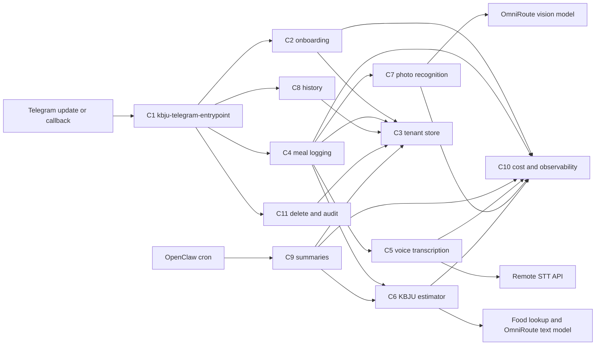

# ARCH-001: KBJU Coach v0.1

## 0. Recon Report (Phase 0 — MANDATORY before any design)

> Required input: `docs/knowledge/openclaw.md`, `docs/knowledge/awesome-skills.md`. Reviewer rejects ArchSpecs that skip this section.

### 0.1 OpenClaw capability map

Sources audited before design: local runtime notes in `docs/knowledge/openclaw.md`, skill catalogue notes in `docs/knowledge/awesome-skills.md`, OpenClaw docs (<https://docs.openclaw.ai>), OpenClaw source/README (<https://github.com/openclaw/openclaw>), and the public skills catalogue (<https://github.com/VoltAgent/awesome-openclaw-skills>). OpenClaw remains locked by PRD-001@0.2.0 §7; this map identifies only what the runtime closes and what remains project-owned.

| PRD requirement | OpenClaw built-in that closes infrastructure | Remaining KBJU Coach gap |
|---|---|---|
| PRD-001@0.2.0 §7 Telegram-only channel; PRD-001@0.2.0 §5 US-1 through US-8 Telegram UX | Gateway/channel support includes Telegram and media-capable messaging surfaces per docs (<https://docs.openclaw.ai>) and source README (<https://github.com/openclaw/openclaw>). | Russian onboarding, commands, inline confirm/edit/delete affordances, typing indicator behavior, and all bot copy. |
| PRD-001@0.2.0 §5 US-2 voice logging; §2 G3 voice latency | Voice/media routing can pass voice input to a skill; local runtime notes identify `VoiceWake` pre-routing to a transcription skill. | Actual Russian transcription provider adapter, retry/fallback policy, transcript retention, and latency/cost measurement. |
| PRD-001@0.2.0 §5 US-4 photo logging | OpenClaw media transport passes photo input into skills; sandbox isolates the skill process. | Meal-photo recognition, low-confidence threshold, mandatory confirmation UX, raw photo deletion after extraction. |
| PRD-001@0.2.0 §5 US-5 summaries | `cron-tools` / scheduled triggers are a built-in OpenClaw path for periodic skill invocation. | User-local schedule definitions, summary aggregation, Russian recommendation prompt, and no-meal nudge content. |
| PRD-001@0.2.0 §2 G2/G3/K2/K3 latency measurement; §7 observability minimums | OpenClaw observability hooks expose per-skill logs, latency metrics, and token spend. | Concrete log schema, metric names, user-scoped correlation IDs, and end-of-pilot KPI queries. |
| PRD-001@0.2.0 §2 G5 cost ceiling | OpenClaw model failover retries providers on errors; OpenClaw supports provider config/fallbacks per docs/source. | Monthly spend accumulator, hard per-call token budgets, auto-degrade trigger, and PO alert. |
| PRD-001@0.2.0 §2 G4 and §5 US-9 tenant isolation | OpenClaw sandbox/process isolation separates the skill process from the host. | Storage-level `user_id` scoping, no unscoped queries, per-user audit log, and end-of-pilot cross-user audit query. |
| PRD-001@0.2.0 §7 secrets | OpenClaw injects secrets through runtime context / env-var style secret handling per local runtime notes and docs. | `.env.example` schema, secret names, least-privilege API keys, and no raw key logging. |
| PRD-001@0.2.0 §7 Node 24 TypeScript runtime | OpenClaw skills are TypeScript on Node 24 per local runtime notes and source README (<https://github.com/openclaw/openclaw>). | Domain implementation must stay in TypeScript; Python/Rust/CLI skills can be referenced but not directly embedded without a later ADR. |

### 0.2 Skill audit (awesome-openclaw-skills)
| Candidate skill (URL) | Matches which PRD §/Goal | Verdict | Rationale |
|---|---|---|---|

Capability A - KBJU / nutrition calculation and meal logging.

| Candidate skill (URL) | Matches which PRD §/Goal | Verdict | Rationale |
|---|---|---|---|
| [`calorie-counter`](https://github.com/openclaw/skills/tree/main/skills/cnqso/calorie-counter) | PRD-001@0.2.0 §5 US-2/US-3/US-7; §2 G1 | reference | Python 3.7 stdlib + SQLite, MIT via skills repo license (<https://github.com/openclaw/skills/blob/main/LICENSE>), last path commit 2026-02-05 (<https://github.com/openclaw/skills/commits/main/skills/cnqso/calorie-counter>). It is forkable but tracks only calories/protein, expects manual values, and misses fat/carbs, Russian parsing, tenant isolation, and confirmation gates. |
| [`diet-tracker`](https://github.com/openclaw/skills/tree/main/skills/yonghaozhao722/diet-tracker) | PRD-001@0.2.0 §5 US-2/US-3/US-5; §2 G1 | reject | Python scripts + Chinese fallback database (`food_database.json` contains Chinese Subway items, no Russian alias corpus), MIT via skills repo, last path commit 2026-02-20 (<https://github.com/openclaw/skills/commits/main/skills/yonghaozhao722/diet-tracker>). ClawHub flags it suspicious, it reads `USER.md` and memory files instead of tenant-scoped storage, and it includes cron reminders outside our UX. |
| [`opencal`](https://github.com/openclaw/skills/tree/main/skills/neikfu/opencal) | PRD-001@0.2.0 §5 US-2/US-3/US-6; §7 food/nutrition database | reference | SKILL-only curl/jq wrapper around OpenCal API, requires `OPENCAL_API_KEY` and an OpenCal iOS account, MIT via skills repo, last path commit 2026-02-19 (<https://github.com/openclaw/skills/commits/main/skills/neikfu/opencal>). Its per-100g scaling and log/delete API shape are useful, but forking would bind the pilot to an external app/account and offload user records outside our right-to-delete boundary. |

Capability B - Voice transcription for Russian Telegram voice messages.

| Candidate skill (URL) | Matches which PRD §/Goal | Verdict | Rationale |
|---|---|---|---|
| [`mh-openai-whisper-api`](https://github.com/openclaw/skills/tree/main/skills/mohdalhashemi98-hue/mh-openai-whisper-api) | PRD-001@0.2.0 §5 US-2/US-7; §2 G3/G5 | reference | Shell/curl wrapper around OpenAI `/v1/audio/transcriptions`, requires `OPENAI_API_KEY`, MIT via skills repo, last path commit 2026-02-25 (<https://github.com/openclaw/skills/commits/main/skills/mohdalhashemi98-hue/mh-openai-whisper-api>). It matches the project default provider path in `docs/knowledge/awesome-skills.md`, but should be reimplemented as a typed Node 24 adapter rather than vendoring shell. |
| [`faster-whisper`](https://github.com/openclaw/skills/tree/main/skills/theplasmak/faster-whisper) | PRD-001@0.2.0 §5 US-2; §7 v0.2 local-transcription swap | reference | Python 3.10 + CTranslate2/faster-whisper with optional ffmpeg/yt-dlp/pyannote, MIT via skills repo, last path commit 2026-02-19 (<https://github.com/openclaw/skills/commits/main/skills/theplasmak/faster-whisper>). Good v0.2 reference for provider abstraction, but v0.1 VPS envelope is ≤2 GB steady RAM and this is a Python local-model stack, not Node 24. |
| [`auto-whisper-safe`](https://github.com/openclaw/skills/tree/main/skills/neal-collab/auto-whisper-safe) | PRD-001@0.2.0 §5 US-2; §7 resource ceiling | reject | Shell wrapper over local `whisper` + `ffmpeg`, default base model ~1.5 GB RAM, MIT via skills repo, last path commit 2026-02-14 (<https://github.com/openclaw/skills/commits/main/skills/neal-collab/auto-whisper-safe>). It optimizes long files, while PRD-001@0.2.0 limits voice to ≤15 s and requires low p95 latency; it would consume most of the 2 GB steady-state budget. |
| [`assemblyai-transcribe`](https://github.com/openclaw/skills/tree/main/skills/tristanmanchester/assemblyai-transcribe) | PRD-001@0.2.0 §5 US-2/US-7 | reject | Node 18+ CLI, requires `ASSEMBLYAI_API_KEY`, MIT via skills repo, last path commit 2026-03-14 (<https://github.com/openclaw/skills/commits/main/skills/tristanmanchester/assemblyai-transcribe>). Rich diarization/translation features exceed v0.1 need and add a second paid transcription provider without a PRD requirement. |
| [`deepgram`](https://github.com/openclaw/skills/tree/main/skills/nerkn/deepgram) | PRD-001@0.2.0 §5 US-2/US-7 | reject | SKILL-only guide to `@deepgram/cli`, requires Deepgram API key/account, MIT via skills repo, last path commit 2026-02-03 (<https://github.com/openclaw/skills/commits/main/skills/nerkn/deepgram>). It is not forkable application code and would introduce a CLI dependency plus another paid provider before ADR comparison. |
| [`elevenlabs-transcribe`](https://github.com/openclaw/skills/tree/main/skills/paulasjes/elevenlabs-transcribe) | PRD-001@0.2.0 §5 US-2/US-7 | reject | Python 3.8 + ffmpeg wrapper requiring `ELEVENLABS_API_KEY`, MIT via skills repo, last path commit 2026-02-03 (<https://github.com/openclaw/skills/commits/main/skills/paulasjes/elevenlabs-transcribe>). ClawHub marks OpenClaw audit suspicious; Scribe features are broader than v0.1 and must compete in ADR, not be forked silently. |

Capability C - Photo meal recognition and confidence labelling.

| Candidate skill (URL) | Matches which PRD §/Goal | Verdict | Rationale |
|---|---|---|---|
| [`google-gemini-media`](https://github.com/openclaw/skills/tree/main/skills/xsir0/google-gemini-media) | PRD-001@0.2.0 §5 US-4; §7 photo latency/cost | reference | Node.js/REST templates for Gemini image understanding/generation, requires `GEMINI_API_KEY`, declares MIT in SKILL, last path commit 2026-01-28 (<https://github.com/openclaw/skills/commits/main/skills/xsir0/google-gemini-media>). Useful for Files API vs inline image routing patterns, but it is generic media guidance and has no meal macro schema, confidence threshold, or confirmation UX. |
| [`hotdog`](https://github.com/openclaw/skills/tree/main/skills/mishafyi/hotdog) | PRD-001@0.2.0 §5 US-4 | reject | SKILL-only curl workflow to a public hotdog battle API, MIT via skills repo, last path commit 2026-02-10 (<https://github.com/openclaw/skills/commits/main/skills/mishafyi/hotdog>). It leaks images to a public leaderboard path, embeds a bearer token in instructions, and classifies only hotdog/not-hotdog rather than meal contents/macros. |
| [`image-detection`](https://github.com/openclaw/skills/tree/main/skills/raghulpasupathi/image-detection) | PRD-001@0.2.0 §5 US-4 | reject | Markdown guide to npm/HuggingFace/Hive AI-generated-image detectors, MIT via skills repo, last path commit 2026-02-21 (<https://github.com/openclaw/skills/commits/main/skills/raghulpasupathi/image-detection>). Wrong domain: detects AI-generated images/NSFW, not food items, portions, or KBJU estimates. |
| [`vtl-image-analysis`](https://github.com/openclaw/skills/tree/main/skills/rusparrish/vtl-image-analysis) | PRD-001@0.2.0 §5 US-4 | reject | Python 3 + numpy/opencv/scikit-image/scipy/pyyaml, per-skill license file plus MIT-compatible public source, last path commit 2026-02-25 (<https://github.com/openclaw/skills/commits/main/skills/rusparrish/vtl-image-analysis>). Wrong domain: composition diagnostics for generated images, no food recognition or nutrition path. |

Capability D - Periodic summary generation / coach wording.

| Candidate skill (URL) | Matches which PRD §/Goal | Verdict | Rationale |
|---|---|---|---|
| [`health-summary`](https://github.com/openclaw/skills/tree/main/skills/yusaku-0426/health-summary) | PRD-001@0.2.0 §5 US-5 | reference | JavaScript `health_summary.js` contract in SKILL metadata, MIT via skills repo, last path commit 2026-02-25 (<https://github.com/openclaw/skills/commits/main/skills/yusaku-0426/health-summary>). Closest domain match for daily/weekly/monthly nutrition totals, but Japanese copy and extra water/fiber/sodium/exercise fields conflict with Russian-only UX and PRD-001@0.2.0 §3 NG2/NG6. |
| [`daily-report`](https://github.com/openclaw/skills/tree/main/skills/visualdeptcreative/daily-report) | PRD-001@0.2.0 §5 US-5; §2 G5 cost alert | reference | Prompt/format SKILL for local Ollama aggregation and Telegram alerts, MIT via skills repo, last path commit 2026-02-05 (<https://github.com/openclaw/skills/commits/main/skills/visualdeptcreative/daily-report>). Good reference for budget-report wording and scheduled report structure, but domain is lead-generation pipeline and not forkable KBJU logic. |
| [`ai-conversation-summary`](https://github.com/openclaw/skills/tree/main/skills/dadaliu0121/ai-conversation-summary) | PRD-001@0.2.0 §5 US-5 | reject | SKILL-only curl call to an external summary API, MIT declared in SKILL, last path commit 2026-02-05 (<https://github.com/openclaw/skills/commits/main/skills/dadaliu0121/ai-conversation-summary>). Sends user text to an unrelated endpoint, lacks cost controls, and summarizes chat history rather than KBJU periods. |
| [`meeting-summarizer`](https://github.com/openclaw/skills/tree/main/skills/claudiodrusus/meeting-summarizer) | PRD-001@0.2.0 §5 US-5 | reject | ClawHub page exists (<https://clawskills.sh/skills/claudiodrusus-meeting-summarizer>) and commit history shows a 2026-03-05 path entry, but the current GitHub contents endpoint returns 404; source/README cannot be audited at current main. Rejecting avoids designing against unavailable source. |

Capability E - Scheduling / timezone support for reports.

| Candidate skill (URL) | Matches which PRD §/Goal | Verdict | Rationale |
|---|---|---|---|
| [`cron-scheduling`](https://github.com/openclaw/skills/tree/main/skills/gitgoodordietrying/cron-scheduling) | PRD-001@0.2.0 §5 US-5; §7 scheduled summaries | reference | SKILL-only guide for cron/systemd timers, MIT via skills repo, last path commit 2026-02-03 (<https://github.com/openclaw/skills/commits/main/skills/gitgoodordietrying/cron-scheduling>). Useful for idempotency/DST caveats, but OpenClaw `cron-tools` is already the project path; no separate cron/systemd integration should be forked. |
| [`temporal-cortex-datetime`](https://github.com/openclaw/skills/tree/main/skills/billylui/temporal-cortex-datetime) | PRD-001@0.2.0 §5 US-1/US-5 timezone confirmation | reference | Rust MCP binary distributed through npm, MIT declared in SKILL, last path commit 2026-03-10 (<https://github.com/openclaw/skills/commits/main/skills/billylui/temporal-cortex-datetime>). Strong reference for DST-aware parsing, but adding Rust/MCP runtime is unnecessary for v0.1 once a user confirms a fixed report time/timezone. |
| [`temporal-cortex-scheduling`](https://github.com/openclaw/skills/tree/main/skills/billylui/temporal-cortex-scheduling) | PRD-001@0.2.0 §5 US-5 only superficially | reject | Rust MCP binary + OAuth credentials for Google/Outlook/CalDAV, MIT declared in SKILL, last path commit 2026-03-10 (<https://github.com/openclaw/skills/commits/main/skills/billylui/temporal-cortex-scheduling>). It implements calendar booking, directly conflicting with PRD-001@0.2.0 §3 NG1. |
| [`calendar-scheduling`](https://github.com/openclaw/skills/tree/main/skills/billylui/calendar-scheduling) | PRD-001@0.2.0 §5 US-5 only superficially | reject | ClawHub page exists (<https://clawskills.sh/skills/billylui-calendar-scheduling>) with OAuth calendar requirements; content overlaps Temporal Cortex scheduling. It is calendar integration, which PRD-001@0.2.0 §3 NG1 explicitly excludes. |
| [`cron-optimizer`](https://github.com/openclaw/skills/tree/main/skills/autogame-17/cron-optimizer) | PRD-001@0.2.0 §5 US-5 only superficially | reject | ClawHub page exists (<https://clawskills.sh/skills/autogame-17-cron-optimizer>) and commit history shows a 2026-03-02 path entry, but the current GitHub contents endpoint returns 404; also optimizes host cron state, which is outside the locked OpenClaw scheduled-trigger path. |

### 0.3 Build-vs-fork-vs-reuse decision summary

Phase 0 produces zero direct forks for v0.1. All audited candidates are either wrong-language for the locked TypeScript/Node 24 skill runtime, too generic, not Russian/tenant-aware, unavailable at current source, externally account-bound, or outside PRD-001@0.2.0 scope. The Executor should build the KBJU domain logic, tenant-scoped storage, confirmation/edit/delete flows, photo confidence handling, right-to-delete, and spend-degrade logic from scratch inside OpenClaw skills; the architecture may reference `mh-openai-whisper-api` for hosted Whisper request shape, `faster-whisper` for a future provider abstraction, `opencal` for per-100g nutrition scaling, `google-gemini-media` for image-understanding request routing, `health-summary` for period aggregation shape, and `cron-scheduling` / `temporal-cortex-datetime` for DST/idempotency considerations.

Capabilities with no suitable fork-candidate: Russian onboarding and target calculation; tenant-isolated meal/audit/transcript storage; Russian confirm/edit/delete UX; photo-to-macro estimation with a numeric low-confidence threshold; monthly cost guard and auto-degrade; right-to-delete; end-of-pilot cross-user audit.

## 1. Context
Implements: PRD-001@0.2.0 §2 Goals, §5 User Stories, §6 KPIs, §7 Technical Envelope, and PO OBC/answers recorded in `docs/questions/Q-ARCH-001-gap-report-2026-04-26.md`.
Does NOT implement: PRD-001@0.2.0 §3 Non-Goals.

### 1.1 Trace matrix
| PRD section | PRD Goal / US | Components that satisfy it |
|---|---|---|
| PRD-001@0.2.0 §2 G1 | Logging volume: ≥3 confirmed meals/day on ≥5 of any rolling 7-day window per pilot user. | C1 Access-Controlled Telegram Entrypoint; C3 Tenant-Scoped Store; C4 Meal Logging Orchestrator; C6 KBJU Estimator; C8 History Mutation Service; C10 Cost, Degrade, and Observability Service |
| PRD-001@0.2.0 §2 G2 | Time-to-first-value: first meal-content message to KBJU draft ≤120 seconds. | C1 Access-Controlled Telegram Entrypoint; C4 Meal Logging Orchestrator; C5 Voice Transcription Provider; C6 KBJU Estimator; C7 Photo Recognition Provider; C10 Cost, Degrade, and Observability Service |
| PRD-001@0.2.0 §2 G3 | Voice round-trip latency: voice ≤15 s returns draft within ≤8 s p95 / ≤30 s p100 and continuous typing indicator. | C1 Access-Controlled Telegram Entrypoint; C4 Meal Logging Orchestrator; C5 Voice Transcription Provider; C6 KBJU Estimator; C10 Cost, Degrade, and Observability Service |
| PRD-001@0.2.0 §2 G4 | Tenant isolation: zero cross-user data leaks. | C1 Access-Controlled Telegram Entrypoint; C3 Tenant-Scoped Store; C10 Cost, Degrade, and Observability Service; C11 Right-to-Delete and Tenant Audit Service |
| PRD-001@0.2.0 §2 G5 | Cost ceiling: LLM + voice transcription ≤$10/month with auto-degrade and PO alert. | C5 Voice Transcription Provider; C6 KBJU Estimator; C7 Photo Recognition Provider; C9 Summary Recommendation Service; C10 Cost, Degrade, and Observability Service |
| PRD-001@0.2.0 §5 US-1 | Onboarding and personalized targets. | C1 Access-Controlled Telegram Entrypoint; C2 Onboarding and Target Calculator; C3 Tenant-Scoped Store |
| PRD-001@0.2.0 §5 US-2 | Voice meal logging with transcription, draft KBJU estimate, confirm/edit, and persistence. | C1 Access-Controlled Telegram Entrypoint; C3 Tenant-Scoped Store; C4 Meal Logging Orchestrator; C5 Voice Transcription Provider; C6 KBJU Estimator; C10 Cost, Degrade, and Observability Service |
| PRD-001@0.2.0 §5 US-3 | Text meal logging with draft KBJU estimate, confirm/edit, and persistence. | C1 Access-Controlled Telegram Entrypoint; C3 Tenant-Scoped Store; C4 Meal Logging Orchestrator; C6 KBJU Estimator; C10 Cost, Degrade, and Observability Service |
| PRD-001@0.2.0 §5 US-4 | Photo meal logging with estimated items/macros, low-confidence label, mandatory confirmation, and correction. | C1 Access-Controlled Telegram Entrypoint; C3 Tenant-Scoped Store; C4 Meal Logging Orchestrator; C6 KBJU Estimator; C7 Photo Recognition Provider; C10 Cost, Degrade, and Observability Service |
| PRD-001@0.2.0 §5 US-5 | Daily / weekly / monthly summaries with totals, deltas, previous-period comparison, and KBJU-only recommendation. | C2 Onboarding and Target Calculator; C3 Tenant-Scoped Store; C9 Summary Recommendation Service; C10 Cost, Degrade, and Observability Service |
| PRD-001@0.2.0 §5 US-6 | Edit / delete any past meal with pagination and audit log; future summaries reflect corrections. | C1 Access-Controlled Telegram Entrypoint; C3 Tenant-Scoped Store; C8 History Mutation Service; C9 Summary Recommendation Service |
| PRD-001@0.2.0 §5 US-7 | Failure UX with manual fallbacks for transcription, KBJU computation, and transport failures. | C1 Access-Controlled Telegram Entrypoint; C4 Meal Logging Orchestrator; C5 Voice Transcription Provider; C6 KBJU Estimator; C7 Photo Recognition Provider; C10 Cost, Degrade, and Observability Service |
| PRD-001@0.2.0 §5 US-8 | Right-to-delete with explicit confirmation and fresh onboarding after deletion. | C1 Access-Controlled Telegram Entrypoint; C3 Tenant-Scoped Store; C11 Right-to-Delete and Tenant Audit Service |
| PRD-001@0.2.0 §5 US-9 | Multi-tenant data isolation for every persistent record and end-of-pilot audit query. | C1 Access-Controlled Telegram Entrypoint; C3 Tenant-Scoped Store; C10 Cost, Degrade, and Observability Service; C11 Right-to-Delete and Tenant Audit Service |
| PRD-001@0.2.0 §6 K1 | Daily confirmed meals logged per active pilot user. | C3 Tenant-Scoped Store; C4 Meal Logging Orchestrator; C10 Cost, Degrade, and Observability Service |
| PRD-001@0.2.0 §6 K2 | Time-to-first-value measurement. | C1 Access-Controlled Telegram Entrypoint; C4 Meal Logging Orchestrator; C10 Cost, Degrade, and Observability Service |
| PRD-001@0.2.0 §6 K3 | Voice latency measurement over rolling 7-day windows. | C5 Voice Transcription Provider; C10 Cost, Degrade, and Observability Service |
| PRD-001@0.2.0 §6 K4 | Cross-user data leak audit over stored records. | C3 Tenant-Scoped Store; C11 Right-to-Delete and Tenant Audit Service |
| PRD-001@0.2.0 §6 K5 | Monthly LLM + voice-transcription spend and auto-degrade evidence. | C5 Voice Transcription Provider; C6 KBJU Estimator; C7 Photo Recognition Provider; C9 Summary Recommendation Service; C10 Cost, Degrade, and Observability Service |
| PRD-001@0.2.0 §6 K6 | Weekly retention: both pilot users active ≥7/7 days/week for 4 weeks. | C3 Tenant-Scoped Store; C4 Meal Logging Orchestrator; C10 Cost, Degrade, and Observability Service |
| PRD-001@0.2.0 §6 K7 | KBJU estimation accuracy target, to be proposed after Phase 5-6 feasibility analysis. | C6 KBJU Estimator; C7 Photo Recognition Provider; C10 Cost, Degrade, and Observability Service |

Every PRD Goal MUST appear. Every component MUST trace back to ≥1 PRD row.

## 2. Architecture Overview

OpenClaw owns Telegram transport, sandboxing, cron dispatch, secret injection, and LLM provider failover. The KBJU Coach implementation is split into cohesive TypeScript skills plus shared modules so meal logging, onboarding, summaries, and privacy/history operations can evolve independently without a single all-purpose skill.

Skill mapping:

| OpenClaw skill / module | Components |
|---|---|
| `kbju-telegram-entrypoint` skill | C1 Access-Controlled Telegram Entrypoint |
| `kbju-onboarding` skill | C2 Onboarding and Target Calculator |
| `kbju-meal-logging` skill | C4 Meal Logging Orchestrator; C5 Voice Transcription Provider; C6 KBJU Estimator; C7 Photo Recognition Provider |
| `kbju-history-privacy` skill | C8 History Mutation Service; C11 Right-to-Delete and Tenant Audit Service |
| `kbju-summary` skill | C9 Summary Recommendation Service |
| shared runtime modules | C3 Tenant-Scoped Store; C10 Cost, Degrade, and Observability Service |

All LLM calls go through OmniRoute first, with direct provider keys available only to the runtime failover path; skill business logic never reads raw provider keys. Persistent records are user_id scoped from day 1, with static Telegram access control (`TELEGRAM_PILOT_USER_IDS`) as a separate outer layer.



## 3. Components
### 3.1 C1 Access-Controlled Telegram Entrypoint
- Responsibility: Enforce pilot-user access, normalize Telegram updates/callbacks, keep the typing indicator active during processing, and route each Russian UX flow to the correct skill.
- Inputs: OpenClaw Telegram text/voice/photo/callback/cron-originated delivery event; `TELEGRAM_PILOT_USER_IDS`; per-user flow state from C3; outgoing message API from OpenClaw.
- Outputs: Routed command/event to C2, C4, C8, C9, or C11; Russian replies; inline confirm/edit/delete callbacks; typing indicator renewal events while C4/C5/C6/C7 run.
- LLM usage: none.
- State: No durable state directly; reads/writes conversation state through C3 with `user_id` scope.
- Failure modes: Telegram send failure retries once for transient transport errors, then C10 logs `telegram_send_failed`; malformed update returns a Russian generic recovery prompt and logs without persistence; non-allowlisted user receives no domain data and no onboarding state; concurrent callbacks for the same draft use C3 optimistic version checks so only the first confirmed mutation wins; rate-limit responses defer typing renewal and emit a C10 alert if repeated.

### 3.2 C2 Onboarding and Target Calculator
- Responsibility: Collect validated biometric/lifestyle answers, explicit timezone, and confirmation before creating a user profile and daily KBJU targets.
- Inputs: `/start`; step answers for sex, age, height, weight, activity level, weight goal, optional pace, timezone, and target confirmation; current user identity from C1; target formula and defaults from Phase 5 KBJU ADR.
- Outputs: Validated user profile; `users.timezone`; daily calorie/protein/fat/carb targets; Russian onboarding messages; non-medical disclaimer; onboarding restart/re-explanation events.
- LLM usage: none for target math; optional template-only text rendering must not call an LLM.
- State: `users`, `user_profiles`, and onboarding step state in C3, all keyed by `user_id`.
- Failure modes: malformed or out-of-range answers re-ask in Russian with a concrete example; duplicate `/start` during onboarding resumes the current step instead of creating a second profile; DB write conflict re-reads the latest step and replays the prompt; timezone is never inferred from Telegram; if target calculation fails due invalid internal config, C10 raises a blocking error and C1 asks the user to retry later.

### 3.3 C3 Tenant-Scoped Store
- Responsibility: Provide the only persistence interface, enforcing `user_id` scope for every profile, draft, transcript, meal, summary, audit, metric, and deletion-relevant record.
- Inputs: Typed repository requests from C1/C2/C4/C8/C9/C10/C11; runtime migration version; `user_id`; transaction boundaries.
- Outputs: Scoped records; paginated query results; atomic mutations; audit entries; end-of-pilot query results for cross-user reference checks.
- LLM usage: none.
- State: Durable relational store selected in Phase 5 storage/multi-tenancy ADR; Docker volume-backed data directory only, no host paths outside declared volumes.
- Failure modes: unscoped repository methods are forbidden by interface and tests; DB locked/rate-limited paths retry once when idempotent, otherwise return a Russian retry-later message through C1; malformed query parameters are rejected before SQL; concurrent writes use transactions plus version columns for meal drafts and edits; migration mismatch fails startup rather than running with partial schema.

### 3.4 C4 Meal Logging Orchestrator
- Responsibility: Convert voice, text, photo, or manual-entry input into a reviewable KBJU draft and persist only explicitly confirmed meals.
- Inputs: Routed meal text from C1; transcript from C5; photo item candidates from C7; manual KBJU form answers; edit corrections; current profile/targets from C3.
- Outputs: Itemized draft with portions and KBJU breakdown; low-confidence label where applicable; inline confirm/edit affordance; confirmed meal record; manual-entry meal record; failure fallback prompt.
- LLM usage: none directly; invokes C6/C7 for model-backed parsing or image recognition.
- State: Meal drafts, draft versions, confirmation status, and source metadata in C3.
- Failure modes: empty/malformed meal text asks for a clearer Russian description; KBJU computation failure triggers guided manual entry via US-7; transport-layer failures in called providers retry once only when idempotent; suspicious model output is not retried and is routed to manual entry; duplicate confirm callbacks are idempotent; concurrent edits require latest draft version.

### 3.5 C5 Voice Transcription Provider
- Responsibility: Convert Telegram voice clips of 15 seconds or less into Russian text and delete raw audio after extraction completes.
- Inputs: Telegram voice file metadata and temporary raw clip handle from C1/OpenClaw; language hint `ru`; provider config from Phase 5 voice ADR; retry budget from C10.
- Outputs: Transcript record scoped to `user_id`; transcription success/failure metric; normalized transcript text for C4; raw-clip deletion confirmation.
- LLM usage: Hosted speech-to-text model selected in Phase 5 voice ADR; purpose is Russian ASR only, not meal reasoning.
- State: Transcript text retained in C3 until right-to-delete; raw audio is temporary and must be deleted immediately after transcript success or terminal failure.
- Failure modes: API unavailable/rate-limited retries once if within latency budget, then C1 replies `Не расслышал, напиши текстом`; second consecutive voice failure for the same user opens manual KBJU entry; voice >15 seconds is rejected with a Russian length prompt; no local GPU path is allowed on the current VPS; raw audio deletion failure is high-severity C10 alert.

### 3.6 C6 KBJU Estimator
- Responsibility: Produce itemized calories/protein/fat/carbs estimates from normalized text or corrected item lists using food lookup first and LLM fallback under cost guard.
- Inputs: Russian meal text; corrected item/portion list; profile/targets; optional lookup results; degrade mode flag from C10; prompt policy including PRD-001@0.2.0 §3 NG6/NG7 and US-5 prohibition terms.
- Outputs: Structured item list with portions, per-item KBJU, total KBJU, confidence, source attribution, and validation errors for C4/C9.
- LLM usage: OmniRoute-routed text model selected in Phase 5 routing ADR; purpose is structured food-item parsing, portion normalization, missing lookup fallback, and summary recommendation support when invoked by C9.
- State: Lookup cache and estimate metadata in C3 if selected by storage ADR; no raw prompt logging.
- Failure modes: lookup API down falls back to LLM-only unless C10 overage degradation disables optional lookup; LLM timeout/rate-limit falls back to manual entry for meal logging and no-meal nudge for summaries; malformed JSON is rejected once, not retried as a suspicious response; prompt-injection-like user text is treated as meal description only and cannot alter system/developer instructions; concurrent estimation requests are independent but spend-guarded per user/month.

### 3.7 C7 Photo Recognition Provider
- Responsibility: Convert a Telegram meal photo into candidate food items, portion estimates, and an explicit confidence value for mandatory user review.
- Inputs: Temporary photo file handle from C1/OpenClaw; user profile context limited to target units; vision model config from Phase 5 photo ADR; low-confidence threshold from Phase 5 photo ADR.
- Outputs: Candidate item list; portion estimates; numeric confidence; Russian `низкая уверенность` label when below threshold; raw-photo deletion confirmation; metrics for C10.
- LLM usage: OmniRoute-routed vision model selected in Phase 5 photo ADR; purpose is food identification and portion estimation only.
- State: Candidate items and confidence are stored in C3 as a draft; raw photo bytes are deleted immediately after extraction succeeds or terminally fails.
- Failure modes: vision API unavailable/rate-limited retries once if within photo latency hard cap, then C1 offers text/manual entry; malformed vision output is discarded and never auto-saved; all photo paths require C4 confirmation regardless of confidence; raw-photo deletion failure is high-severity C10 alert; concurrent photo drafts are separated by draft ID and `user_id`.

### 3.8 C8 History Mutation Service
- Responsibility: Let a user view, edit, or delete any past confirmed meal with page size 5 and append-only audit records.
- Inputs: History command or natural-language history request from C1; page cursor; selected meal ID; edit/delete callback; corrected items/portions/KBJU.
- Outputs: Paginated Russian history page; updated meal record; deleted meal marker or hard-delete result as selected by data ADR; audit entry; future-summary correction delta input for C9.
- LLM usage: none for command/callback flows; natural-language history intent classification can use C1 deterministic command patterns first and may use the Phase 5 routing ADR only if explicitly allowed.
- State: Meal history and audit entries in C3.
- Failure modes: requested meal not owned by `user_id` returns not-found without revealing existence; malformed cursor restarts at newest page; concurrent edit/delete uses meal version checks; recomputation failure after edit keeps the original meal unchanged and offers manual KBJU entry; already-delivered summaries are not modified.

### 3.9 C9 Summary Recommendation Service
- Responsibility: Generate scheduled daily, weekly, and monthly Telegram summaries per user using only that user's confirmed data and KBJU-only recommendations.
- Inputs: OpenClaw cron event; user timezone from C2/C3; confirmed meals and targets from C3; previous-period aggregates; persona document path from `PERSONA_PATH` pointing to `docs/personality/PERSONA-001-kbju-coach.md`; F-M2 enforcement policy from Phase 5 ADR.
- Outputs: Russian summary message; no-meal nudge; summary record; correction-delta note for post-edit periods; recommendation validation result.
- LLM usage: OmniRoute-routed text model selected in Phase 5 routing ADR; purpose is short Russian KBJU-only recommendation generation from numeric aggregates.
- State: Summary records, schedule metadata, and last-delivery status in C3.
- Failure modes: cron duplicate uses idempotency key `(user_id, period_type, period_start)`; no confirmed meals produces deterministic nudge without LLM; LLM timeout/rate-limit sends deterministic numeric summary without recommendation and logs degraded output; recommendation mentioning forbidden medical/clinical/supplement/drug topics is blocked by validator path from Phase 5 ADR; missing `PERSONA_PATH` fails startup for this skill.

### 3.10 C10 Cost, Degrade, and Observability Service
- Responsibility: Measure latency, success/failure, confirmation rates, and per-call spend while enforcing token/cost budgets and auto-degrade behavior before overspend.
- Inputs: Structured events from all components; per-call token budgets from skill manifests; provider cost estimates and router billing reports; monthly `$10` ceiling; PO alert destination.
- Outputs: JSON logs through `ctx.log`; latency/cost metrics; degrade-mode flag; PO alert; KPI query material for K1-K7.
- LLM usage: none.
- State: Metrics/cost counters in C3 or runtime metrics sink selected in Phase 7; no raw prompts, raw audio, or raw photos in logs.
- Failure modes: unknown cost event uses worst-case configured price until billing reconciliation; budget over trend enables cheaper model and/or optional lookup skip; metrics write failure never blocks user reply but raises an alert; malformed event is dropped with schema error metric; concurrent spend updates use atomic increments; provider-key or raw-prompt leakage in logs is treated as a security bug.

### 3.11 C11 Right-to-Delete and Tenant Audit Service
- Responsibility: Permanently delete all records for one user on confirmed `/forget_me` flow and provide the end-of-pilot tenant-isolation audit query.
- Inputs: `/forget_me` or natural-language deletion intent from C1; single yes/no confirmation; `user_id`; audit-run request after pilot.
- Outputs: Deletion transaction result; stopped summary schedule state; fresh-onboarding eligibility; audit report showing zero cross-user references or concrete findings.
- LLM usage: none.
- State: Operates on all C3 persistent entities; keeps no independent durable data after deletion.
- Failure modes: cancellation leaves all data unchanged; partial deletion failure rolls back transaction and alerts C10; repeated delete after prior deletion returns a Russian already-deleted/fresh-start message without old personalization; audit query never returns full other-user data in user-facing messages; concurrent delete and meal confirmation serializes on `user_id` lock.

## 4. Data Flow
<Step-by-step; what data is produced where.>

## 5. Data Model / Schemas (declarative — no runnable code)
```yaml
EntityName:
  id: uuid
  field: type
```

## 6. External Interfaces
| System | Protocol | Auth | Rate limit | Failure mode |
|---|---|---|---|---|
| Telegram Bot API | HTTPS | bot token | 30 msg/s/chat | retry w/ backoff |
| OpenFoodFacts | HTTPS | none | ≈100 req/min | cache + LLM fallback |
| Whisper | HTTPS | API key | 50 req/min (OpenAI) | local fallback in v0.2 |

## 7. Tech Stack Decisions (linked ADRs)
- Language / runtime: OpenClaw TypeScript skill runtime on Node 24, PO-locked by PRD-001@0.2.0 §7.
- Storage and tenant isolation: PostgreSQL shared tables with `user_id`, composite keys, and row-level security — `ADR-001@0.1.0`.
- LLM routing: OmniRoute-first Fireworks pool with direct provider keys only as runtime fallback — `ADR-002@0.1.0`.
- Voice transcription: Fireworks Whisper V3 Turbo hosted transcription — `ADR-003@0.1.0`.
- Photo recognition (v0.1): Fireworks Qwen3 VL 30B A3B Instruct, low-confidence threshold `confidence_0_1 < 0.70` — `ADR-004@0.1.0`.
- Food / KBJU estimation: Open Food Facts + USDA FoodData Central lookup with LLM fallback; K7 proposal +/-25% calories and +/-30% macros per meal, +/-15% daily calories and +/-20% daily macros — `ADR-005@0.1.0`.
- Summary recommendation guardrails: system prompt plus deterministic validator and deterministic fallback for forbidden topics — `ADR-006@0.1.0`.
- Data hosting jurisdiction shortlist: recommend EU durable storage with transient remote inference; PO selection remains open until ratified — `ADR-007@0.1.0`.
- Deployment: portable Docker Compose on the VPS with named volumes and no host-path/systemd dependency — `ADR-008@0.1.0`.

## 8. Observability
- Logs: format, where collected
- Metrics: what + endpoint
- Tracing: yes/no + tool

## 9. Security
- Secrets management: <where>
- Network boundaries: <what's exposed>
- LLM prompt-injection mitigations: <concrete; "sanitise inputs" alone is rejected>
- PII handling: <retention, deletion path>

## 10. Deployment
- Runtime: openclaw skill image, Docker Compose on VPS
- Resource budget: <CPU/RAM — must fit PRD Technical Envelope>
- Rollback procedure: <actual command sequence, not "revert to previous version">

## 11. Work Breakdown (tickets for Executor)
| ID | Title | Depends on | Assigned executor |
|---|---|---|---|
| TKT-XXX | … | — | glm-5.1 |

## 12. Risks & Open Questions
- R1: ...
- Q_TO_BUSINESS_1: ... ← escalation upstream

---

## Handoff Checklist
- [ ] §0 Recon Report present, ≥3 candidates audited per major capability
- [ ] Trace matrix covers every PRD Goal
- [ ] Each component has clear Inputs / Outputs / failure modes
- [ ] All referenced ADRs exist and are `proposed` or `accepted`
- [ ] Resource budget fits PRD Technical Envelope (numeric check)
- [ ] Work Breakdown lists ≥3 atomic tickets with explicit dependency graph
- [ ] §8, §9, §10 are non-empty with concrete choices
- [ ] All PRD/ADR references pin to a specific version (`@X.Y.Z`)
- [ ] No production code in this file (schemas in §5 are declarative YAML only)
